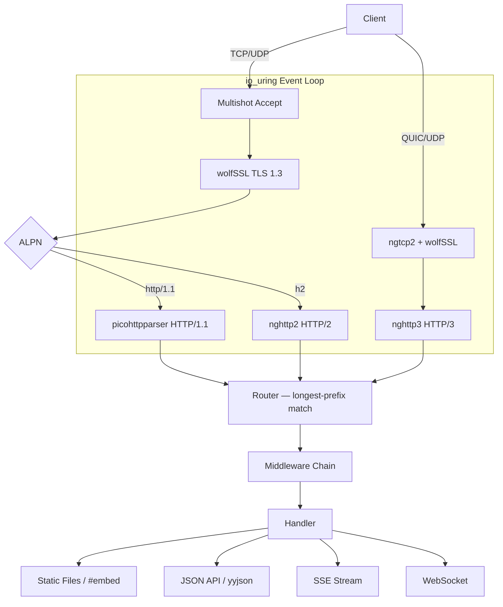

<p align="center">
  <h1 align="center">iohttp</h1>
  <p align="center">Embedded HTTP server for C23 — io_uring · wolfSSL · HTTP/1.1·2·3</p>
</p>

<p align="center">
  <a href="LICENSE"></a>
  
  
  
  
  
</p>

Production-grade embedded HTTP server library in C23. Built on `io_uring` for
zero-syscall I/O, native wolfSSL integration for TLS 1.3 / QUIC, and full
HTTP/1.1 + HTTP/2 + HTTP/3 protocol support. Drop-in replacement for Mongoose,
CivetWeb, and libmicrohttpd — with modern protocol stack and kernel-native
async I/O.

## Quick Start

```bash
git clone https://github.com/dantte-lp/iohttp.git
cd iohttp
cmake --preset clang-debug
cmake --build --preset clang-debug
ctest --preset clang-debug
```

## Architecture



## Key Features

- **io_uring native** — multishot accept, provided buffers, zero-copy send, SQPOLL mode
- **wolfSSL integration** — TLS 1.3, mTLS, QUIC crypto, session resumption, FIPS-ready
- **HTTP/1.1** — picohttpparser (SSE4.2 SIMD, ~4+ GB/s), keep-alive, chunked TE
- **HTTP/2** — nghttp2 (HPACK, multiplexed streams, server push)
- **HTTP/3** — ngtcp2 + nghttp3 (QUIC, 0-RTT, connection migration)
- **Router** — longest-prefix match, path parameters, per-route auth/permissions
- **Middleware** — rate limiting, CORS, JWT auth, mTLS, audit log, security headers
- **Static files** — C23 `#embed`, ETag, gzip/brotli, immutable cache, SPA fallback
- **WebSocket** — RFC 6455, ping/pong, fragmentation, per-message compression
- **SSE** — Server-Sent Events with io_uring timers
- **JSON** — yyjson (~2.4 GB/s) for API serialization
- **API docs** — Scalar UI integration for OpenAPI specs
- **Security** — CSP, HSTS, X-Frame-Options, SameSite cookies, RBAC bitmask
- **Single binary** — embed SPA + assets in executable via `#embed` or packed FS

## Protocol Stack

| Layer | Library | License | LOC |
|-------|---------|---------|-----|
| HTTP/1.1 parser | [picohttpparser](https://github.com/h2o/picohttpparser) | MIT | ~800 |
| HTTP/2 frames | [nghttp2](https://github.com/nghttp2/nghttp2) | MIT | ~18K |
| QUIC transport | [ngtcp2](https://github.com/ngtcp2/ngtcp2) | MIT | ~28K |
| HTTP/3 + QPACK | [nghttp3](https://github.com/ngtcp2/nghttp3) | MIT | ~12K |
| WebSocket | [wslay](https://github.com/tatsuhiro-t/wslay) | MIT | ~3K |
| Structured Fields | [sfparse](https://github.com/ngtcp2/sfparse) | MIT | ~1K |
| TLS 1.3 + QUIC | [wolfSSL](https://github.com/wolfSSL/wolfssl) | GPLv2+* | — |
| Async I/O | [liburing](https://github.com/axboe/liburing) | MIT/LGPL | ~3K |
| JSON | [yyjson](https://github.com/ibireme/yyjson) | MIT | ~8K |

## Documentation

| # | Document | Description |
|---|----------|-------------|
| 01 | [Architecture](docs/en/01-architecture.md) | Core design, event loop, module decomposition |
| 02 | [Comparison](docs/en/02-comparison.md) | Feature matrix vs Mongoose, H2O, libmicrohttpd, etc. |

## Example

```c
#include <iohttp/server.h>

static int hello_handler(io_request_t *req, io_response_t *resp, void *ctx)
{
    return io_respond_json(resp, 200, "{\"message\":\"hello\"}");
}

int main(void)
{
    io_server_config_t cfg = {
        .listen_addr = "0.0.0.0",
        .listen_port = 8080,
        .tls_cert    = "/etc/certs/server.pem",
        .tls_key     = "/etc/certs/server.key",
        .queue_depth  = 256,
    };

    io_server_t *srv = io_server_create(&cfg);
    io_route_add(srv, IO_GET, "/api/hello", hello_handler, nullptr);
    io_route_static(srv, "/admin", "./dist", IO_STATIC_SPA);
    io_server_run(srv);  /* blocks on io_uring event loop */
    io_server_destroy(srv);
}
```

## Build Requirements

- Linux kernel 6.7+ (io_uring features, CVE-2024-0582 avoidance)
- glibc 2.39+
- Clang 22+ or GCC 15+ (C23 support)
- CMake 4.0+
- liburing 2.7+
- wolfSSL 5.8.4+ (--enable-quic)
- nghttp2, ngtcp2, nghttp3 (HTTP/2 + HTTP/3)

## License

GPLv3 — see [LICENSE](LICENSE).

wolfSSL dependency requires GPL-compatible license. See [wolfSSL license note](docs/en/02-comparison.md#protocol-library-stack-iohttps-approach).
