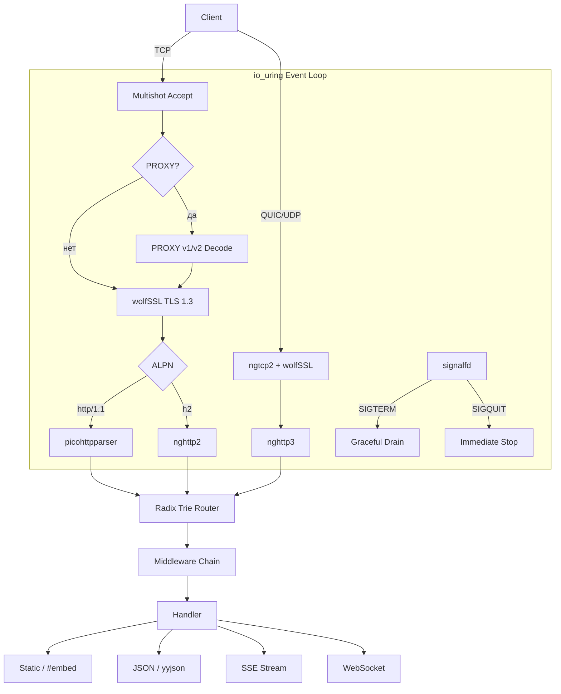
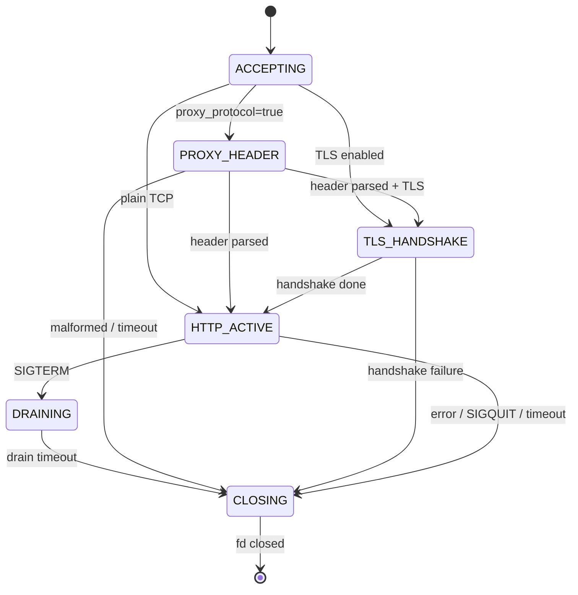

[](README.md)
[](README.ru.md)

<p align="center">
  <h1 align="center">iohttp</h1>
  <p align="center">Встраиваемый HTTP-сервер для C23 — io_uring · wolfSSL · HTTP/1.1·2·3</p>
</p>

<p align="center">
  <a href="LICENSE"></a>
  
  
  
  
  
  
</p>

HTTP-сервер промышленного уровня для встраивания в C23-приложения. Построен на
`io_uring` для ввода-вывода без системных вызовов, нативная интеграция wolfSSL
для TLS 1.3 / QUIC, полная поддержка HTTP/1.1 + HTTP/2 + HTTP/3. Замена
Mongoose, CivetWeb и libmicrohttpd — с современным стеком протоколов и
асинхронным вводом-выводом на уровне ядра.

## Быстрый старт

```bash
git clone https://github.com/dantte-lp/iohttp.git
cd iohttp
cmake --preset clang-debug
cmake --build --preset clang-debug
ctest --preset clang-debug
```

## Архитектура



## Ключевые возможности

- **io_uring native** — multishot accept, provided buffers, zero-copy send, SQPOLL
- **wolfSSL** — TLS 1.3, mTLS, QUIC crypto, возобновление сессий, FIPS
- **HTTP/1.1** — picohttpparser (SSE4.2 SIMD, ~4+ ГБ/с), keep-alive, chunked TE
- **HTTP/2** — nghttp2 (HPACK, мультиплексированные потоки, server push)
- **HTTP/3** — ngtcp2 + nghttp3 (QUIC, 0-RTT, миграция соединений)
- **Маршрутизатор** — longest-prefix match, параметры пути, per-route авторизация
- **Middleware** — rate limiting, CORS, JWT auth, mTLS, аудит-лог, security headers
- **Статические файлы** — C23 `#embed`, ETag, gzip/brotli, immutable cache, SPA fallback
- **WebSocket** — RFC 6455, ping/pong, фрагментация, per-message сжатие
- **SSE** — Server-Sent Events с io_uring таймерами
- **JSON** — yyjson (~2.4 ГБ/с) для API-сериализации

## Продакшен-возможности (Sprint 12)

- **Linked timeouts** — HEADER (30с) / BODY (60с) / KEEPALIVE (65с) через `IORING_OP_LINK_TIMEOUT`
- **Ограничения запросов** — 431 Request Header Fields Too Large, 413 Content Too Large
- **Обработка сигналов** — signalfd + io_uring: SIGTERM → плавная остановка, SIGQUIT → немедленная
- **Структурированное логирование** — ioh_log с уровнями ERROR/WARN/INFO/DEBUG, пользовательские sink'и
- **Идентификатор запроса** — X-Request-Id, 128-бит hex (arc4random), проброс входящего ID
- **PROXY protocol v1/v2** — интеграция в accept→recv pipeline, только явный режим

<details>
<summary>Конечный автомат соединений</summary>



</details>

## Соответствие RFC

| RFC | Название | Статус |
|-----|----------|--------|
| 9110 | HTTP Semantics | Частично |
| 9112 | HTTP/1.1 | Реализовано |
| 9113 | HTTP/2 | Реализовано |
| 9114 | HTTP/3 | Реализовано |
| 9000 | QUIC Transport | Реализовано |
| 8446 | TLS 1.3 | Реализовано |
| 6455 | WebSocket | Реализовано |

## Стек протоколов

| Уровень | Библиотека | Лицензия | LOC |
|---------|-----------|----------|-----|
| HTTP/1.1 parser | [picohttpparser](https://github.com/h2o/picohttpparser) | MIT | ~800 |
| HTTP/2 frames | [nghttp2](https://github.com/nghttp2/nghttp2) | MIT | ~18K |
| QUIC transport | [ngtcp2](https://github.com/ngtcp2/ngtcp2) | MIT | ~28K |
| HTTP/3 + QPACK | [nghttp3](https://github.com/ngtcp2/nghttp3) | MIT | ~12K |
| WebSocket | [wslay](https://github.com/tatsuhiro-t/wslay) | MIT | ~3K |
| Structured Fields | [sfparse](https://github.com/ngtcp2/sfparse) | MIT | ~1K |
| TLS 1.3 + QUIC | [wolfSSL](https://github.com/wolfSSL/wolfssl) | GPLv2+* | — |
| Async I/O | [liburing](https://github.com/axboe/liburing) | MIT/LGPL | ~3K |
| JSON | [yyjson](https://github.com/ibireme/yyjson) | MIT | ~8K |

## Документация

| # | Документ | Описание |
|---|----------|----------|
| 01 | [Архитектура](docs/ru/01-architecture.md) | Ядро, цикл событий, декомпозиция модулей |
| 02 | [Сравнение](docs/ru/02-comparison.md) | Матрица возможностей vs Mongoose, H2O, libmicrohttpd и др. |
| 03 | [Продакшен](docs/ru/03-production-hardening.md) | Таймауты, лимиты, сигналы, логирование, request ID, PROXY |

## Пример

```c
#include "core/ioh_server.h"
#include "core/ioh_ctx.h"

static int hello(ioh_ctx_t *c, void *data)
{
    (void)data;
    return ioh_ctx_json(c, 200, "{\"message\":\"hello\"}");
}

int main(void)
{
    ioh_server_config_t cfg;
    ioh_server_config_init(&cfg);
    cfg.listen_port = 8080;

    ioh_server_t *srv = ioh_server_create(&cfg);
    ioh_server_set_on_request(srv, hello, nullptr);
    ioh_server_run(srv);
    ioh_server_destroy(srv);
}
```

## Требования к сборке

- Ядро Linux 6.7+ (возможности io_uring, защита от CVE-2024-0582)
- glibc 2.39+
- Clang 22+ или GCC 15+ (поддержка C23)
- CMake 4.0+
- liburing 2.7+
- wolfSSL 5.8.4+ (--enable-quic)
- nghttp2, ngtcp2, nghttp3 (HTTP/2 + HTTP/3)

## Лицензия

GPLv3 — см. [LICENSE](LICENSE).

Зависимость wolfSSL требует GPL-совместимую лицензию. См. [примечание о лицензии wolfSSL](docs/ru/02-comparison.md#стек-протокольных-библиотек-подход-iohttp).
