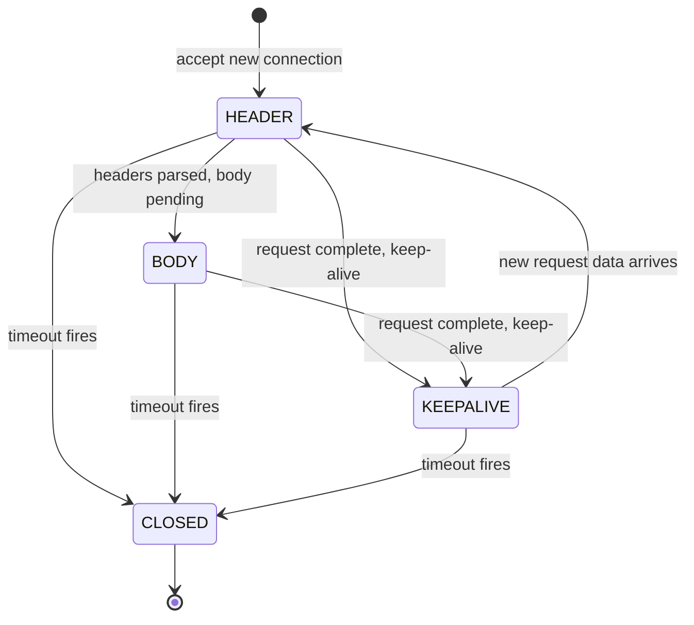
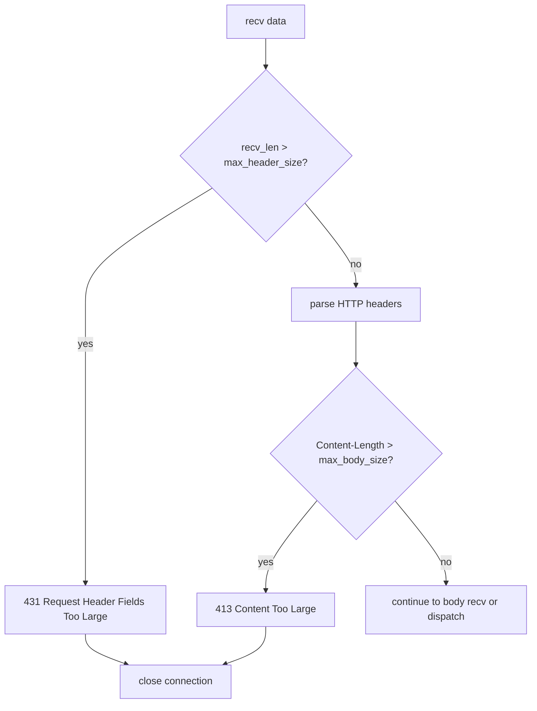
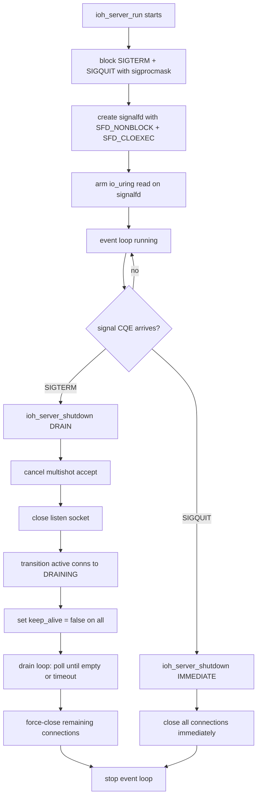
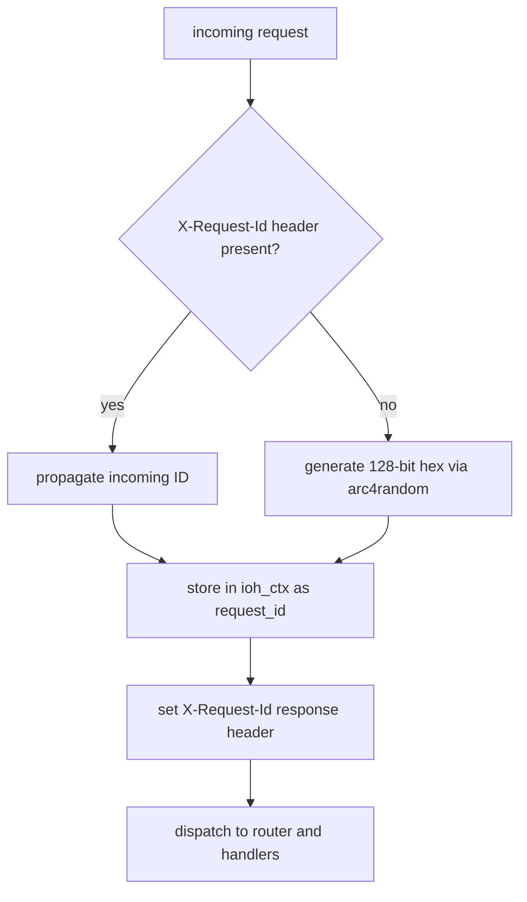
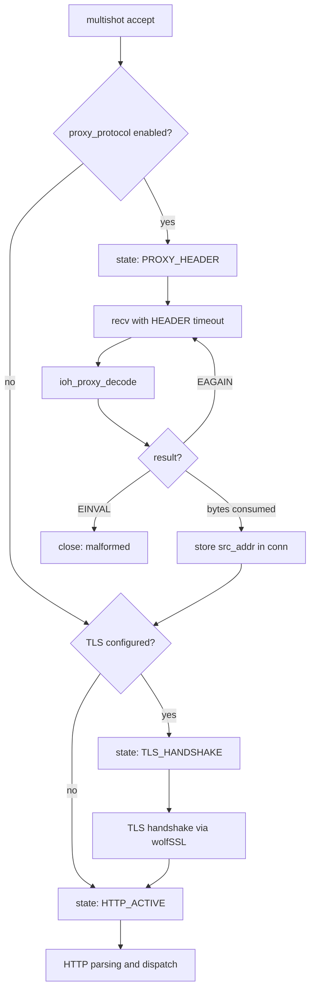
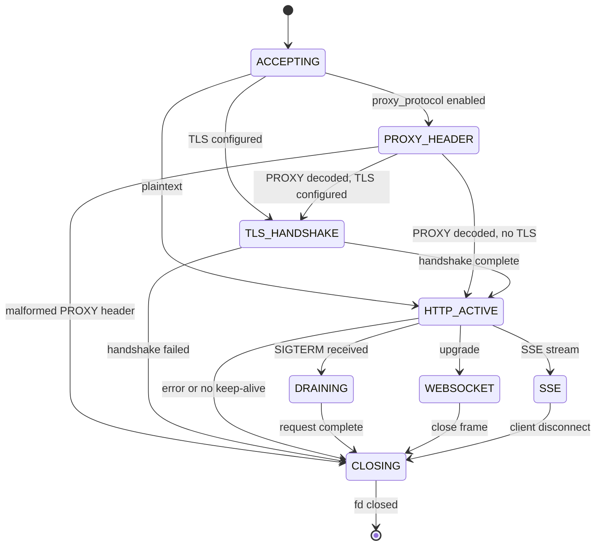
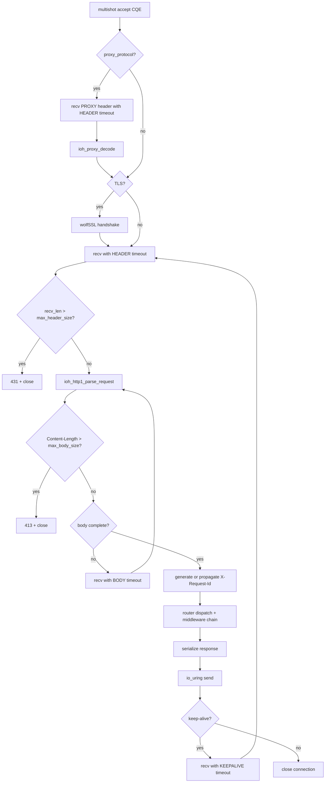

# Sprint 12: Production Hardening

iohttp Sprint 12 introduces six production-hardening features that close the gap
between a functional HTTP server and one that can be deployed behind a load balancer
in a real environment. Every feature is built on the io_uring event loop -- signals
are read via `signalfd`, timeouts use `IORING_OP_LINK_TIMEOUT`, and PROXY protocol
decoding is integrated directly into the accept-recv pipeline. No threads, no
blocking calls, no epoll fallback.

---

## Table of Contents

1. [Linked Timeouts](#1-linked-timeouts)
2. [Request Limits](#2-request-limits)
3. [Signal Handling](#3-signal-handling)
4. [Structured Logging](#4-structured-logging)
5. [Request ID](#5-request-id)
6. [PROXY Protocol](#6-proxy-protocol)
7. [Testing](#7-testing)
8. [Migration Notes](#8-migration-notes)

---

## 1. Linked Timeouts

### What It Does

Every `IORING_OP_RECV` submitted by the server is linked to an
`IORING_OP_LINK_TIMEOUT` SQE. If the recv does not complete within the deadline,
the kernel cancels it automatically and delivers a timeout CQE. This eliminates
slowloris attacks, stuck connections, and idle connection buildup without any
userspace timer management.

### How It Works

Timeouts follow the connection through three phases. Each phase sets a different
deadline appropriate to its expected data rate:

| Phase | Enum | Default | Purpose |
|-------|------|---------|---------|
| HEADER | `IOH_TIMEOUT_HEADER` | 30 s | Time to receive complete HTTP headers |
| BODY | `IOH_TIMEOUT_BODY` | 60 s | Time to receive the full request body |
| KEEPALIVE | `IOH_TIMEOUT_KEEPALIVE` | 65 s | Idle time between pipelined requests |

The timeout phase transitions automatically as the request progresses:

1. New connection starts in `IOH_TIMEOUT_HEADER`
2. When headers are parsed but the body is incomplete, transitions to `IOH_TIMEOUT_BODY`
3. After a response is sent on a keep-alive connection, transitions to `IOH_TIMEOUT_KEEPALIVE`
4. When the next request arrives, resets to `IOH_TIMEOUT_HEADER`



### SQE Linking Internals

Each `arm_recv()` call produces either one or two SQEs depending on whether a
timeout phase is active:

```
SQE 1: IORING_OP_RECV (flags |= IOSQE_IO_LINK)
SQE 2: IORING_OP_LINK_TIMEOUT (timeout_ts = phase duration)
```

When the recv completes before the timeout, the kernel delivers:
- Recv CQE with `res > 0` (data received)
- Timeout CQE with `res = -ECANCELED` (timeout was canceled)

When the timeout fires first:
- Timeout CQE with `res = -ETIME`
- Recv CQE with `res = -ECANCELED` (recv was canceled)

> [!IMPORTANT]
> The `timeout_ts` field lives in `ioh_conn_t` (not on the stack) because the
> kernel reads it asynchronously. The timespec must outlive the SQE submission.

### Configuration

| Parameter | Field | Default | Unit |
|-----------|-------|---------|------|
| Header timeout | `ioh_server_config_t.header_timeout_ms` | 30000 | ms |
| Body timeout | `ioh_server_config_t.body_timeout_ms` | 60000 | ms |
| Keepalive timeout | `ioh_server_config_t.keepalive_timeout_ms` | 65000 | ms |

<details>
<summary>Example: configuring aggressive timeouts for an API gateway</summary>

```c
ioh_server_config_t cfg;
ioh_server_config_init(&cfg);
cfg.listen_port = 8080;
cfg.header_timeout_ms  = 5000;   /* 5s for headers */
cfg.body_timeout_ms    = 15000;  /* 15s for body */
cfg.keepalive_timeout_ms = 10000; /* 10s idle */
```

</details>

---

## 2. Request Limits

### What It Does

The server enforces hard limits on header size and body size, rejecting oversized
requests with the appropriate HTTP status code before the application handler runs.
This prevents memory exhaustion from malicious or misconfigured clients.

### Enforcement Points

| Check | When | Status Code | Response |
|-------|------|-------------|----------|
| Header size | After recv, before HTTP parse | **431** Request Header Fields Too Large | Connection closed after response |
| Body size | After header parse, before body recv | **413** Content Too Large | Connection closed after response |

The header size check compares the total bytes received so far against
`max_header_size`. This fires before the HTTP parser runs, so malformed oversized
requests are rejected without wasting CPU on parsing.

The body size check examines the parsed `Content-Length` header value against
`max_body_size`. If the declared body exceeds the limit, the server rejects
immediately without waiting for the body data to arrive.



### Configuration

| Parameter | Field | Default | Unit |
|-----------|-------|---------|------|
| Max header size | `ioh_server_config_t.max_header_size` | 8192 | bytes |
| Max body size | `ioh_server_config_t.max_body_size` | 1048576 | bytes |

> [!NOTE]
> The `max_header_size` limit covers the entire HTTP request line plus all headers.
> The default of 8 KiB matches common industry practice (nginx default, AWS ALB).
> The `max_body_size` default of 1 MiB is intentionally conservative -- increase it
> for file upload endpoints.

<details>
<summary>Example: large file upload endpoint</summary>

```c
ioh_server_config_t cfg;
ioh_server_config_init(&cfg);
cfg.listen_port = 8080;
cfg.max_header_size = 16384;       /* 16 KiB headers */
cfg.max_body_size   = 104857600;   /* 100 MiB uploads */
```

</details>

---

## 3. Signal Handling

### What It Does

The server handles `SIGTERM` and `SIGQUIT` through `signalfd` integrated into the
io_uring event loop. No signal handlers, no `volatile sig_atomic_t` flags, no race
conditions. Signals are delivered as regular CQEs alongside network I/O.

| Signal | Action | Shutdown Mode |
|--------|--------|---------------|
| `SIGTERM` | Graceful drain | `IOH_SHUTDOWN_DRAIN` |
| `SIGQUIT` | Immediate close | `IOH_SHUTDOWN_IMMEDIATE` |

### How It Works



### Graceful Drain Sequence (SIGTERM)

1. Stop accepting new connections (cancel multishot accept, close listen fd)
2. Transition all `IOH_CONN_HTTP_ACTIVE` connections to `IOH_CONN_DRAINING`
3. Set `keep_alive = false` on all connections -- in-flight requests complete but
   connections close after the current response
4. Run a drain loop polling every 50 ms until either all connections close or the
   drain timeout expires
5. Force-close any connections that remain after the drain timeout

### Immediate Shutdown (SIGQUIT)

All connections are closed synchronously. TLS contexts are destroyed, file
descriptors are closed, and pool slots are freed in a single pass.

### Configuration

The drain timeout uses `keepalive_timeout_ms` from the server configuration
(default 65 s). This ensures the drain phase waits long enough for in-flight
keep-alive connections to complete their current request-response cycle.

> [!CAUTION]
> The `signalfd` is created inside `ioh_server_run()`. If you use `ioh_server_run_once()`
> in your own event loop, you must handle signals yourself. The signalfd setup only
> applies to the blocking `ioh_server_run()` entry point.

<details>
<summary>Example: container orchestrator integration</summary>

Kubernetes sends `SIGTERM` before pod termination. With the default drain timeout,
the server has 65 seconds to finish in-flight requests before force-closing:

```c
ioh_server_config_t cfg;
ioh_server_config_init(&cfg);
cfg.listen_port = 8080;
cfg.keepalive_timeout_ms = 30000; /* 30s drain matches k8s default */

ioh_server_t *srv = ioh_server_create(&cfg);
/* ... configure router, TLS ... */

/* Blocks until SIGTERM/SIGQUIT or ioh_server_stop() */
int rc = ioh_server_run(srv);
ioh_server_destroy(srv);
```

</details>

---

## 4. Structured Logging

### What It Does

The `ioh_log` module provides level-filtered, module-tagged logging with pluggable
sink callbacks. All internal server messages (accept, timeout, shutdown, errors) use
this module. Application code can use the same API for consistent output.

### Log Levels

| Level | Enum | Numeric | Use Case |
|-------|------|---------|----------|
| ERROR | `IOH_LOG_ERROR` | 0 | Unrecoverable failures, resource exhaustion |
| WARN | `IOH_LOG_WARN` | 1 | Rejected requests, pool full, malformed input |
| INFO | `IOH_LOG_INFO` | 2 | Server start/stop, listen address, shutdown |
| DEBUG | `IOH_LOG_DEBUG` | 3 | Per-connection events, PROXY decode, timeouts |

Messages below the configured minimum level are filtered before formatting
(no `snprintf` cost for suppressed messages).

### API

```c
/* Set minimum level (default: IOH_LOG_INFO) */
ioh_log_set_level(IOH_LOG_DEBUG);

/* Query current level */
ioh_log_level_t level = ioh_log_get_level();

/* Direct API */
ioh_log(IOH_LOG_INFO, "mymodule", "request %s %s", method, path);

/* Convenience macros */
IOH_LOG_ERROR("tls", "handshake failed: %s", ioh_tls_error_str(rc));
IOH_LOG_WARN("server", "pool full, rejecting fd=%d", client_fd);
IOH_LOG_INFO("server", "listening on %s:%u", addr, port);
IOH_LOG_DEBUG("server", "conn %u: timeout, closing", conn_id);
```

### Custom Sinks

The default sink writes to stderr. Replace it with a custom callback for JSON
logging, syslog, file output, or integration with an observability pipeline:

```c
void json_sink(ioh_log_level_t level,
               const char *module,
               const char *message,
               void *user_data)
{
    FILE *f = (FILE *)user_data;
    fprintf(f,
        "{\"level\":\"%s\",\"module\":\"%s\","
        "\"msg\":\"%s\"}\n",
        ioh_log_level_name(level), module, message);
}

/* Install custom sink */
ioh_log_set_sink(json_sink, stderr);

/* Revert to default stderr output */
ioh_log_set_sink(nullptr, nullptr);
```

> [!NOTE]
> The sink callback receives a fully formatted message string. The `module` parameter
> identifies the subsystem (e.g., `"server"`, `"tls"`, `"router"`) and can be used
> for filtering or routing in the sink implementation.

---

## 5. Request ID

### What It Does

Every HTTP request gets a unique `X-Request-Id` header in the response. If the
client sends an `X-Request-Id` header, the server propagates it unchanged. If no
ID is present, the server generates a 128-bit hex string using `arc4random()`.

### How It Works



### ID Format

Generated IDs are 32 hex characters (128 bits) produced by four calls to
`arc4random()`:

```
X-Request-Id: a1b2c3d4e5f6a7b8c9d0e1f2a3b4c5d6
```

The ID is allocated from the per-request arena (`ioh_ctx_sprintf`), so it is
automatically freed when the request context is destroyed.

### Accessing the Request ID

Inside a handler or middleware, retrieve the ID from the context key-value store:

```c
int my_handler(ioh_ctx_t *c)
{
    const char *rid = ioh_ctx_get(c, "request_id");
    IOH_LOG_INFO("handler", "[%s] processing request", rid);

    return ioh_ctx_json(c, 200, "{\"status\":\"ok\"}");
}
```

> [!WARNING]
> When propagating an incoming `X-Request-Id`, the server does not validate its
> format or length. If you need to enforce a specific format (e.g., UUID), add
> validation in a middleware before the request reaches your handlers.

---

## 6. PROXY Protocol

### What It Does

When deployed behind a load balancer (HAProxy, AWS NLB, GCP ILB), the server can
decode PROXY protocol v1 (text) and v2 (binary) headers to extract the real client
IP address and port. This is integrated directly into the connection accept pipeline.

### Pipeline Integration

PROXY protocol decoding occurs as the first step after accept, before TLS
handshake and HTTP parsing:



### Protocol Support

| Version | Format | Max Length | Detection |
|---------|--------|-----------|-----------|
| v1 | Text: `PROXY TCP4 src dst sport dport\r\n` | 108 bytes | Starts with `PROXY ` |
| v2 | Binary: 12-byte signature + header + addresses | 16+ bytes | 12-byte magic signature |

The decoder returns:
- `> 0`: bytes consumed (header fully decoded)
- `-EAGAIN`: incomplete header, need more data
- `-EINVAL`: malformed header
- `-ENOSPC`: unknown protocol version

### Decoded Result

```c
typedef struct {
    uint8_t version;                   /* 1 or 2 */
    bool is_local;                     /* LOCAL command (health check) */
    uint8_t family;                    /* AF_INET or AF_INET6 */
    struct sockaddr_storage src_addr;  /* real client address */
    struct sockaddr_storage dst_addr;  /* original destination */
} ioh_proxy_result_t;
```

The `src_addr` is stored in `ioh_conn_t.proxy_addr` and `proxy_used` is set to
`true`. Subsequent middleware and handlers can check `proxy_used` to determine
whether to use `proxy_addr` or `peer_addr` for the client IP.

### Configuration

| Parameter | Field | Default |
|-----------|-------|---------|
| Enable PROXY protocol | `ioh_server_config_t.proxy_protocol` | `false` |

> [!CAUTION]
> PROXY protocol is **explicit mode only**. When enabled, the server expects a PROXY
> header on every connection to that listener. There is no auto-detection. Mixing
> PROXY and non-PROXY clients on the same listener is a security risk -- a malicious
> client can forge any source IP by sending a crafted PROXY header. Only enable this
> on listeners that exclusively receive traffic from trusted proxies.

<details>
<summary>Example: HAProxy to iohttp with PROXY v2</summary>

HAProxy configuration:

```
backend iohttp_servers
    server s1 10.0.0.5:8080 send-proxy-v2
```

iohttp configuration:

```c
ioh_server_config_t cfg;
ioh_server_config_init(&cfg);
cfg.listen_port = 8080;
cfg.proxy_protocol = true;

ioh_server_t *srv = ioh_server_create(&cfg);
```

</details>

---

## 7. Testing

### Unit Tests

All Sprint 12 features have Unity-based unit tests in `tests/unit/`:

| Feature | Test File | Key Test Cases |
|---------|-----------|----------------|
| Linked timeouts | `test_ioh_server.c` | Timeout phase transitions, CQE handling for `-ECANCELED` vs `-ETIME` |
| Request limits | `test_ioh_server.c` | 431 on oversized headers, 413 on oversized body |
| Signal handling | `test_ioh_server.c` | SIGTERM drain, SIGQUIT immediate, signalfd lifecycle |
| Structured logging | `test_ioh_log.c` | Level filtering, custom sink, level name strings |
| Request ID | `test_ioh_server.c` | Generation format, incoming propagation, arena allocation |
| PROXY protocol | `test_ioh_proxy_proto.c` | v1 decode, v2 decode, incomplete data, malformed input |

### Integration Tests

`tests/integration/test_tls_pipeline.c` validates the full accept-PROXY-TLS-HTTP
pipeline with linked timeouts active.

### Running Tests

```bash
# Inside the dev container
cmake --preset clang-debug
cmake --build --preset clang-debug
ctest --preset clang-debug

# With sanitizers (recommended)
cmake --preset clang-debug \
  -DCMAKE_C_FLAGS="-fsanitize=address,undefined"
cmake --build --preset clang-debug
ctest --preset clang-debug
```

### Validating Timeout Behavior

To verify linked timeouts in a live server, connect with `nc` and observe the
connection being closed after the header timeout:

```bash
# Connect but send nothing -- should timeout after header_timeout_ms
nc -v localhost 8080
# ... connection closed after 30s (default header timeout)
```

---

## 8. Migration Notes

### Upgrading from Sprint 11

Sprint 12 is backward-compatible. All new configuration fields have sensible
defaults set by `ioh_server_config_init()`. Existing code that calls
`ioh_server_config_init()` before configuring fields will pick up the new defaults
automatically.

**No breaking changes.** The following are new additions only:

| Change | Impact |
|--------|--------|
| `ioh_server_config_t` gains `header_timeout_ms`, `body_timeout_ms`, `keepalive_timeout_ms` | Defaults applied by `ioh_server_config_init()` |
| `ioh_server_config_t` gains `max_header_size`, `max_body_size` | Defaults: 8 KiB / 1 MiB |
| `ioh_server_config_t` gains `proxy_protocol` | Default: `false` (disabled) |
| `ioh_conn_t` gains `timeout_phase`, `timeout_ts`, `proxy_addr`, `proxy_used` | Internal fields, not part of public API |
| `ioh_log_*` API added | Optional -- server uses it internally, applications can adopt it |
| `X-Request-Id` header added to all responses | Clients may observe a new header |

> [!NOTE]
> If your application already sets `X-Request-Id` in a middleware or handler, the
> server-generated ID will be overwritten by your value during response serialization
> (last `ioh_response_set_header` call wins). To preserve the server-generated ID,
> check for its existence before setting your own.

### Connection State Machine (Full)

The complete connection state machine including Sprint 12 additions:



### Request Processing Pipeline (Full)


