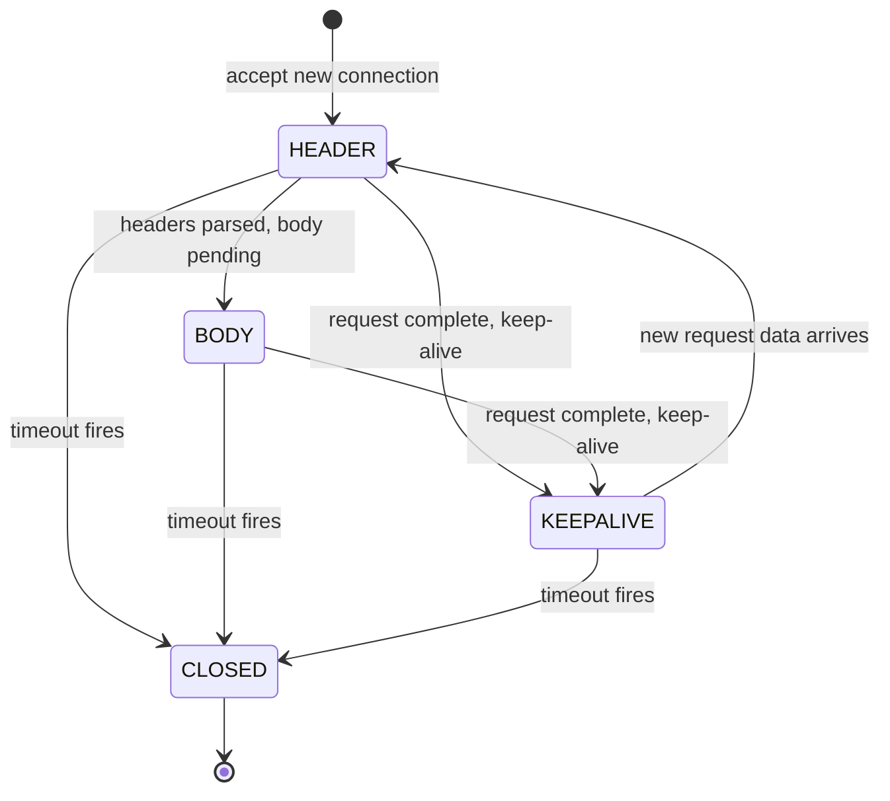
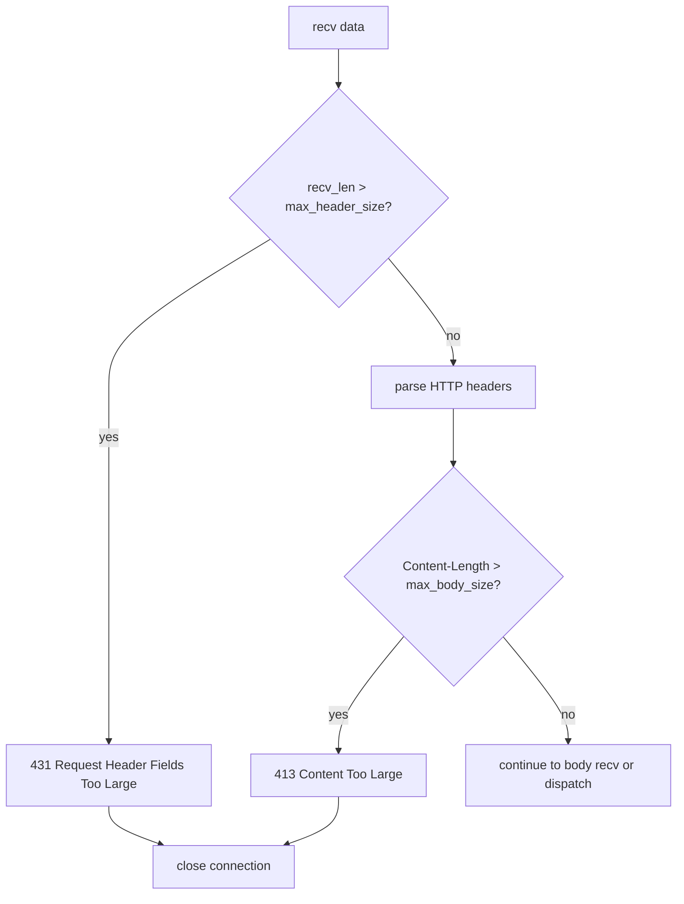
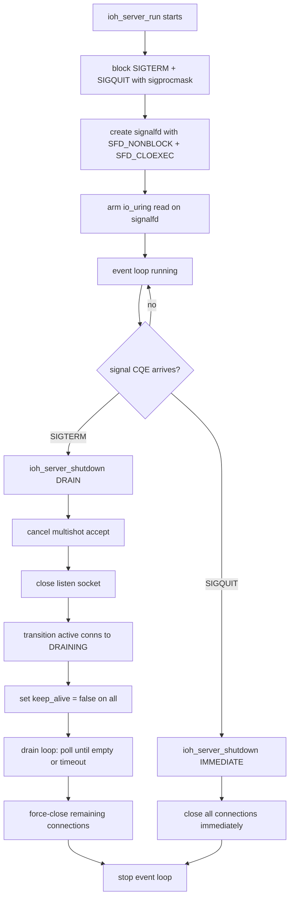
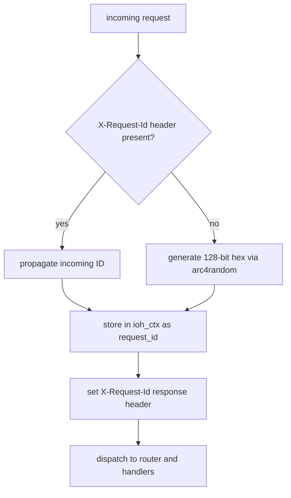
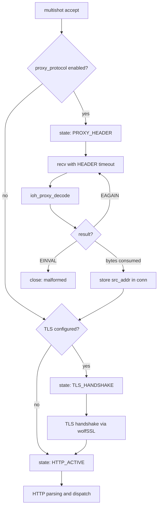
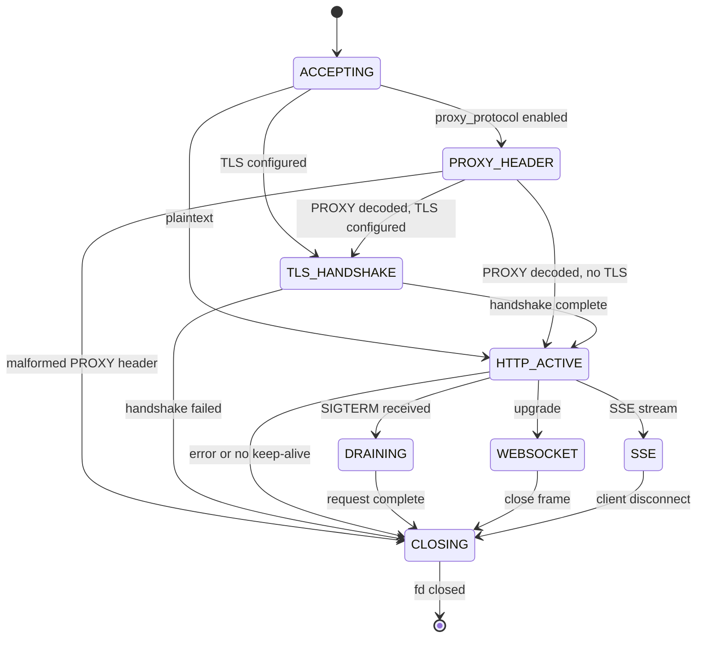
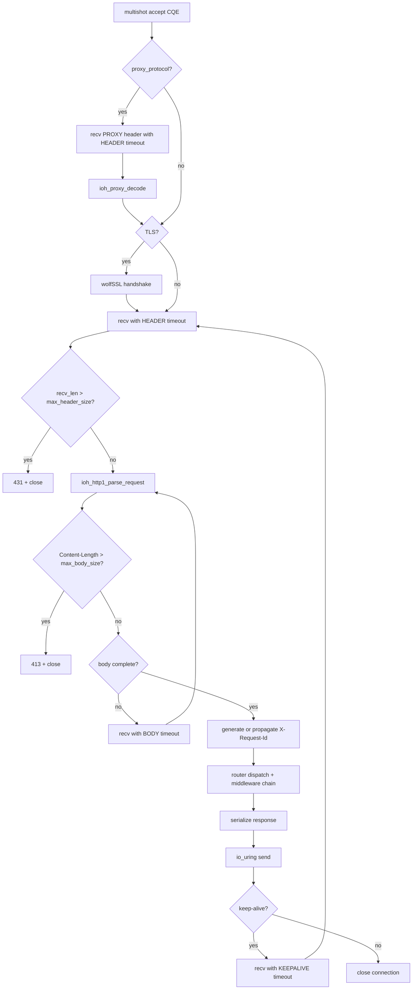

# Спринт 12: Подготовка к продакшену

Спринт 12 iohttp вводит шесть функций для подготовки к продакшену, которые закрывают
разрыв между функциональным HTTP-сервером и сервером, готовым к развёртыванию за
балансировщиком нагрузки в реальной среде. Каждая функция построена на событийном цикле
io_uring -- сигналы читаются через `signalfd`, таймауты используют
`IORING_OP_LINK_TIMEOUT`, а декодирование PROXY protocol интегрировано непосредственно
в конвейер accept-recv. Никаких потоков, блокирующих вызовов и epoll-фоллбэка.

---

## Содержание

1. [Связанные таймауты](#1-связанные-таймауты)
2. [Ограничения запросов](#2-ограничения-запросов)
3. [Обработка сигналов](#3-обработка-сигналов)
4. [Структурированное логирование](#4-структурированное-логирование)
5. [Идентификатор запроса](#5-идентификатор-запроса)
6. [PROXY Protocol](#6-proxy-protocol)
7. [Тестирование](#7-тестирование)
8. [Заметки по миграции](#8-заметки-по-миграции)

---

## 1. Связанные таймауты

### Назначение

Каждый `IORING_OP_RECV`, отправляемый сервером, связывается с SQE
`IORING_OP_LINK_TIMEOUT`. Если recv не завершится в пределах дедлайна, ядро
автоматически отменяет его и доставляет CQE таймаута. Это устраняет slowloris-атаки,
зависшие соединения и накопление простаивающих подключений без какого-либо управления
таймерами в пользовательском пространстве.

### Принцип работы

Таймауты сопровождают соединение через три фазы. Каждая фаза устанавливает свой
дедлайн, соответствующий ожидаемой скорости передачи данных:

| Фаза | Перечисление | По умолчанию | Назначение |
|------|-------------|-------------|------------|
| HEADER | `IOH_TIMEOUT_HEADER` | 30 с | Время на получение полных HTTP-заголовков |
| BODY | `IOH_TIMEOUT_BODY` | 60 с | Время на получение полного тела запроса |
| KEEPALIVE | `IOH_TIMEOUT_KEEPALIVE` | 65 с | Время простоя между конвейерными запросами |

Фаза таймаута переключается автоматически по мере обработки запроса:

1. Новое соединение начинается в фазе `IOH_TIMEOUT_HEADER`
2. Когда заголовки разобраны, но тело ещё не получено, происходит переход в `IOH_TIMEOUT_BODY`
3. После отправки ответа на keep-alive соединении происходит переход в `IOH_TIMEOUT_KEEPALIVE`
4. При поступлении следующего запроса фаза сбрасывается на `IOH_TIMEOUT_HEADER`



### Внутреннее устройство связывания SQE

Каждый вызов `arm_recv()` порождает один или два SQE в зависимости от того, активна ли
фаза таймаута:

```
SQE 1: IORING_OP_RECV (flags |= IOSQE_IO_LINK)
SQE 2: IORING_OP_LINK_TIMEOUT (timeout_ts = phase duration)
```

Если recv завершается раньше таймаута, ядро доставляет:
- CQE recv с `res > 0` (данные получены)
- CQE таймаута с `res = -ECANCELED` (таймаут был отменён)

Если таймаут срабатывает первым:
- CQE таймаута с `res = -ETIME`
- CQE recv с `res = -ECANCELED` (recv был отменён)

> [!IMPORTANT]
> Поле `timeout_ts` находится в `ioh_conn_t` (не на стеке), потому что ядро читает его
> асинхронно. Структура timespec должна существовать дольше, чем отправка SQE.

### Конфигурация

| Параметр | Поле | По умолчанию | Единица |
|----------|------|-------------|---------|
| Таймаут заголовков | `ioh_server_config_t.header_timeout_ms` | 30000 | мс |
| Таймаут тела | `ioh_server_config_t.body_timeout_ms` | 60000 | мс |
| Таймаут keep-alive | `ioh_server_config_t.keepalive_timeout_ms` | 65000 | мс |

<details>
<summary>Пример: настройка агрессивных таймаутов для API-шлюза</summary>

```c
ioh_server_config_t cfg;
ioh_server_config_init(&cfg);
cfg.listen_port = 8080;
cfg.header_timeout_ms  = 5000;   /* 5s for headers */
cfg.body_timeout_ms    = 15000;  /* 15s for body */
cfg.keepalive_timeout_ms = 10000; /* 10s idle */
```

</details>

---

## 2. Ограничения запросов

### Назначение

Сервер применяет жёсткие ограничения на размер заголовков и тела запроса, отклоняя
чрезмерно большие запросы с соответствующим HTTP-кодом состояния до вызова обработчика
приложения. Это предотвращает исчерпание памяти из-за вредоносных или неправильно
настроенных клиентов.

### Точки проверки

| Проверка | Момент срабатывания | Код состояния | Ответ |
|----------|---------------------|---------------|-------|
| Размер заголовков | После recv, до разбора HTTP | **431** Request Header Fields Too Large | Соединение закрывается после ответа |
| Размер тела | После разбора заголовков, до recv тела | **413** Content Too Large | Соединение закрывается после ответа |

Проверка размера заголовков сравнивает общее количество полученных байт с
`max_header_size`. Это срабатывает до запуска HTTP-парсера, поэтому некорректные
чрезмерно большие запросы отклоняются без траты CPU на разбор.

Проверка размера тела анализирует значение разобранного заголовка `Content-Length`
относительно `max_body_size`. Если объявленное тело превышает лимит, сервер отклоняет
запрос немедленно, не дожидаясь поступления данных тела.



### Конфигурация

| Параметр | Поле | По умолчанию | Единица |
|----------|------|-------------|---------|
| Макс. размер заголовков | `ioh_server_config_t.max_header_size` | 8192 | байт |
| Макс. размер тела | `ioh_server_config_t.max_body_size` | 1048576 | байт |

> [!NOTE]
> Ограничение `max_header_size` охватывает всю строку HTTP-запроса плюс все заголовки.
> Значение по умолчанию 8 КиБ соответствует общепринятой отраслевой практике (nginx по
> умолчанию, AWS ALB). Значение `max_body_size` по умолчанию 1 МиБ намеренно
> консервативно -- увеличьте его для эндпоинтов загрузки файлов.

<details>
<summary>Пример: эндпоинт загрузки больших файлов</summary>

```c
ioh_server_config_t cfg;
ioh_server_config_init(&cfg);
cfg.listen_port = 8080;
cfg.max_header_size = 16384;       /* 16 KiB headers */
cfg.max_body_size   = 104857600;   /* 100 MiB uploads */
```

</details>

---

## 3. Обработка сигналов

### Назначение

Сервер обрабатывает `SIGTERM` и `SIGQUIT` через `signalfd`, интегрированный в
событийный цикл io_uring. Никаких обработчиков сигналов, никаких флагов
`volatile sig_atomic_t`, никаких гонок. Сигналы доставляются как обычные CQE наравне
с сетевым вводом-выводом.

| Сигнал | Действие | Режим завершения |
|--------|----------|-----------------|
| `SIGTERM` | Плавное завершение (drain) | `IOH_SHUTDOWN_DRAIN` |
| `SIGQUIT` | Немедленное закрытие | `IOH_SHUTDOWN_IMMEDIATE` |

### Принцип работы



### Последовательность плавного завершения (SIGTERM)

1. Прекратить приём новых соединений (отменить multishot accept, закрыть listen fd)
2. Перевести все соединения `IOH_CONN_HTTP_ACTIVE` в состояние `IOH_CONN_DRAINING`
3. Установить `keep_alive = false` на всех соединениях -- текущие запросы завершаются,
   но соединения закрываются после текущего ответа
4. Запустить цикл опроса каждые 50 мс до тех пор, пока все соединения не закроются
   или не истечёт таймаут
5. Принудительно закрыть все оставшиеся соединения после истечения таймаута

### Немедленное завершение (SIGQUIT)

Все соединения закрываются синхронно. TLS-контексты уничтожаются, файловые дескрипторы
закрываются, слоты пула освобождаются за один проход.

### Конфигурация

Таймаут фазы drain использует `keepalive_timeout_ms` из конфигурации сервера
(по умолчанию 65 с). Это гарантирует, что фаза drain ожидает достаточно долго для
завершения текущего цикла запрос-ответ на keep-alive соединениях.

> [!CAUTION]
> `signalfd` создаётся внутри `ioh_server_run()`. Если вы используете
> `ioh_server_run_once()` в собственном событийном цикле, вы должны обрабатывать
> сигналы самостоятельно. Настройка signalfd применяется только к блокирующей точке
> входа `ioh_server_run()`.

<details>
<summary>Пример: интеграция с оркестратором контейнеров</summary>

Kubernetes отправляет `SIGTERM` перед завершением пода. С таймаутом по умолчанию
сервер имеет 65 секунд на завершение текущих запросов перед принудительным закрытием:

```c
ioh_server_config_t cfg;
ioh_server_config_init(&cfg);
cfg.listen_port = 8080;
cfg.keepalive_timeout_ms = 30000; /* 30s drain matches k8s default */

ioh_server_t *srv = ioh_server_create(&cfg);
/* ... configure router, TLS ... */

/* Blocks until SIGTERM/SIGQUIT or ioh_server_stop() */
int rc = ioh_server_run(srv);
ioh_server_destroy(srv);
```

</details>

---

## 4. Структурированное логирование

### Назначение

Модуль `ioh_log` предоставляет логирование с фильтрацией по уровням, тегами модулей
и подключаемыми обратными вызовами для вывода. Все внутренние сообщения сервера
(accept, таймаут, завершение, ошибки) используют этот модуль. Код приложения может
использовать тот же API для единообразного вывода.

### Уровни логирования

| Уровень | Перечисление | Числовое значение | Применение |
|---------|-------------|-------------------|------------|
| ERROR | `IOH_LOG_ERROR` | 0 | Невосстановимые сбои, исчерпание ресурсов |
| WARN | `IOH_LOG_WARN` | 1 | Отклонённые запросы, переполнение пула, некорректный ввод |
| INFO | `IOH_LOG_INFO` | 2 | Запуск/остановка сервера, адрес прослушивания, завершение |
| DEBUG | `IOH_LOG_DEBUG` | 3 | События по соединениям, декодирование PROXY, таймауты |

Сообщения ниже настроенного минимального уровня фильтруются до форматирования
(никаких затрат на `snprintf` для подавленных сообщений).

### API

```c
/* Set minimum level (default: IOH_LOG_INFO) */
ioh_log_set_level(IOH_LOG_DEBUG);

/* Query current level */
ioh_log_level_t level = ioh_log_get_level();

/* Direct API */
ioh_log(IOH_LOG_INFO, "mymodule", "request %s %s", method, path);

/* Convenience macros */
IOH_LOG_ERROR("tls", "handshake failed: %s", ioh_tls_error_str(rc));
IOH_LOG_WARN("server", "pool full, rejecting fd=%d", client_fd);
IOH_LOG_INFO("server", "listening on %s:%u", addr, port);
IOH_LOG_DEBUG("server", "conn %u: timeout, closing", conn_id);
```

### Пользовательские обработчики вывода

Обработчик по умолчанию пишет в stderr. Замените его пользовательским обратным вызовом
для JSON-логирования, syslog, файлового вывода или интеграции с конвейером
наблюдаемости:

```c
void json_sink(ioh_log_level_t level,
               const char *module,
               const char *message,
               void *user_data)
{
    FILE *f = (FILE *)user_data;
    fprintf(f,
        "{\"level\":\"%s\",\"module\":\"%s\","
        "\"msg\":\"%s\"}\n",
        ioh_log_level_name(level), module, message);
}

/* Install custom sink */
ioh_log_set_sink(json_sink, stderr);

/* Revert to default stderr output */
ioh_log_set_sink(nullptr, nullptr);
```

> [!NOTE]
> Обратный вызов получает полностью отформатированную строку сообщения. Параметр
> `module` идентифицирует подсистему (например, `"server"`, `"tls"`, `"router"`) и
> может использоваться для фильтрации или маршрутизации в реализации обработчика.

---

## 5. Идентификатор запроса

### Назначение

Каждый HTTP-запрос получает уникальный заголовок `X-Request-Id` в ответе. Если клиент
отправляет заголовок `X-Request-Id`, сервер передаёт его без изменений. Если
идентификатор отсутствует, сервер генерирует 128-битную шестнадцатеричную строку
с помощью `arc4random()`.

### Принцип работы



### Формат идентификатора

Генерируемые идентификаторы состоят из 32 шестнадцатеричных символов (128 бит),
полученных четырьмя вызовами `arc4random()`:

```
X-Request-Id: a1b2c3d4e5f6a7b8c9d0e1f2a3b4c5d6
```

Идентификатор выделяется из арены текущего запроса (`ioh_ctx_sprintf`), поэтому
автоматически освобождается при уничтожении контекста запроса.

### Доступ к идентификатору запроса

Внутри обработчика или middleware получите идентификатор из хранилища ключ-значение
контекста:

```c
int my_handler(ioh_ctx_t *c)
{
    const char *rid = ioh_ctx_get(c, "request_id");
    IOH_LOG_INFO("handler", "[%s] processing request", rid);

    return ioh_ctx_json(c, 200, "{\"status\":\"ok\"}");
}
```

> [!WARNING]
> При передаче входящего `X-Request-Id` сервер не проверяет его формат или длину.
> Если вам необходимо обеспечить определённый формат (например, UUID), добавьте
> валидацию в middleware до того, как запрос достигнет ваших обработчиков.

---

## 6. PROXY Protocol

### Назначение

При развёртывании за балансировщиком нагрузки (HAProxy, AWS NLB, GCP ILB) сервер
может декодировать заголовки PROXY protocol v1 (текстовый) и v2 (бинарный) для
извлечения реального IP-адреса и порта клиента. Это интегрировано непосредственно
в конвейер приёма соединений.

### Интеграция в конвейер

Декодирование PROXY protocol происходит как первый шаг после accept, до TLS-рукопожатия
и разбора HTTP:



### Поддержка протоколов

| Версия | Формат | Макс. длина | Обнаружение |
|--------|--------|-------------|-------------|
| v1 | Текст: `PROXY TCP4 src dst sport dport\r\n` | 108 байт | Начинается с `PROXY ` |
| v2 | Бинарный: 12-байтная сигнатура + заголовок + адреса | 16+ байт | 12-байтная магическая сигнатура |

Декодер возвращает:
- `> 0`: количество потреблённых байт (заголовок полностью декодирован)
- `-EAGAIN`: неполный заголовок, нужно больше данных
- `-EINVAL`: некорректный заголовок
- `-ENOSPC`: неизвестная версия протокола

### Результат декодирования

```c
typedef struct {
    uint8_t version;                   /* 1 or 2 */
    bool is_local;                     /* LOCAL command (health check) */
    uint8_t family;                    /* AF_INET or AF_INET6 */
    struct sockaddr_storage src_addr;  /* real client address */
    struct sockaddr_storage dst_addr;  /* original destination */
} ioh_proxy_result_t;
```

Поле `src_addr` сохраняется в `ioh_conn_t.proxy_addr`, а `proxy_used` устанавливается
в `true`. Последующие middleware и обработчики могут проверять `proxy_used` для
определения, использовать ли `proxy_addr` или `peer_addr` в качестве IP клиента.

### Конфигурация

| Параметр | Поле | По умолчанию |
|----------|------|-------------|
| Включить PROXY protocol | `ioh_server_config_t.proxy_protocol` | `false` |

> [!CAUTION]
> PROXY protocol работает **только в явном режиме**. При включении сервер ожидает
> PROXY-заголовок на каждом соединении данного слушателя. Автоопределение отсутствует.
> Смешивание PROXY и не-PROXY клиентов на одном слушателе является угрозой
> безопасности -- вредоносный клиент может подделать любой IP-адрес источника, отправив
> сфабрикованный PROXY-заголовок. Включайте эту опцию только на слушателях, которые
> принимают трафик исключительно от доверенных прокси.

<details>
<summary>Пример: HAProxy к iohttp с PROXY v2</summary>

Конфигурация HAProxy:

```
backend iohttp_servers
    server s1 10.0.0.5:8080 send-proxy-v2
```

Конфигурация iohttp:

```c
ioh_server_config_t cfg;
ioh_server_config_init(&cfg);
cfg.listen_port = 8080;
cfg.proxy_protocol = true;

ioh_server_t *srv = ioh_server_create(&cfg);
```

</details>

---

## 7. Тестирование

### Модульные тесты

Все функции спринта 12 имеют модульные тесты на основе Unity в `tests/unit/`:

| Функция | Файл теста | Ключевые тест-кейсы |
|---------|-----------|---------------------|
| Связанные таймауты | `test_ioh_server.c` | Переходы фаз таймаутов, обработка CQE для `-ECANCELED` и `-ETIME` |
| Ограничения запросов | `test_ioh_server.c` | 431 при превышении заголовков, 413 при превышении тела |
| Обработка сигналов | `test_ioh_server.c` | Drain по SIGTERM, немедленное завершение по SIGQUIT, жизненный цикл signalfd |
| Структурированное логирование | `test_ioh_log.c` | Фильтрация по уровням, пользовательский обработчик, строки названий уровней |
| Идентификатор запроса | `test_ioh_server.c` | Формат генерации, передача входящего ID, выделение из арены |
| PROXY protocol | `test_ioh_proxy_proto.c` | Декодирование v1, декодирование v2, неполные данные, некорректный ввод |

### Интеграционные тесты

`tests/integration/test_tls_pipeline.c` проверяет полный конвейер
accept-PROXY-TLS-HTTP с активными связанными таймаутами.

### Запуск тестов

```bash
# Inside the dev container
cmake --preset clang-debug
cmake --build --preset clang-debug
ctest --preset clang-debug

# With sanitizers (recommended)
cmake --preset clang-debug \
  -DCMAKE_C_FLAGS="-fsanitize=address,undefined"
cmake --build --preset clang-debug
ctest --preset clang-debug
```

### Проверка поведения таймаутов

Для проверки связанных таймаутов на работающем сервере подключитесь с помощью `nc`
и убедитесь, что соединение закрывается после истечения таймаута заголовков:

```bash
# Connect but send nothing -- should timeout after header_timeout_ms
nc -v localhost 8080
# ... connection closed after 30s (default header timeout)
```

---

## 8. Заметки по миграции

### Обновление с спринта 11

Спринт 12 обратно совместим. Все новые поля конфигурации имеют разумные значения
по умолчанию, устанавливаемые `ioh_server_config_init()`. Существующий код, вызывающий
`ioh_server_config_init()` перед настройкой полей, автоматически получит новые значения
по умолчанию.

**Нет критических изменений.** Ниже перечислены только новые дополнения:

| Изменение | Влияние |
|-----------|---------|
| `ioh_server_config_t` получает `header_timeout_ms`, `body_timeout_ms`, `keepalive_timeout_ms` | Значения по умолчанию задаются `ioh_server_config_init()` |
| `ioh_server_config_t` получает `max_header_size`, `max_body_size` | По умолчанию: 8 КиБ / 1 МиБ |
| `ioh_server_config_t` получает `proxy_protocol` | По умолчанию: `false` (отключено) |
| `ioh_conn_t` получает `timeout_phase`, `timeout_ts`, `proxy_addr`, `proxy_used` | Внутренние поля, не являются частью публичного API |
| Добавлен API `ioh_log_*` | Опционально -- сервер использует его внутренне, приложения могут адаптировать |
| Заголовок `X-Request-Id` добавляется во все ответы | Клиенты могут обнаружить новый заголовок |

> [!NOTE]
> Если ваше приложение уже устанавливает `X-Request-Id` в middleware или обработчике,
> сгенерированный сервером идентификатор будет перезаписан вашим значением при
> сериализации ответа (побеждает последний вызов `ioh_response_set_header`). Чтобы
> сохранить сгенерированный сервером идентификатор, проверяйте его наличие перед
> установкой собственного.

### Машина состояний соединения (полная)

Полная машина состояний соединения с дополнениями спринта 12:



### Конвейер обработки запросов (полный)


