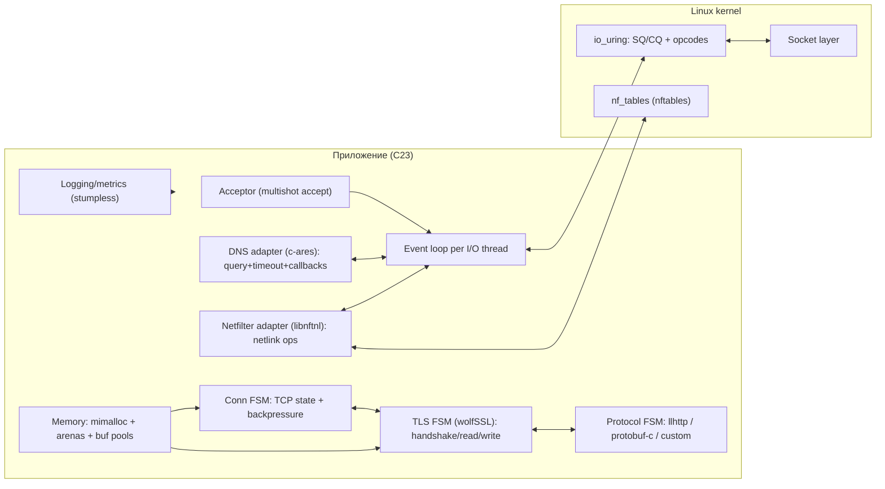
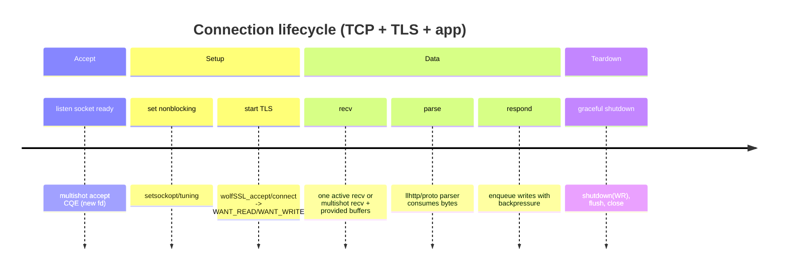
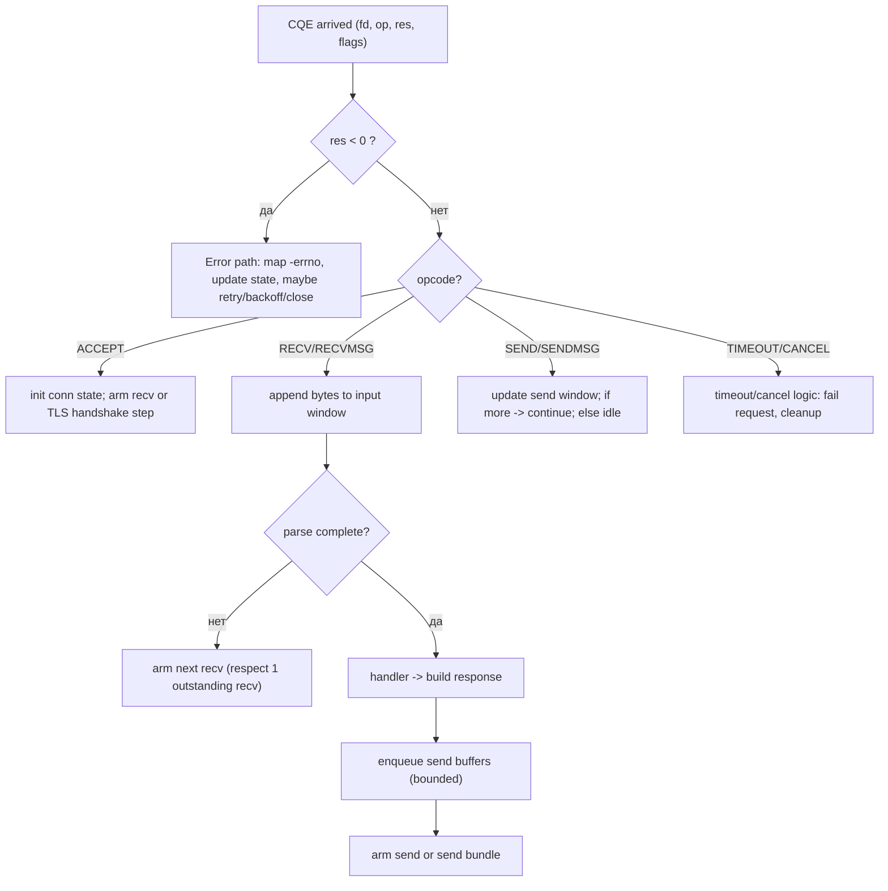

# Разработка сетевого стека на modern C23 для Linux с io_uring и liburing 2.14

## Executive summary

Этот документ — строгое техническое исследование практики построения высокопроизводительного сетевого стека (TCP/UDP + sockets + accept/connect + TLS (wolfSSL) + DNS (c-ares) + nftables (libnftnl)) на Linux с использованием **io_uring** (через **liburing 2.14**) и современного **C23** под **Clang 22.1.0**. В фокусе — архитектурные паттерны (reactor/proactor/hybrid), корректная работа с SQE/CQE, управление буферами и памятью, backpressure, timeouts/cancellation, многопоточность и безопасность. citeturn6search25turn7view0turn20view2turn21view1turn22search7

Ключевое проектное решение: **io_uring — это естественный “proactor” (completion-driven) механизм**, но для сетевого сервера/клиента чаще всего оптимален **гибрид**: proactor на “горячем пути” I/O + локальные реакторные/состоянийные машины для протоколов и TLS, плюс адаптеры для библиотек (wolfSSL/c-ares), которым нужно “подкачать” данные или дождаться готовности. На практике именно гибрид упрощает корректность (особенно жизненный цикл буферов и сериализацию операций на сокете) и даёт устойчивую производительность. citeturn15search6turn7view0turn22search2turn22search1

Для **сетевых** операций в io_uring важно учитывать ограничение порядка: на одном TCP-сокете **в общем случае небезопасно** держать несколько одновременных outstanding send’ов или outstanding recv’ов (направления независимы), т.к. ядро может переупорядочивать исполнение при внутренних poll/back-end механизмах. Это напрямую влияет на дизайн очередей отправки, на “один активный recv на соединение”, на необходимость `IOSQE_IO_LINK`, либо (в новых ядрах) на использование специализированных возможностей вроде multishot и send/recv bundles. citeturn15search6turn11view0turn23view0turn15search2

Рекомендуемая “минимальная” линия ядра (если цель — современный networking-набор io_uring): **Linux ≥ 6.1 LTS** как практический базис, потому что `IORING_SETUP_DEFER_TASKRUN` (важная штука для предсказуемой латентности и батчинга completion-work) доступен начиная с 6.1. При этом longterm-линейки на kernel.org на дату документа включают 6.18/6.12/6.6/6.1 и др.; выбор зависит от того, какие “фичи-пики” вы хотите (например, `IORING_OP_BIND/LISTEN` появились с 6.11, а `IORING_OP_RECV_ZC` — с 6.15). citeturn20view2turn23view2turn16view0turn27view1turn27view0

Что **не указано** во входных требованиях и влияет на итоговую архитектуру/тюнинг: целевая минимальная версия ядра, целевые p99/p999 latency и RPS/QPS, тип нагрузки (мелкие сообщения vs стриминг), число ядер/NUMA, модель конкуренции (один процесс/несколько), требования к наблюдаемости/трейсингу. В документе ниже даются варианты и точки выбора. citeturn27view1turn15search6turn20view2turn23view2turn16view0

## Оглавление

- [Executive summary](#executive-summary)
- [Контекст, стек и предпосылки](#контекст-стек-и-предпосылки)
- [Архитектура и паттерны сетевого стека поверх io_uring](#архитектура-и-паттерны-сетевого-стека-поверх-io_uring)
- [Практика io_uring для сети: операции, буферы, кодовые шаблоны](#практика-io_uring-для-сети-операции-буферы-кодовые-шаблоны)
- [Надёжность, безопасность, тестирование и CI](#надёжность-безопасность-тестирование-и-ci)
- [Производительность и совместимость: тюнинг, fallbacks, матрица версий](#производительность-и-совместимость-тюнинг-fallbacks-матрица-версий)
- [Источники](#источники)

## Контекст, стек и предпосылки

Технологический стек (версии заданы вами; ниже — их релевантность к теме):

| Компонент (версия)               |       Роль в теме io_uring + сеть | Критичность | Комментарий                                                                                                                                        |
| -------------------------------- | --------------------------------: | ----------: | -------------------------------------------------------------------------------------------------------------------------------------------------- |
| **liburing 2.14**                | Основной userspace API к io_uring | **Высокая** | liburing — официальный “helper” слой; 2.14 — актуальный релиз на начало 2026. citeturn6search25turn26search1                                   |
| **Linux kernel**                 | Реализует opcodes/флаги/поведение | **Высокая** | Фичи сильно зависят от версии ядра; longterm-линейки перечислены на kernel.org. citeturn27view1turn27view0                                     |
| **Clang 22.1.0**                 | Компилятор, UB-sanitizers, анализ | **Высокая** | `-std=c23` доступен в Clang 18+; Clang 22 подходит. citeturn21search1turn21search4                                                             |
| **CMake 4.2.3**                  |       Сборка/опции/санитайзеры/CI |     Средняя | Важен как механизм воспроизводимой сборки, но не “ядро” io_uring темы.                                                                             |
| **wolfSSL 5.8.2**                |                    TLS поверх TCP | **Высокая** | Требует неблокирующего state-machine подхода: WANT_READ/WANT_WRITE — “не ошибка” на nonblocking. citeturn22search2turn22search18turn22search6 |
| **Wolfsentry 1.6.2**             |  Политики/фильтрация/безопасность |     Средняя | Полезно вокруг TLS/conn policy, но не обязательно для io_uring.                                                                                    |
| **c-ares 1.34.6**                |                   Асинхронный DNS | **Высокая** | Имеет интерфейсы интеграции в event-loop (`ares_process_fds`, callbacks, timeouts). citeturn22search0turn22search1turn22search17              |
| **libnftnl 1.3.1**               |       nftables/netlink управление |     Средняя | Интегрируется через netlink-сокеты; io_uring умеет `sendmsg/recvmsg` (>=5.3). citeturn22search7turn22search3turn23view0                       |
| **Unity/CMock/Ceedling**         |          Unit/integration тесты C |     Высокая | Критично для качества, особенно при большом количестве состояний и backpressure.                                                                   |
| **mimalloc 3.2.8**               |                         Аллокатор |     Средняя | Полезен для снижения фрагментации/latency, но аккуратно с pin/registered buffers.                                                                  |
| **llhttp 9.3.1**                 |                       HTTP parser |     Средняя | Не про io_uring, но про протокольный слой и нагрузку.                                                                                              |
| **yyjson 0.12.0 / cJSON 1.7.19** |                              JSON |      Низкая | Не влияет на io_uring, но влияет на CPU и аллокации.                                                                                               |
| **SQLite 3520000 (2026)**        |                         Хранилище |      Низкая | В сеть/uring напрямую не входит; важно не блокировать event loop.                                                                                  |
| **protobuf-c 1.5.2**             |                      Сериализация |      Низкая | Аналогично JSON: CPU/аллокации, не uring-напрямую.                                                                                                 |
| **stumpless 2.2.0**              |                       Логирование |      Низкая | Важно: не блокировать на I/O логов; выделить отдельный путь.                                                                                       |
| **Doxygen 1.16.1**               |                      Документация |      Низкая | Для инженерной дисциплины, не для uring performance.                                                                                               |

Предпосылки/ограничения:

- **Целевая минимальная версия ядра — не указано.** Далее предлагаются профили: “совместимость”, “баланс”, “максимум фич”. При выборе нужно учитывать, что многие сетевые opcodes/флаги появились в 5.5–6.15+ (например, `IORING_OP_SEND_ZC` доступен с 6.0, `IORING_OP_RECV_ZC` — с 6.15, `IORING_OP_BIND/LISTEN` — с 6.11). citeturn8view1turn16view0turn23view2turn27view1
- **Целевая нагрузка/латентность — не указано.** Это влияет на: стратегию батчинга SQE, size ring’ов, `SQPOLL`/taskrun-моды, политику буферов (fixed vs provided-buf-ring), подход к zero-copy (send_zc / splice / ZC Rx). citeturn20view2turn10view0turn13view0turn14view0turn8view1
- **Режим языка:** вы хотите **modern C23**. Clang официально поддерживает режим C23 через `-std=c23` (доступен начиная с Clang 18), а также сохраняет `-std=c2x`. Для C23 характерно значение `__STDC_VERSION__ == 202311L` и появление `nullptr` как нулевой константы указателя (с типом `nullptr_t`) — это полезно для снижения неоднозначностей вокруг `NULL`. citeturn21search1turn21search18turn21search5

## Архитектура и паттерны сетевого стека поверх io_uring

Сетевой стек поверх io_uring почти неизбежно становится системой из многих state machines: соединение (TCP), TLS, прикладной протокол (например, HTTP), DNS-запросы и управляющие netlink-операции. io_uring хорошо подходит для того, чтобы в “горячем пути” не делать лишних syscalls, но требует дисциплины по очередям и владению памятью. citeturn15search6turn7view0turn20view2turn22search1

Таблица сравнения паттернов:

| Паттерн      | Как выглядит в Linux                                     |                      Latency |      Throughput |       Сложность | Когда выбирать                                                  |
| ------------ | -------------------------------------------------------- | ---------------------------: | --------------: | --------------: | --------------------------------------------------------------- |
| **Reactor**  | `epoll`/`poll` + nonblocking `recv/send`                 |                      Средняя | Средняя/высокая |         Средняя | Нужен простой portability/fallback, много готовых интеграций    |
| **Proactor** | io_uring: submit “операцию”, ждать CQE                   | Низкая (при хорошем тюнинге) |         Высокая |         Высокая | Цель — максимум syscalls amortization + контроль буферов        |
| **Hybrid**   | io_uring для I/O + state machines/адаптеры для библиотек |               Низкая/средняя |         Высокая | Средняя/высокая | Практический “sweet spot” для TLS/DNS/протоколов и корректности |

Архитектурная схема (пример целевого дизайна — один из “хороших” вариантів):



Жизненный цикл соединения (упрощённый timeline):



Flowchart обработки запроса (пример):



Интеграция TLS (wolfSSL) и DNS (c-ares) — принцип:

- **wolfSSL** (как и OpenSSL-подобные библиотеки) работает как state machine: операции чтения/записи/handshake могут вернуть “нужно больше данных” или “нужно дождаться возможности записать”. В wolfSSL это выражается кодами ошибок уровня WANT_READ/WANT_WRITE; в nonblocking режиме это ожидаемо и не является “фатальной ошибкой”. Значит, I/O слой должен уметь: (1) попытаться сделать шаг TLS, (2) если нужен read/write — поставить соответствующую uring-операцию (recv/send/poll_first), (3) по CQE возобновить TLS шаг. citeturn22search2turn22search18turn23view0turn9view0
- **c-ares** спроектирован для интеграции в event-loop: новые интеграторы должны использовать `ares_process_fds`, а не select-based старые интерфейсы; таймауты вычисляются через `ares_timeout`, а уведомления о том, какие сокеты и какие события ждать, могут строиться через callback-ориентированные примеры/мануалы. Это хорошо ложится на io_uring через `IORING_OP_POLL_ADD` или через моделирование readiness. citeturn22search1turn22search17turn22search0turn7view1
- **libnftnl** — userspace библиотека для netlink API nf_tables; операции выполняются через netlink-сокеты, что технически позволяет обслуживать их тем же I/O механизмом, что и прочие сокеты (`sendmsg/recvmsg`). citeturn22search7turn22search3turn23view0

## Практика io_uring для сети: операции, буферы, кодовые шаблоны

### Базовая модель SQE→CQE и правила обработки ошибок

- io_uring возвращает результаты через CQE, и **errno не используется** для передачи ошибок: `cqe->res` содержит либо положительный/нулевой результат, либо **`-errno`**. Это относится и к сетевым операциям, и к splice/прочим. Любой обработчик CQE должен считать `res < 0` обязательной веткой, иначе вы “теряете” ошибки и создаёте бесконечные ретраи/утечки. citeturn15search6turn3view3turn7view0
- Для multishot-операций требуется смотреть `cqe->flags` (например, `IORING_CQE_F_MORE`), чтобы понимать, будут ли ещё CQE от той же “постановки”. citeturn4view3turn7view1turn1view3

### Полезные типы SQE для сетевого стека и важные модификаторы

Таблица (ядро → “минимум”, где явно задокументировано):

| Назначение           | io_uring opcode/prepare                             |   Минимальное ядро | Ключевые замечания                                                                                  |
| -------------------- | --------------------------------------------------- | -----------------: | --------------------------------------------------------------------------------------------------- |
| accept               | `IORING_OP_ACCEPT` / `io_uring_prep_accept`         |                5.5 | Базовый accept4-эквивалент. citeturn7view3                                                       |
| multishot accept     | `io_uring_prep_multishot_accept`                    |               5.19 | Один SQE → много CQE; осторожно с `addr`/`addrlen` (перезапись). citeturn4view3                  |
| connect              | `IORING_OP_CONNECT`                                 |                5.5 | connect(2) эквивалент. citeturn12view0                                                           |
| recv/recvmsg         | `IORING_OP_RECV` / `IORING_OP_RECVMSG`              |          5.6 / 5.3 | Есть `IORING_RECVSEND_POLL_FIRST` для пустых сокетов. citeturn9view0turn23view0                 |
| multishot recv       | `io_uring_prep_recv_multishot`                      |                6.0 | Требует `IOSQE_BUFFER_SELECT`, length=0 и т.д. citeturn15search19turn1view3                     |
| send/sendmsg         | `IORING_OP_SEND` / `IORING_OP_SENDMSG`              |          5.6 / 5.3 | Для переполненного sendbuf — `IORING_RECVSEND_POLL_FIRST`. citeturn9view0turn23view0            |
| send_zc/sendmsg_zc   | `IORING_OP_SEND_ZC` / `IORING_OP_SENDMSG_ZC`        |          6.0 / 6.1 | Двойные CQE: completion + notification; буфер нельзя трогать до notif. citeturn8view1turn3view1 |
| provide buffers      | `IORING_OP_PROVIDE_BUFFERS` + `IOSQE_BUFFER_SELECT` |                5.7 | Буфер из пула “расходуется” и должен быть возвращён (re-provide). citeturn10view0turn11view1    |
| splice               | `IORING_OP_SPLICE` / `io_uring_prep_splice`         |                5.7 | Нужен pipe хотя бы с одной стороны; полезно для zero-copy pipeline. citeturn13view0turn3view3   |
| shutdown             | `IORING_OP_SHUTDOWN`                                |               5.11 | Для graceful shutdown соединений. citeturn12view3                                                |
| bind/listen          | `IORING_OP_BIND` / `IORING_OP_LISTEN`               |               6.11 | Позволяет полностью собрать listen-путь в uring. citeturn23view2                                 |
| msg ring             | `IORING_OP_MSG_RING`                                |               5.18 | Меж-ring сигнализация/передача сообщений. citeturn8view1                                         |
| cancel               | `IORING_OP_ASYNC_CANCEL`                            | 5.5 (см. страницу) | Отмена outstanding запросов по user_data. citeturn7view3                                         |
| timeout/link_timeout | `IORING_OP_TIMEOUT` / `IORING_OP_LINK_TIMEOUT`      |          5.4 / 5.5 | Основа для timeouts и cancellation policy. citeturn9view0turn12view0                            |
| ZC receive           | `IORING_OP_RECV_ZC`                                 |               6.15 | Требует регистрации ZC Rx IFQ; очень advanced. citeturn16view0turn14view0                       |

### Кодовые шаблоны на C23

Ниже — короткие, ориентировочно компилируемые фрагменты. Они не претендуют на полноту, но задают “стиль” API и ключевые контрольные точки.

#### Инициализация ring с учётом режима taskrun и single issuer

Важно: setup-флаги зависят от ядра. Например, `IORING_SETUP_COOP_TASKRUN` появился с 5.19, `IORING_SETUP_SINGLE_ISSUER` — с 6.0, `IORING_SETUP_DEFER_TASKRUN` — с 6.1. Это нужно учитывать как через профили ядра, так и через runtime-проверки/фоллбеки. citeturn20view0turn20view1turn20view2turn27view1

```c
// build: clang -std=c23 -O2 -Wall -Wextra -pedantic -D_GNU_SOURCE demo.c -luring
#include <errno.h>
#include <stdio.h>
#include <stdlib.h>
#include <string.h>
#include <liburing.h>

static void die(const char *msg, int err) {
    fprintf(stderr, "%s: %s\n", msg, strerror(err));
    exit(1);
}

int main(void) {
    enum { RING_ENTRIES = 4096 };

    struct io_uring ring;
    struct io_uring_params p;
    memset(&p, 0, sizeof(p));

    // Надёжный дефолт для networking-нагрузок на современных ядрах:
    // COOP_TASKRUN + TASKRUN_FLAG уменьшают "насильственные" прерывания userspace
    // и улучшают batching (если ядро поддерживает).
    p.flags |= IORING_SETUP_COOP_TASKRUN;     // >= 5.19
    p.flags |= IORING_SETUP_TASKRUN_FLAG;     // >= 5.19

    // SINGLE_ISSUER / DEFER_TASKRUN — ещё лучше для предсказуемости, но требуют >=6.0/6.1.
    // Здесь намеренно НЕ включаем без feature-gating: старое ядро вернёт -EINVAL.
    // p.flags |= IORING_SETUP_SINGLE_ISSUER;  // >= 6.0
    // p.flags |= IORING_SETUP_DEFER_TASKRUN;  // >= 6.1 (и требует SINGLE_ISSUER)

    int ret = io_uring_queue_init_params(RING_ENTRIES, &ring, &p);
    if (ret < 0) die("io_uring_queue_init_params failed", -ret);

    printf("io_uring ready: sq_entries=%u cq_entries=%u flags=0x%x\n",
           p.sq_entries, p.cq_entries, p.flags);

    io_uring_queue_exit(&ring);
    return 0;
}
```

Почему это важно для сети: без `COOP_TASKRUN` по умолчанию ядро может “дергать” userspace на completion, что ухудшает batching и иногда латентность; `DEFER_TASKRUN` позволяет _явно_ сказать “делай completion-work только тогда, когда я вошёл в `io_uring_enter(GETEVENTS)`”. citeturn20view0turn20view1turn20view2turn7view0

#### Multishot accept: один SQE на множество подключений

Multishot accept доступен с ядра 5.19; он генерирует CQE на каждое принятые соединение и выставляет `IORING_CQE_F_MORE`, пока продолжит работу. Важно учитывать риск перезаписи `sockaddr` (если вы используете `addr/addrlen`) как явно описано в manpage. citeturn4view3

```c
#include <liburing.h>
#include <sys/socket.h>
#include <netinet/in.h>
#include <stdint.h>

static inline uint64_t pack_ud(uint32_t type, uint32_t id) {
    return ((uint64_t)type << 32) | id;
}

enum ud_type { UD_ACCEPT = 1 };

void arm_multishot_accept(struct io_uring *ring, int listen_fd, uint32_t accept_id) {
    struct io_uring_sqe *sqe = io_uring_get_sqe(ring);
    // addr/addrlen можно передать, но для multishot часто лучше NULL, чтобы избежать перезаписи.
    io_uring_prep_multishot_accept(sqe, listen_fd, NULL, NULL, 0);
    io_uring_sqe_set_data64(sqe, pack_ud(UD_ACCEPT, accept_id));
}
```

При обработке CQE:

- `cqe->res` содержит новый fd при успехе, либо `-errno` при ошибке (errno не используется). citeturn15search6turn4view3
- `cqe->flags & IORING_CQE_F_MORE` означает, что accept продолжит выдавать CQE; если флаг не выставлен — нужно переустановить accept. citeturn4view3turn7view1

#### Provided buffers и multishot recv: базовый “buffer selection” путь

Классический механизм: `IORING_OP_PROVIDE_BUFFERS` (>=5.7) + `IOSQE_BUFFER_SELECT` позволяет ядру выбирать буфер из пула в момент, когда реально есть данные, снижая необходимость “держать” выделенный буфер на каждый pending recv. Но важно помнить: “выданный” буфер **уходит из пула** и должен быть возвращён (re-provide / через buffer ring API), иначе получите `-ENOBUFS`. citeturn10view0turn11view1turn10view1

```c
#include <liburing.h>
#include <stdint.h>

enum { BGID_RX = 7, BUF_SZ = 2048, BUF_COUNT = 4096 };

static unsigned char rx_pool[BUF_COUNT][BUF_SZ];

void provide_rx_buffers(struct io_uring *ring) {
    struct io_uring_sqe *sqe = io_uring_get_sqe(ring);
    io_uring_prep_provide_buffers(sqe,
        (void*)rx_pool,          // addr
        BUF_SZ,                  // len
        BUF_COUNT,               // nr
        BGID_RX,                 // bgid
        0                        // bid start
    );
    // completion придёт как CQE; ошибки — в cqe->res (-errno)
}

void arm_recv_multishot(struct io_uring *ring, int fd, uint64_t user_data) {
    struct io_uring_sqe *sqe = io_uring_get_sqe(ring);
    io_uring_prep_recv_multishot(sqe, fd, NULL, 0, 0); // length=0, buf=NULL обязателен для multishot
    sqe->flags |= IOSQE_BUFFER_SELECT;
    sqe->buf_group = BGID_RX;
    io_uring_sqe_set_data64(sqe, user_data);
}
```

Ключевые проверки при обработке CQE:

- Для buffer selection: при успехе, CQE содержит `IORING_CQE_F_BUFFER`, и в старших битах закодирован `bid` выбранного буфера; если буферов нет — `-ENOBUFS`. После обработки буфера его нужно вернуть в пул (в противном случае “съедите” весь пул и застопорите вход). citeturn11view1turn10view1turn10view0
- Для multishot recv: следите за `IORING_CQE_F_MORE`, иначе вы можете перестать получать данные, не переустановив recv. citeturn1view3turn7view1

Практически, для высоких нагрузок чаще удобнее перейти от “provide_buffers как SQE” к **ring-provided buffer rings** (`io_uring_setup_buf_ring` и друзья), потому что это упрощает возврат буферов и даёт более эффективный механизм пополнения. Базовая доступность `io_uring_setup_buf_ring` заявлена “Available since 5.19”. citeturn17search16turn17search30

#### Send и backpressure на сокете

`IORING_OP_SEND` (>=5.6) умеет внутренне “армировать poll и повторить send”, а флаг `IORING_RECVSEND_POLL_FIRST` позволяет пропустить первую (скорее всего бесполезную) попытку send, если вы ожидаете, что сокет часто “полон” — полезно при высоких нагрузках и больших очередях отправки. citeturn9view0turn23view0

```c
#include <liburing.h>
#include <stdint.h>

void arm_send(struct io_uring *ring, int fd, const void *buf, unsigned len, uint64_t user_data) {
    struct io_uring_sqe *sqe = io_uring_get_sqe(ring);
    io_uring_prep_send(sqe, fd, buf, len, 0);
    // Опционально:
    // sqe->ioprio |= IORING_RECVSEND_POLL_FIRST;
    io_uring_sqe_set_data64(sqe, user_data);
}
```

Важная дисциплина: из-за ограничений порядка на stream TCP сокете (см. предупреждения в io_uring(7)) безопаснее проектировать слой отправки как: “не более одного активного send на соединение”, остальные — в bounded очереди, и активировать следующий send только после CQE предыдущего. Альтернативы — `IOSQE_IO_LINK` или (на новых ядрах) send bundles, но в любом случае нельзя допускать перекрытия send-операций на одном сокете без строгой модели. citeturn15search6turn11view0turn15search2

#### Zero-copy send: время жизни буферов и notification CQE

`IORING_OP_SEND_ZC` (>=6.0) и `IORING_OP_SENDMSG_ZC` (>=6.1) дают zero-copy попытку для отправки, но критично меняют модель владения буфером: операция обычно создаёт **два CQE**, где второй — notification (`IORING_CQE_F_NOTIF`) и именно он сигнализирует, что память можно переиспользовать. Нельзя модифицировать/освобождать буфер до прихода notif; при этом zerocopy не гарантирован — возможен fallback на копирование или `-EOPNOTSUPP` для протоколов без поддержки. citeturn8view1turn3view1turn19view29

Это напрямую влияет на дизайн: zero-copy send требует или отдельного “pinned/immutable” буферного слоя, или refcount/epoch-механизма, или выдачи буферов из арены с задержанным возвратом.

#### ZC Rx (экстремальный путь): требования к NIC и режиму io_uring

В ядре описан механизм **io_uring zero copy Rx (ZC Rx)**, который убирает kernel→user copy на приёме и доставляет payload напрямую в userspace memory; при этом заголовки остаются в ядре и проходят обычный TCP stack. Однако этот путь требует NIC HW возможностей: header/data split, flow steering и RSS-разведение очередей; настройка сейчас предполагается “out-of-band” через ethtool. Документация также указывает обязательные setup-флаги io_uring (например, `IORING_SETUP_SINGLE_ISSUER`, `IORING_SETUP_DEFER_TASKRUN`, `IORING_SETUP_CQE32` или `IORING_SETUP_CQE_MIXED`). citeturn14view0turn14view1turn20view2

Со стороны io_uring, `IORING_OP_RECV_ZC` указан как доступный с **ядра 6.15** (в соответствующей manpage), и перед использованием требуется регистрация zero-copy RX interface queue. citeturn16view0turn14view0

Практический вывод: ZC Rx — опция только если у вас (а) высокий throughput, (б) подходящая NIC/драйвер/офлоады, (в) готовность сильно усложнить буферную модель и эксплуатацию.

## Надёжность, безопасность, тестирование и CI

### Надёжность: обработка ошибок, timeouts, cancellation, graceful shutdown

Строгие правила:

- Всегда интерпретируйте `cqe->res < 0` как `-errno` и обрабатывайте _каждый_ CQE, включая неожиданные ошибки, short reads/writes, `-ECANCELED`, `-ETIME` и т.д.; io_uring не ставит errno. citeturn15search6turn3view3turn7view0
- Timeouts и cancellation должны быть частью протокольного контракта:
  - `IORING_OP_TIMEOUT` (>=5.4) — таймер на CQ, может завершиться `-ETIME` или `-ECANCELED`. citeturn9view0
  - `IORING_OP_LINK_TIMEOUT` (>=5.5) — таймаут конкретного связанного запроса (через `IOSQE_IO_LINK`), в случае истечения пытается отменить связанный запрос. citeturn12view0turn11view0
  - `IORING_OP_ASYNC_CANCEL` — отмена outstanding запроса по `user_data`. citeturn7view3
- Для аккуратного закрытия соединения используйте `IORING_OP_SHUTDOWN` (>=5.11) как часть graceful shutdown (например: shutdown(SHUT_WR) → дочитать/дослать → close). citeturn12view3turn12view2

Backpressure:

- Запрещайте unbounded очереди в userspace: каждая сущность (соединение, DNS-запрос, upstream) должна иметь лимиты на in-flight и очередь; иначе вы получите латентностные “хвосты”, OOM и коллапс. Это особенно важно при batched submit, где легко разогнать внутреннюю очередь “быстрее, чем сеть”. citeturn15search6turn7view0turn27view1
- Отдельно контролируйте: (1) **SQ ring capacity**, (2) пул комплитов, (3) пул RX буферов, (4) пул TX буферов (особенно при send_zc).

### Безопасность: TLS, io_uring attack surface, sandboxing, capabilities

TLS (wolfSSL):

- Неблокирующие соединения требуют моделирования WANT_READ/WANT_WRITE как “сигнала продолжить позже”, а не как фатальной ошибки; это должно быть отражено в вашем TLS state machine, иначе вы получите ложные disconnect’ы или busy loops. citeturn22search2turn22search18turn22search6
- Внутренняя ошибка TLS и сетевые ошибки должны быть разведены (отдельные коды ошибок/метрики), чтобы быстро диагностировать проблемы сертификатов/шифров vs проблемы транспорта.

io_uring attack surface и системные ограничения:

- По историческим причинам io_uring воспринимается как значимая поверхность атак (в т.ч. LPE уязвимости), поэтому в Linux появился sysctl `io_uring_disabled` и механизм “io_uring_group” для ограничения создания новых ring’ов. Документация sysctl прямо описывает, что при `io_uring_disabled=1` процесс должен быть привилегирован (`CAP_SYS_ADMIN`) или состоять в `io_uring_group`, чтобы создавать io_uring instance. citeturn25search10turn25search14turn25search6  
  Практический вывод: если ваше ПО должно работать в “жёстких” окружениях (серверы с hardening, контейнеры), вам нужен fallback-путь (например, epoll) и/или чётко описанная эксплуатационная политика по sysctl/группам.
- io_uring предоставляет встроенный механизм **restrictions** (allowlist) для sandboxing: ограничения можно зарегистрировать только если ring стартует в disabled состоянии (`IORING_SETUP_R_DISABLED`, >=5.10), после чего разрешаются только разрешённые opcode/register ops/SQE flags. citeturn20view0turn25search9turn24view0

Capabilities и привилегии:

- Для сетевых и системных задач могут потребоваться capabilities: например, привязка к портам <1024 — `CAP_NET_BIND_SERVICE`, управление firewall/nftables — типично `CAP_NET_ADMIN`, управление memlock — `CAP_IPC_LOCK`. Конкретные semantics перечислены в `capabilities(7)`. citeturn25search0turn24view0turn22search7
- Для `IORING_SETUP_SQPOLL` (submission queue polling) manpage указывает, что **начиная с ядра 5.13** этот режим можно использовать без `CAP_SYS_NICE`, а до 5.13 требовались привилегии (CAP_SYS_NICE), иначе `io_uring_setup()` вернёт `-EPERM`. Также до ядра 5.11 требовалась регистрация файлов, чтобы использовать SQPOLL корректно. citeturn1view1turn15search13

Seccomp:

- seccomp-bpf — базовый механизм sandboxing на Linux; если вы ограничиваете syscalls, учитывайте, что io_uring “упаковывает” операции (например, socket/bind/listen) в opcodes, и policy должна учитывать это. citeturn25search17turn7view0turn8view1

### Память: registered buffers, mimalloc, арены и границы владения

- Любое “закрепление” памяти (в т.ч. через регистрацию буферов) связано с `RLIMIT_MEMLOCK`; `io_uring_register(2)` описывает ошибки `-ENOMEM` при превышении memlock и то, что лимит может не применяться при наличии `CAP_IPC_LOCK`. citeturn24view0
- Практическая рекомендация: разделяйте memory domains:
  - **Control plane** (состояния, мелкие структуры, парсеры) — можно на mimalloc/arena.
  - **Data plane buffers** (RX/TX) — отдельные пулы/арены фиксированных размеров, с явным lifecycle и учётом того, когда буфер может быть переиспользован (особенно send_zc notification-модель). citeturn8view1turn11view1turn24view0

### Тестирование: unit/integration и отрицательные сценарии

Unit-тесты (Unity/CMock/Ceedling):

- Тестируйте state machines как детерминированные функции: вход (событие “recv bytes”, “timeout”, “tls want read”, “cqe error”) → выход (какие SQE поставить, какие таймеры, какие переходы состояния).
- Мокайте “submit/cqe delivery” слой: это позволяет воспроизводить гонки completion’ов, `-ECANCELED`, `-EPIPE`, `-ETIMEDOUT` без реальной сети.

Integration-тесты:

- Loopback TCP/UDP, тесты на half-close, RST, задержки (tc netem), переполнение sendbuf, DNS timeouts (c-ares), отказ в nftables (нет CAP_NET_ADMIN).
- Обязательно негативные: отсутствует io_uring (sysctl запрещён), отсутствуют нужные opcode’, нет multishot, нет provided buffers, нет send_zc.

Отладка/профилирование:

- **perf/ftrace** полезны для latency-профиля, `perf ftrace latency` может строить гистограммы латентности функций (опционально BPF). citeturn25search7turn25search23
- **bpftrace** — высокоуровневый eBPF-трейсер; удобен для диагностики “почему latency хвосты”, “где блокируемся”, “что происходит с сокетами”. citeturn25search3turn25search15
- Для диагностики io_uring фич на конкретной машине полезны механизмы probe: в экосистеме liburing обычно проверяют поддержку через `io_uring_get_probe()` и сверяют доступность opcode. citeturn19search12turn7view0

### CI: рекомендуемый pipeline и CMake фрагменты

Минимальный CI pipeline (примерный, адаптируйте под ваш Git/CI):

- Build matrix: Debug/Release; kernel headers baseline (контейнеры).
- Static analysis: `clang-tidy`, `scan-build` (Clang Static Analyzer), warnings-as-errors (по профилю).
- Sanitizers: ASan/UBSan (и опционально TSan для логики вне uring-структур), плюс `-fno-omit-frame-pointer` для профилировщиков.
- Fuzzing: libFuzzer (Clang) для парсеров (llhttp/protobuf/json) и для “frame decoder” вашего протокола.
- Integration: сетевые тесты на loopback + tc netem (если доступно), тесты fallback-mode (epoll) и “uring disabled”.

CMake-snippet (пример):

```cmake
cmake_minimum_required(VERSION 4.2.3)
project(netstack_uring C)

set(CMAKE_C_COMPILER clang)
set(CMAKE_C_STANDARD 23)
set(CMAKE_C_STANDARD_REQUIRED ON)
set(CMAKE_C_EXTENSIONS OFF)

add_executable(server
  src/main.c
  src/uring_loop.c
  src/net_conn.c
  src/tls_wolfssl.c
  src/dns_cares.c
)

target_compile_options(server PRIVATE
  -Wall -Wextra -Wpedantic
  -Wconversion -Wsign-conversion
  -Wshadow -Wstrict-prototypes
  -fno-omit-frame-pointer
)

target_compile_definitions(server PRIVATE _GNU_SOURCE=1)

# liburing
target_link_libraries(server PRIVATE uring)

option(ENABLE_ASAN "Enable AddressSanitizer" OFF)
if(ENABLE_ASAN)
  target_compile_options(server PRIVATE -fsanitize=address,undefined)
  target_link_options(server PRIVATE -fsanitize=address,undefined)
endif()
```

Стилевая дисциплина C23 (рекомендации):

- Явные типы, `static inline` для small helpers, отказ от “магических” void\* где возможно.
- Использовать `nullptr` (C23) вместо `NULL` в “чистом C23” коде, чтобы убрать неоднозначности и ошибки вокруг макросных определений `NULL`. citeturn21search5turn21search18turn21search1
- Для совместимости с Clang: компилировать `-std=c23`; при необходимости fallback на `-std=c2x` (Clang поддерживает очень давно). citeturn21search1

## Производительность и совместимость: тюнинг, fallbacks, матрица версий

### Практический тюнинг производительности

Submission/completion batching:

- io_uring по смыслу предназначен для “polybatching”: вы можете поставить множество SQE и одним `io_uring_enter`/`io_uring_submit` инициировать их выполнение; это снижает syscall overhead. citeturn7view0turn15search6turn17search18
- `IORING_SETUP_COOP_TASKRUN` и особенно `IORING_SETUP_DEFER_TASKRUN` помогают увеличивать batching completion-work и избегать лишних прерываний userspace (что бьёт по latency и кэшу). citeturn20view0turn20view2turn19search29

Ring sizing:

- Практическое правило: размер ring’а должен покрывать **максимум in-flight** операций, включая accept/recv/send/timeouts/cancels + внутренние служебные операции (provide buffers, msg-ring и т.д.). Недооценка ring size приводит к backpressure на уровне SQ (“не можем получить SQE”), и вы вынуждены блокировать на `IORING_ENTER_SQ_WAIT` или строить сложную конкуренцию. citeturn7view0turn20view0turn27view1

SQPOLL:

- `IORING_SETUP_SQPOLL` включает kernel thread, который “polled submit queue” и позволяет избегать syscalls на submit-пути, но это требует аккуратного энергопотребления/CPU affinity и правильной эксплуатации wakeup-флагов. Требования по CAP_SYS_NICE и исторические нюансы отражены в manpage; на современных ядрах (>=5.13) проще. citeturn1view1turn20view0turn15search13turn17search3
- Для сетевой нагрузки SQPOLL может быть полезен в low-latency профиле, но может “съесть” CPU. Решение обычно принимается по измерениям (p99/p999 + CPU). citeturn27view1turn15search6turn25search7

Multithreading & CPU affinity:

- Для высокой нагрузки часто эффективен подход “**один ring на I/O thread**” + pinning thread к CPU/NUMA, чтобы уменьшить миграции и улучшить кэш-локальность.
- `IORING_SETUP_ATTACH_WQ` позволяет шарить backend io-wq между ring’ами вместо создания отдельных пулов. citeturn20view0turn19search1
- Важно помнить: `IORING_SETUP_SINGLE_ISSUER` (>=6.0) — это не просто “hint”; ядро **enforces** правило “один submitter”, иначе операции падают с `-EEXIST`. citeturn20view1turn20view2

### Антипаттерны (что ломает и корректность, и производительность)

- **Blocking syscalls** в “горячем” потоке event loop: любой блокирующий DNS, лог, файловый I/O или синхронный TLS внутри обработчика CQE приводит к head-of-line blocking и хвостам latency.
- **Смешивание sync/async без адаптеров**: нельзя “иногда делать recv() синхронно”, иногда через uring — без строгого состояния и владения буферами.
- **Per-connection thread**: масштабируется плохо и разрушает кэш; io_uring создан как раз для обратного.
- **Unbounded queues**: неизбежный рост памяти и хвосты latency.
- **Неправильные lifetimes буферов**: особенно критично для send_zc (нельзя переиспользовать до notif CQE). citeturn8view1turn3view1
- **Игнорирование cq errors** и флагов multishot (`IORING_CQE_F_MORE`): приводит к “тихим остановкам” приёма/accept или накоплению ошибок. citeturn4view3turn1view3turn15search6
- **Неверная интеграция TLS**: WANT_READ/WANT_WRITE трактуются как фатальные ошибки или вызывают busy loop вместо корректного ожидания readiness. citeturn22search2turn22search6
- **Unsafe shared mutable state** между потоками без строгой модели: особенно опасно из-за reorder completion’ов и out-of-order CQE.

### Fallbacks (когда io_uring недоступен/урезан)

Это важно не только из-за “старых ядер”, но и из-за hardening: sysctl может запрещать создание io_uring instance (или требовать группу/привилегию). citeturn25search10turn25search14

Минимально разумный fallback:

- `epoll` + nonblocking sockets + `accept4`/`recvmsg`/`sendmsg`
- таймеры: `timerfd` или `epoll`-таймеры
- единые state machines и API abstraction такие же, как для uring, но backend операций меняется (submit→syscall, CQE→epoll-event).

### Матрица “feature → минимальные версии kernel/liburing”

Ниже — практическая матрица для планирования baseline. “Минимальная liburing” дана как ориентир по manpage версии/появлению API; в вашем стеке liburing 2.14 это уже “покрыто”, но матрица полезна для понимания происхождения. citeturn6search25turn4view3turn3view1turn17search16turn16view0

| Feature                                        | Минимальное ядро |  Минимальная liburing (ориентир) | Комментарий                                                                                                      |
| ---------------------------------------------- | ---------------: | -------------------------------: | ---------------------------------------------------------------------------------------------------------------- |
| Базовый networking accept/connect/send/recv    |          5.5–5.6 |                liburing “ранние” | `ACCEPT/CONNECT` с 5.5; `SEND/RECV` с 5.6. citeturn7view3turn12view0turn9view0                              |
| `SENDMSG/RECVMSG`                              |              5.3 |                liburing “ранние” | Удобно для netlink (libnftnl) и UDP. citeturn23view0                                                          |
| Provided buffers (`IORING_OP_PROVIDE_BUFFERS`) |              5.7 | liburing 2.2+ (по manpage эпохе) | Требует дисциплины возврата буферов; иначе `-ENOBUFS`. citeturn10view0turn11view1turn19view24               |
| Buffer ring (`io_uring_setup_buf_ring`)        |             5.19 |                    liburing 2.2+ | Более удобная модель пополнения; `setup_buf_ring` доступен с 5.19. citeturn17search16turn17search30          |
| multishot accept                               |             5.19 |           liburing 2.2 (manpage) | Один SQE → много CQE; `IORING_CQE_F_MORE`. citeturn4view3                                                     |
| multishot recv                                 |              6.0 |           liburing “современная” | Оптимизирует recv-путь с буферами; требует `IOSQE_BUFFER_SELECT`. citeturn15search19turn1view3turn11view1   |
| `IORING_SETUP_COOP_TASKRUN` + `TASKRUN_FLAG`   |             5.19 |           liburing “современная” | Снижает прерывания, улучшает batching; `TASKRUN_FLAG` помогает с peek-паттернами. citeturn20view0turn20view1 |
| `IORING_SETUP_SINGLE_ISSUER`                   |              6.0 |           liburing “современная” | Ядро enforce’ит single submitter; основа для DEFER_TASKRUN. citeturn20view1turn20view2                       |
| `IORING_SETUP_DEFER_TASKRUN`                   |              6.1 |           liburing “современная” | Ключ к управлению completion-work моментом; требует SINGLE_ISSUER. citeturn20view2turn19search25             |
| `IORING_OP_SEND_ZC` / `SENDMSG_ZC`             |        6.0 / 6.1 |           liburing 2.3 (manpage) | Двойные CQE + notif; buffer lifetime усложняется. citeturn8view1turn3view1                                   |
| `IORING_OP_BIND` / `IORING_OP_LISTEN`          |             6.11 |                 liburing “новая” | Позволяет строить listening-путь без syscalls. citeturn23view2                                                |
| `IORING_OP_RECV_ZC` (ZC Rx)                    |             6.15 |           liburing “очень новая” | Требует ZC Rx setup и регистрации IFQ; high complexity. citeturn16view0turn14view0                           |
| CQE mixed sizes (`IORING_SETUP_CQE_MIXED`)     |             6.18 |    liburing ≥2.12 (прозрачность) | Для workload’ов с 16b и 32b CQE; liburing 2.12+ делает прозрачно. citeturn20view3                             |

Практическая рекомендация по baseline (варианты):

- **Совместимость**: ориентироваться на kernel ≥ 6.1 LTS (есть DEFER_TASKRUN, современные setflags, стабильная линия), но не рассчитывать на bind/listen/recv_zc и часть новейших фич. citeturn20view2turn27view1turn27view0
- **Баланс**: kernel ≥ 6.6 LTS/6.12 LTS (актуальные longterm-линейки, лучше покрытие фич, проще эксплуатация). citeturn27view1turn27view0
- **Максимум фич**: kernel ≥ 6.12/6.18 и ближе к stable (с оглядкой на вашу инфраструктуру), если нужны современные сетевые opcodes и advanced buffer rings. citeturn27view1turn27view0turn20view3

## Источники

Основные первичные источники (официальные/канонические):

- Linux man-pages / liburing manpages: `io_uring_enter(2)`, `io_uring_setup(2)`, `io_uring_register(2)`, `io_uring(7)`, а также manpages prepare/helper’ов (accept/multishot accept, recv multishot, send_zc, splice, buffer ring API). citeturn7view0turn20view0turn24view0turn15search6turn4view3turn1view3turn3view1turn3view3turn17search16turn16view0
- Linux kernel documentation: io_uring ZC Rx и системные настройки (sysctl), netlink/nftables спецификация. citeturn14view0turn25search10turn22search11
- kernel.org: актуальные longterm-ветки и статусы релизов. citeturn27view1turn27view0
- LLVM/Clang: статус C23 режима и релизные заметки Clang 22.1.0. citeturn21search1turn21search4
- wolfSSL: документация по WANT_READ/WANT_WRITE и неблокирующему I/O. citeturn22search2turn22search18
- c-ares: официальная документация по асинхронной обработке и интеграции в event loops (`ares_process_fds`, таймауты, примеры). citeturn22search0turn22search1turn22search17
- libnftnl/nftables: официальное описание, что libnftnl — низкоуровневый netlink API к nf_tables. citeturn22search7turn22search3
- Linux capabilities: `capabilities(7)` как справочник по привилегиям. citeturn25search0
- bpftrace/perf: официальные описания инструментов трассировки/профилирования. citeturn25search3turn25search7turn25search23
- Дополнительный русский материал (вводный, не первичный): цикл статей про io_uring (Habr). citeturn17search20turn2search18
