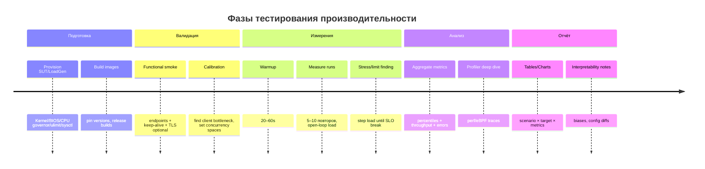

# Методология комплексного тестирования производительности `iohttp` vs топ‑серверы на Go/C/C++/Java/C#/Python/Rust/Zig

## Executive summary

Цель методологии — получить **честное, воспроизводимое и диагностируемое** сравнение `iohttp` (C23, **io_uring** как core runtime, встроенный **wolfSSL**, поддержка **PROXY protocol**, SPA‑раздача) с «лучшими представителями класса» в других языках. Методология строится вокруг двух принципов: (1) **идентичные функциональные endpoints и payloads** для всех серверов (keep‑alive HTTP/1.1, статика, JSON API, TLS опционально), (2) **открытая нагрузка (open‑loop)** для корректной оценки latency под заданным RPS и избежания coordinated omission (на уровне генератора нагрузки), что прямо указано в design wrk2 и Vegeta. citeturn10search1turn11search6

Базовый набор сценариев делится на: **HTTP/1.1 plaintext**, **HTTP/1.1 TLS**, **статик/SPA**, **JSON API**, **много соединений/длинноживущие соединения**, **streaming**, **upload**. Для HTTP/2/HTTP/3 рекомендуется отдельная расширенная серия, используя `h2load`, который по документации nghttp2 предназначен для benchmarking HTTP/1.1/2/3. citeturn17search0

Сравнение с учётом особенностей `iohttp`:
- **io_uring‑специфичные метрики** добавляются через perf/eBPF (tracepoints `io_uring:*`) и анализ io_uring‑операций (multishot, provided buffers, send_zc). Для `recv_multishot` спецификация liburing требует `len=0`, `IOSQE_BUFFER_SELECT` и проверку `IORING_CQE_F_MORE`; для `send_zc` указано, что обычно приходят **два CQE**, и переиспользование памяти безопасно только после notification CQE с `IORING_CQE_F_NOTIF`. citeturn0search0turn0search2
- **TLS** сравнивается в двух разрезах: (A) «native TLS каждой реализации», (B) «единообразная TLS‑терминация» (опционально) для отделения TLS‑стоимости от application server (понимая, что это уже тест «Nginx/Envoy + backend»). Для Nginx официально рекомендуемый способ включения TLS — `listen ... ssl` (директива `ssl` устарела и удалена), и конфигурации session cache/буферов описаны в `ngx_http_ssl_module`. citeturn2search0turn2search1
- **PROXY protocol** сравнивается отдельным сценарием, так как поддержка неоднородна. В Nginx параметр `proxy_protocol` у `listen` включает PROXY; v2 поддерживается начиная с 1.13.11. citeturn14search5turn14search3

Если детали инфраструктуры пользователя (модель CPU, NUMA, NIC, топология сети) неизвестны — отмечать как **unspecified** и заполнять перед запуском.

## Цели тестирования и критерии успеха

**Цели (что именно измеряем):**
- **Пропускная способность** (RPS, MB/s) при заданных условиях.
- **Задержки** p50/p95/p99/p99.9 (где уместно) при строго заданном RPS (open‑loop), чтобы сравнивать качество обслуживания под нагрузкой. citeturn10search1turn11search6
- **Стоимость соединений**: accept rate, handshakes (TLS), keep‑alive эффективность.
- **Ресурсы**: CPU (user/system), RSS/VSZ, аллокации/GC паузы (JVM/.NET/Python), syscalls и context switches, сетевые retran/ошибки, socket backlog.
- **Стабильность**: процент ошибок, потерянных соединений, reset/timeouts.

**Критерии успеха (пример — настраивается под ваши SLO):**
- Для каждого сценария определить «победные» показатели:  
  1) `p99 latency` ≤ X ms при Y RPS, `errors` < 0.1%, `drops` (conn) ~0.  
  2) Максимальная стабильная throughput до достижения заранее заданного `p99` или `error budget`.
- Для `iohttp` как цели сравнения:  
  - в plaintext HTTP/1.1 и в statics — быть в «верхнем кластере» (≤ 10–15% от лидера по throughput при сопоставимом p99) при условии одинаковой функциональности (keep‑alive, корректная отдача, одинаковые payload).  
  - в TLS сценарии: фиксировать, что TLS‑библиотеки разные (wolfSSL vs OpenSSL/JSSE/rustls), поэтому оценка делается **двумя сериями**: native TLS и unified terminator. citeturn2search0turn7search0
- Для io_uring‑фич: отсутствие деградаций/ошибок при high‑conn сценариях; корректность send_zc lifetime (иначе риск некорректных результатов и падений). citeturn0search2

## Матрица тестового стенда и окружения

### Таблица рекомендуемых профилей стенда

| Профиль                         | Рекомендуемая схема                                          | Когда использовать                 | Плюсы                                | Минусы                                           |
| ------------------------------- | ------------------------------------------------------------ | ---------------------------------- | ------------------------------------ | ------------------------------------------------ |
| Bare‑metal (рекомендуется)      | 2 машины: **SUT** (server) + **LoadGen**, 10/25/40/100GbE (unspecified) | Финальные сравнения                | Минимум виртуализационных артефактов | Требует железа/доступа                           |
| VM (KVM/Hyper‑V, рекоменд. KVM) | 2 VM + выделенные физ. ядра + virtio‑net                     | CI/регрессии                       | Быстро, доступно                     | Сетевой overhead, шум scheduler                  |
| Docker (на bare‑metal)          | Контейнеры на SUT и LoadGen, `--network host`                | Быстрые итерации, сборки одинаковы | Реплицируемость окружения            | Container overhead (cgroup/FS), нюансы perf/eBPF |

**Рекомендованная стратегия:**  
- Dev‑цикл: Docker (host network).  
- Регрессии: VM.  
- Публикуемые/основные результаты: bare‑metal.

### Минимальные обязательные требования окружения

- **Linux kernel**: для `iohttp` по вашим документам целится 6.7+ (внутренний requirement). Для сравнения лучше фиксировать один kernel для всех (host). (Если kernel/version неизвестна — **unspecified**.)
- **Тип сети**: одинаковый MTU, одинаковые offload настройки (фиксировать перед тестом).
- **CPU governor**: «performance» (фиксировать), TurboBoost/SMT — либо фиксировать ON/OFF и документировать.
- **Время/синхронизация**: NTP/chrony на обоих узлах (для сопоставимости timestamps и системных метрик).
- **Ограничения ОС**:
  - `ulimit -n` (fd limit) достаточный для high‑conn сценариев.
  - sysctl backlog: kernel docs описывают `somaxconn` как limit listen backlog и дают контекст вокруг overflow поведения; это ключ для high‑conn тестов. citeturn12search2

### Базовая настройка Linux (рекомендуемый baseline)

Пример baseline sysctl (адаптировать и обязательно зафиксировать в отчёте значения *до* и *после*):
```bash
# backlog / accept
sysctl -w net.core.somaxconn=4096
sysctl -w net.ipv4.tcp_max_syn_backlog=8192

# портовый диапазон для loadgen (актуально при большом числе исходящих соединений)
sysctl -w net.ipv4.ip_local_port_range="10240 65535"

# буферы (осторожно: зависит от RAM/NIC)
sysctl -w net.core.rmem_max=134217728
sysctl -w net.core.wmem_max=134217728
sysctl -w net.ipv4.tcp_rmem="4096 87380 134217728"
sysctl -w net.ipv4.tcp_wmem="4096 65536 134217728"
```
`somaxconn` и описание overflow‑поведения документированы в kernel sysctl reference. citeturn12search2

### Плюсы/минусы Docker/VM/bare‑metal и рекомендованные конфиги

**Docker**: использовать `--network host`, pinning CPU (`--cpuset-cpus`), фиксировать cgroup limits; иначе часть результатов будет отражать лимиты контейнера, а не сервер.

**VM**: фиксировать vCPU pinning + hugepages (если применимо), virtio‑net, отключать overcommit. В отчёт обязательно включать гипервизор/тип виртуализации.

**Bare‑metal**: обязательно выделять отдельный LoadGen узел, чтобы не упереться в client bottleneck (это одна из главных ловушек; см. раздел “pitfalls”).

## Набор сравниваемых серверов и эталонные реализации

### Таблица кандидатов (baseline set)

| Язык   | Сервер (baseline)      | Почему он                                                    | Базовые док‑источники/тезисы                                 | Примечания о сопоставимости c `iohttp`                       |
| ------ | ---------------------- | ------------------------------------------------------------ | ------------------------------------------------------------ | ------------------------------------------------------------ |
| C23    | `iohttp`               | SUT (ваш проект)                                             | (внутренние .md: io_uring+wolfSSL+PROXY+SPA)                 | HTTP/2/3 + io_uring особенности — отдельные сценарии         |
| C      | Nginx                  | де‑факто стандарт для high‑perf HTTP/статик; есть PROXY и TLS настройки | TLS через `listen ... ssl`, `ssl` директива устарела/удалена; PROXY `proxy_protocol` и v2 support since 1.13.11 citeturn2search0turn2search1turn14search5turn14search3 | Отличный baseline для статики/keep‑alive; upload‑семантика возможна, но требует аккуратного endpoint (см. сценарии) |
| Go     | stdlib `net/http`      | основной production путь в Go                                | параметры `ReadHeaderTimeout/IdleTimeout/MaxHeaderBytes` в `http.Server` citeturn1search1 | На TLS часто включается HTTP/2; для “только HTTP/1.1” фиксировать explicitly |
| C++    | Drogon                 | популярный и активно поддерживаемый C++ web framework        | `registerHandler`, threading model, config `ssl`, `document_root`, `upload_path` citeturn19search0turn4search0turn19search3 | Static/JSON/TLS можно закрыть чисто через config             |
| Java   | Undertow               | лёгкий high‑perf Java server, удобен для minimal handlers + static resources | ResourceHandler/ResourceManager, builder/handlers citeturn3search1turn3search0turn3search2 | JSSE TLS отличается от wolfSSL/OpenSSL; фиксировать JDK      |
| C#     | ASP.NET Core (Kestrel) | стандарт production стека .NET                               | Kestrel endpoints/UseHttps; counters для Kestrel; dotnet-counters citeturn7search0turn16search4turn16search6 | Богатые встроенные метрики; TLS/HTTP2/3 зависит от runtime   |
| Python | FastAPI + Uvicorn      | популярный async стек; хорош как representative              | StaticFiles mount; Uvicorn ssl-keyfile/ssl-certfile и HTTPS run options citeturn5search4turn6search1turn6search5 | Python обычно слабее по raw RPS; важно фиксировать workers/uvloop |
| Rust   | Axum + axum-server     | современный Rust web stack; TLS через rustls                 | axum-server TLS rustls; ServeDir (tower-http) citeturn5search3turn9search0 | TLS‑библиотека rustls; фиксировать runtime threads           |
| Zig    | Zap                    | популярный Zig web microframework, заявляет production usage | ZAP использует facil.io, поддержка Zig stable, TLS через OpenSSL флаг citeturn8search1 | TLS отличается; фиксировать Zig version и флаг openssl       |

**Важно:** альтернативы (не baseline) можно добавлять отдельной серией, но тогда требуется такой же набор endpoint‑ов, Dockerfile и фиксация конфигов. Примеры альтернатив: Go `fasthttp`, Java Netty/Jetty, Rust hyper/actix, Python aiohttp/gunicorn‑uvicorn.

### Эталонные endpoints (единый контракт для всех реализаций)

Обязательные:
- `GET /api/hello` → JSON `{"hello":"world"}` (стабильный размер, фиксированная строка).
- `GET /static/1k.bin`, `/static/10k.bin`, `/static/128k.bin`, `/static/1m.bin` → статические файлы.
- `GET /` и arbitrary SPA paths (`/app`, `/profile/123`) → SPA fallback на `index.html` (как у `iohttp` SPA‑fallback).
- Keep‑alive включён по умолчанию (HTTP/1.1), желательно без forced close.

Опциональные/для отдельных сценариев:
- `POST /api/upload` → читает body полностью, отвечает JSON `{"bytes":<n>}`.
- `GET /api/stream` → streaming ответ (SSE или chunked JSON lines).
- TLS: `https://...` (TLS 1.3 preferred; фиксировать cipher policy где возможно).

### Минимальные реализации и Dockerfile (baseline)

Ниже — **минимальные** примерные реализации. Они предназначены как «шаблон репозитория бенчмарка», а не как production‑код.

#### C: Nginx (config вместо кода) + Dockerfile

`nginx.conf`:
```nginx
worker_processes auto;
events { worker_connections 8192; }

http {
  access_log off;
  error_log /dev/stderr warn;

  sendfile on;
  tcp_nopush on;
  tcp_nodelay on;
  keepalive_timeout 65;

  server {
    listen 8080;

    # JSON API
    location = /api/hello {
      default_type application/json;
      return 200 '{"hello":"world"}';
    }

    # Static files
    location /static/ {
      root /srv; # /srv/static/...
      try_files $uri =404;
    }

    # SPA fallback (не для /api и /static)
    location / {
      root /srv/spa;
      try_files $uri /index.html;
    }
  }

  # Optional TLS server (enable by mounting certs and using alternate conf)
  # listen 8443 ssl; ssl_certificate ...; ssl_certificate_key ...;
}
```
Официальная документация описывает `listen ... ssl` как рекомендуемый способ включения TLS (директива `ssl` устарела/удалена). citeturn2search0turn2search1

`Dockerfile`:
```dockerfile
FROM nginx:1.27-alpine
COPY nginx.conf /etc/nginx/nginx.conf
COPY static/ /srv/static/
COPY spa/ /srv/spa/
EXPOSE 8080
```

#### Go: net/http

`main.go` (HTTP/1.1 + статика + JSON + upload):
```go
package main

import (
  "crypto/tls"
  "encoding/json"
  "io"
  "log"
  "net/http"
  "os"
  "time"
)

func main() {
  mux := http.NewServeMux()

  mux.HandleFunc("/api/hello", func(w http.ResponseWriter, r *http.Request) {
    w.Header().Set("Content-Type", "application/json")
    _ = json.NewEncoder(w).Encode(map[string]string{"hello": "world"})
  })

  mux.Handle("/static/", http.StripPrefix("/static/", http.FileServer(http.Dir("/srv/static"))))

  mux.HandleFunc("/api/upload", func(w http.ResponseWriter, r *http.Request) {
    b, _ := io.ReadAll(r.Body)
    w.Header().Set("Content-Type", "application/json")
    _ = json.NewEncoder(w).Encode(map[string]int{"bytes": len(b)})
  })

  // SPA fallback
  mux.HandleFunc("/", func(w http.ResponseWriter, r *http.Request) {
    if len(r.URL.Path) >= 5 && r.URL.Path[:5] == "/api/" {
      http.NotFound(w, r); return
    }
    http.ServeFile(w, r, "/srv/spa/index.html")
  })

  srv := &http.Server{
    Addr:              ":8080",
    Handler:           mux,
    ReadHeaderTimeout: 5 * time.Second,
    IdleTimeout:       60 * time.Second,
    MaxHeaderBytes:    1 << 20,
    TLSConfig: &tls.Config{
      MinVersion: tls.VersionTLS13,
    },
  }

  cert := os.Getenv("TLS_CERT")
  key := os.Getenv("TLS_KEY")
  if cert != "" && key != "" {
    log.Fatal(srv.ListenAndServeTLS(cert, key))
  } else {
    log.Fatal(srv.ListenAndServe())
  }
}
```
Параметры `ReadHeaderTimeout/IdleTimeout/MaxHeaderBytes` описаны в `net/http.Server`. citeturn1search1

`Dockerfile`:
```dockerfile
FROM golang:1.26-alpine AS build
WORKDIR /src
COPY main.go .
RUN go build -trimpath -ldflags="-s -w" -o /out/app main.go

FROM alpine:3.20
RUN adduser -D app
USER app
COPY --from=build /out/app /app
COPY static/ /srv/static/
COPY spa/ /srv/spa/
EXPOSE 8080
ENV GOMAXPROCS=0
ENTRYPOINT ["/app"]
```

#### C++: Drogon

`main.cc`:
```cpp
#include <drogon/drogon.h>
using namespace drogon;

int main() {
  app().registerHandler("/api/hello",
    [](const HttpRequestPtr&, std::function<void (const HttpResponsePtr&)>&& cb){
      Json::Value j;
      j["hello"] = "world";
      cb(HttpResponse::newHttpJsonResponse(j));
    },
    {Get});

  // Остальное (document_root, ssl, upload_path) — через config.json
  app().loadConfigFile("./config.json").run();
  return 0;
}
```
Drogon поддерживает `registerHandler`, threading настройку и конфиг `ssl`, а также `document_root` и `upload_path` как ключи config. citeturn19search0turn19search3

`config.json` (минимально):
```json
{
  "listeners": [ { "address": "0.0.0.0", "port": 8080, "https": false } ],
  "app": {
    "document_root": "/srv/spa",
    "upload_path": "/tmp/uploads",
    "client_max_body_size": "10M"
  },
  "ssl": {
    "cert": "/certs/cert.pem",
    "key": "/certs/key.pem",
    "conf": [ ["min_protocol", "TLSv1.3"] ]
  }
}
```

`Dockerfile` (примерный, зависит от сборки drogon):
```dockerfile
FROM ubuntu:24.04 AS build
RUN apt-get update && apt-get install -y --no-install-recommends \
  cmake g++ git libssl-dev zlib1g-dev ca-certificates \
  && rm -rf /var/lib/apt/lists/*
WORKDIR /src
# В методологии фиксируйте commit/tag drogon.
RUN git clone --depth 1 https://github.com/drogonframework/drogon.git /drogon \
  && cmake -S /drogon -B /drogon/build -DCMAKE_BUILD_TYPE=Release \
  && cmake --build /drogon/build -j
COPY main.cc config.json .
RUN g++ -O3 -DNDEBUG -I/drogon/lib/inc -L/drogon/build/lib \
  main.cc -ldrogon -ltrantor -ljsoncpp -lssl -lcrypto -lpthread -o /out/app

FROM ubuntu:24.04
RUN useradd -m app
USER app
COPY --from=build /out/app /app
COPY --from=build /src/config.json /config.json
COPY static/ /srv/static/
COPY spa/ /srv/spa/
EXPOSE 8080
ENTRYPOINT ["/app"]
```

#### Java: Undertow

`Main.java` (минимальный, статика + JSON + fallback):
```java
import io.undertow.Undertow;
import io.undertow.server.HttpHandler;
import io.undertow.server.HttpServerExchange;
import io.undertow.util.Headers;
import io.undertow.server.handlers.PathHandler;
import io.undertow.Handlers;
import io.undertow.server.handlers.resource.ResourceHandler;
import io.undertow.server.handlers.resource.FileResourceManager;

import java.io.File;
import java.nio.charset.StandardCharsets;

public class Main {
  static HttpHandler jsonHello = exchange -> {
    exchange.getResponseHeaders().put(Headers.CONTENT_TYPE, "application/json");
    exchange.getResponseSender().send("{\"hello\":\"world\"}");
  };

  public static void main(String[] args) {
    var staticRoot = new File("/srv/static");
    var spaRoot    = new File("/srv/spa");

    ResourceHandler staticHandler = Handlers.resource(new FileResourceManager(staticRoot, 1024));
    ResourceHandler spaHandler    = Handlers.resource(new FileResourceManager(spaRoot, 1024));

    HttpHandler spaFallback = (HttpServerExchange exchange) -> {
      String path = exchange.getRequestPath();
      if (path.startsWith("/api/")) { exchange.setStatusCode(404); return; }
      // Простая модель: в реальной реализации лучше try-serve файла и fallback
      exchange.getResponseHeaders().put(Headers.CONTENT_TYPE, "text/html; charset=utf-8");
      exchange.getResponseSender().send(new String(java.nio.file.Files.readAllBytes(
        new File(spaRoot, "index.html").toPath()
      ), StandardCharsets.UTF_8));
    };

    PathHandler routes = Handlers.path()
      .addExactPath("/api/hello", jsonHello)
      .addPrefixPath("/static", staticHandler)
      .addPrefixPath("/", spaFallback);

    Undertow server = Undertow.builder()
      .addHttpListener(8080, "0.0.0.0")
      .setHandler(routes)
      .build();

    server.start();
  }
}
```
Документация Undertow описывает ResourceHandler/ResourceManager для статики и наличие `Undertow.builder()` с handler‑цепочками. citeturn3search1turn3search0turn3search2

`Dockerfile` (Maven):
```dockerfile
FROM maven:3.9-eclipse-temurin-21 AS build
WORKDIR /src
COPY pom.xml .
COPY src/ src/
RUN mvn -q -DskipTests package

FROM eclipse-temurin:21-jre
WORKDIR /app
COPY --from=build /src/target/app.jar /app/app.jar
COPY static/ /srv/static/
COPY spa/ /srv/spa/
EXPOSE 8080
ENV JAVA_OPTS="-Xms512m -Xmx512m -XX:+AlwaysPreTouch -Xlog:gc:file=/tmp/gc.log:uptime,level,tags"
ENTRYPOINT ["sh","-c","java $JAVA_OPTS -jar /app/app.jar"]
```
`-Xlog:gc` и примеры unified logging описаны в manpage `java`. citeturn18search1

#### C#: ASP.NET Core (Kestrel)

`Program.cs`:
```csharp
using System.Net;
using Microsoft.AspNetCore.Builder;
using Microsoft.Extensions.Hosting;

var builder = WebApplication.CreateBuilder(args);

// Optional HTTPS if configured via appsettings/env; Kestrel endpoint config supports TLS protocols/certs
builder.WebHost.ConfigureKestrel((context, serverOptions) => {
    // Plaintext
    serverOptions.ListenAnyIP(8080);

    // TLS optional (enable if cert present)
    var certPath = Environment.GetEnvironmentVariable("TLS_PFX");
    var certPass = Environment.GetEnvironmentVariable("TLS_PFX_PASS");
    if (!string.IsNullOrEmpty(certPath)) {
        serverOptions.ListenAnyIP(8443, lo => lo.UseHttps(certPath, certPass));
    }
});

var app = builder.Build();

app.UseStaticFiles(); // middleware short-circuits for static files citeturn7search1

app.MapGet("/api/hello", () => Results.Json(new { hello = "world" }));

app.MapPost("/api/upload", async (HttpRequest req) => {
    using var ms = new MemoryStream();
    await req.Body.CopyToAsync(ms);
    return Results.Json(new { bytes = ms.Length });
});

// SPA fallback
app.MapFallbackToFile("index.html");

app.Run();
```
Kestrel endpoint+HTTPS конфигурируется через `Listen(...).UseHttps(...)` и appsettings, включая выбор TLS протоколов. citeturn7search0  
Kestrel публикует EventCounters (например `current-tls-handshakes`, `request-queue-length`) — полезно для диагностики. citeturn16search4

`Dockerfile`:
```dockerfile
FROM mcr.microsoft.com/dotnet/sdk:9.0 AS build
WORKDIR /src
COPY . .
RUN dotnet publish -c Release -o /out

FROM mcr.microsoft.com/dotnet/aspnet:9.0
WORKDIR /app
COPY --from=build /out/ /app/
COPY static/ /srv/static/
COPY spa/ /app/wwwroot/  # wwwroot for UseStaticFiles + fallback
EXPOSE 8080 8443
ENV DOTNET_GCServer=1
ENTRYPOINT ["dotnet","app.dll"]
```
Настройка GC (gcServer и др.) описана в runtime config settings. citeturn16search2  
Live‑метрики/счётчики можно снимать `dotnet-counters`. citeturn16search6

#### Python: FastAPI + Uvicorn

`app.py`:
```python
from fastapi import FastAPI, Request
from fastapi.responses import FileResponse, JSONResponse
from fastapi.staticfiles import StaticFiles

app = FastAPI()
app.mount("/static", StaticFiles(directory="/srv/static"), name="static")  # citeturn5search4

@app.get("/api/hello")
async def hello():
    return {"hello": "world"}

@app.post("/api/upload")
async def upload(req: Request):
    body = await req.body()
    return {"bytes": len(body)}

# SPA fallback
@app.get("/{path:path}")
async def spa(path: str):
    if path.startswith("api/") or path.startswith("static/"):
        return JSONResponse(status_code=404, content={"error": "not found"})
    return FileResponse("/srv/spa/index.html")
```

`Dockerfile`:
```dockerfile
FROM python:3.13-slim
WORKDIR /app
RUN pip install --no-cache-dir fastapi uvicorn
COPY app.py .
COPY static/ /srv/static/
COPY spa/ /srv/spa/
EXPOSE 8080 8443
# TLS включается Uvicorn опциями --ssl-keyfile/--ssl-certfile citeturn6search1turn6search5
CMD ["sh","-c","uvicorn app:app --host 0.0.0.0 --port 8080 --workers ${WORKERS:-1}"]
```
Флаги `--ssl-keyfile`/`--ssl-certfile` и HTTPS режимы описаны в документации Uvicorn. citeturn6search1turn6search5

#### Rust: Axum + axum-server + tower-http ServeDir

`main.rs`:
```rust
use axum::{routing::{get, post}, Json, Router};
use axum::body::Bytes;
use serde_json::json;
use tower_http::services::ServeDir;

#[tokio::main]
async fn main() {
    let static_svc = ServeDir::new("/srv/static");
    let spa_svc = ServeDir::new("/srv/spa").append_index_html_on_directories(true);

    let app = Router::new()
        .route("/api/hello", get(|| async { Json(json!({"hello":"world"})) }))
        .route("/api/upload", post(|body: Bytes| async move {
            Json(json!({"bytes": body.len()}))
        }))
        .nest_service("/static", static_svc)
        .fallback_service(spa_svc); // simplification: для строгого SPA fallback можно делать ServeFile(index.html)

    // TLS optional via axum-server rustls
    let addr = ([0,0,0,0], 8080).into();
    axum::serve(tokio::net::TcpListener::bind(addr).await.unwrap(), app).await.unwrap();
}
```
`tower_http::services::ServeDir` документирован как файловый сервис (feature `fs`). citeturn9search0  
TLS/HTTPS через rustls для axum обеспечивается `axum-server`, включая `bind_rustls`. citeturn5search3

`Dockerfile`:
```dockerfile
FROM rust:1.85 AS build
WORKDIR /src
COPY Cargo.toml Cargo.lock ./
COPY src/ src/
RUN cargo build --release

FROM debian:bookworm-slim
COPY --from=build /src/target/release/app /app
COPY static/ /srv/static/
COPY spa/ /srv/spa/
EXPOSE 8080
ENTRYPOINT ["/app"]
```

#### Zig: Zap

Zap заявляет production использование и объясняет, что использует facil.io; TLS поддерживается через OpenSSL при сборке с `-Dopenssl` или env. citeturn8search1

`main.zig` (упрощённый шаблон — уточнять по API Zap версии, иначе пометить как baseline stub):
```zig
const std = @import("std");
// const zap = @import("zap"); // зависит от zap API

pub fn main() !void {
    // TODO: implement /api/hello JSON, /static, SPA fallback согласно zap examples.
    // В отчёте фиксируйте Zig stable version и zap commit/tag.
}
```
`Dockerfile` (шаблон):
```dockerfile
FROM ubuntu:24.04
RUN apt-get update && apt-get install -y --no-install-recommends \
  ca-certificates curl xz-utils git build-essential libssl-dev \
  && rm -rf /var/lib/apt/lists/*
# TODO: install Zig stable version per zap requirements (фиксировать версию!)
# TODO: build zap target with -Dopenssl=true if TLS scenario used
```
Если невозможно дать точный working example из-за API churn — фиксировать как **unspecified** и делать отдельный шаг “pin zap API + example”.

## Сценарии бенчмарков и профили нагрузки

### Набор сценариев (обязательные)

1) **Static file (cold/warm cache)**  
Цель: throughput и tail latency на статики.  
- Файлы: 1KB/10KB/128KB/1MB.  
- Два режима:  
  - warm cache (после прогрева; page cache есть),  
  - cold-ish (между прогонами чистить page cache запрещено на shared host; лучше отдельный boot/VM snapshot или отдельная фаза “cold start”, иначе bias).

2) **SPA fallback**  
Цель: path routing и fallback без лишних аллокаций/regex.  
- Paths: `/`, `/app`, `/app/123`, `/profile/settings`.  
- Ожидание: отдаётся один и тот же `index.html` (фиксированный размер).

3) **JSON API (малый ответ)**  
`GET /api/hello` (≈ 17–30 байт полезной нагрузки).  
Цель: overhead routing/serialization, минимальный ответ.

4) **Upload (read body)**  
`POST /api/upload`  
- Payload: 1KB/32KB/256KB/1MB.  
- Ожидание: сервер читает тело полностью и возвращает `{"bytes":N}`.

5) **Many connections / connection churn**  
- высокая скорость установления соединений, короткая жизнь.  
- Проверка: backlog, accept loop, системные лимиты.

6) **Long‑lived connections**  
- keep‑alive соединения, редкие запросы (simulate real clients).  
- Важно: фиксировать `timeout/idle` параметры серверов.

7) **TLS**  
- те же сценарии 1–4, но по HTTPS.  
- Варианты:  
  - TLS 1.3, session reuse (keep‑alive + resumption),  
  - “handshake heavy” (короткие соединения).

### Дополнительные (рекомендуемые) сценарии

- **HTTP/2**: multiplexing, `-m` streams per conn (через `h2load`). `h2load` описан как benchmarking tool для HTTP/3/HTTP/2/HTTP/1.1 и умеет многопоточность на клиента. citeturn17search0  
- **HTTP/3**: отдельная серия, понимая, что не все серверы поддерживают.
- **PROXY protocol**: отдельная серия (или только для тех, кто поддерживает нативно). В Nginx параметр `proxy_protocol` включает PROXY, а v2 поддерживается с 1.13.11. citeturn14search5turn14search3

### Диапазоны concurrency и длительности

Рекомендация (адаптируется под CPU/RAM; если неизвестно — **unspecified**):
- Concurrency (connections): 64, 256, 1024, 4096, 16384 (для long‑lived).  
- Threads для loadgen: ≈ количество физических ядер на LoadGen.  
- Warmup: 20–60s.  
- Measure: 60–180s.  
- Повторы: минимум 5 (stable), 10 (для публикации), с randomization порядка сценариев для снижения дрейфа температуры/кэшей.

### Таблица “сценарии × метрики” (минимальный обязательный набор)

| Сценарий        | Latency p50/p95/p99 | Throughput | CPU user/sys |  RSS | Syscalls/ctxswitch | Socket stats | Ошибки |          GC/паузи |
| --------------- | ------------------: | ---------: | -----------: | ---: | -----------------: | -----------: | -----: | ----------------: |
| Static 1KB..1MB |                   ✓ |          ✓ |            ✓ |    ✓ |                  ✓ |            ✓ |      ✓ |               N/A |
| SPA fallback    |                   ✓ |          ✓ |            ✓ |    ✓ |                  ✓ |            ✓ |      ✓ |               N/A |
| JSON hello      |                   ✓ |          ✓ |            ✓ |    ✓ |                  ✓ |            ✓ |      ✓ | ✓ (managed langs) |
| Upload          |                   ✓ |          ✓ |            ✓ |    ✓ |                  ✓ |            ✓ |      ✓ |                 ✓ |
| Many conns      |                   ✓ |          ✓ |            ✓ |    ✓ |                  ✓ |            ✓ |      ✓ |                 ✓ |
| Long-lived      |                   ✓ |          ✓ |            ✓ |    ✓ |                  ✓ |            ✓ |      ✓ |                 ✓ |
| TLS variants    |                   ✓ |          ✓ |            ✓ |    ✓ |                  ✓ |            ✓ |      ✓ |                 ✓ |

## Сбор метрик и инструментарий

### Генераторы нагрузки (рекомендуемый стек)

- **wrk2**: open‑loop constant throughput (`-R/--rate`) и корректная запись latency (HdrHistogram), с акцентом на избежание coordinated omission. citeturn10search1  
- **Vegeta**: также designed под постоянную частоту запросов (constant request rate), полезен как второй независимый генератор. citeturn11search6  
- **Fortio**: задаёт QPS и собирает percentiles; удобен для quick sanity runs и построения histogram/percentiles. citeturn10search0  
- **h2load (nghttp2)**: benchmarking tool для HTTP/1.1/2/3, включая множественные streams (`-m`) и multi-threading. citeturn17search0  
- **httperf**: классика для некоторых моделей нагрузки; у проекта есть SSL support (preliminary) и полезен для connection-level сценариев. citeturn11search7

Примеры (концептуальные команды; фиксируйте версии инструментов):
```bash
# wrk2: 30s warm + latency percentiles, constant 50k RPS total
wrk -t8 -c1024 -d60s -R50000 --latency http://SERVER:8080/api/hello

# vegeta: 30k RPS, 60s
echo "GET http://SERVER:8080/api/hello" | vegeta attack -duration=60s -rate=30000 | tee out.bin | vegeta report

# h2load: HTTP/2, 100 conns, 100 streams each, 100k req total
h2load -n100000 -c100 -m100 https://SERVER:8443/api/hello
```
`h2load` usage/semantics и поддержка HTTP/3 описаны в nghttp2 документации. citeturn17search0

### Системные метрики (CPU/RAM/IO/сеть)

- `perf`: CPU профили и счётчики (cycles, instructions, cs, migrations, etc).
- Flamegraphs: репо FlameGraph описывает стандартный пайплайн `perf record` → `perf script` → `stackcollapse-perf.pl` → `flamegraph.pl`. citeturn12search0
- `ss`: стандартный инструмент для socket statistics (включая состояния TCP, очереди, retrans). citeturn13search1
- eBPF:
  - `bpftrace`: быстрые one‑liners; tutorial показывает `-l` для listing probes, удобен для `tracepoint:syscalls:*` и `tracepoint:io_uring:*`. citeturn11search3
  - BCC: toolkit для eBPF‑анализа I/O и сети (tcplife/tcpaccept/tcpretrans и др.). citeturn13search0

Примеры диагностики:
```bash
# Socket snapshot
ss -s
ss -tanp | head

# perf CPU profile 60s
perf record -F 99 -a -g -- sleep 60
perf script > out.perf
# далее flamegraph (см. FlameGraph repo)

# bpftrace: список io_uring tracepoints
bpftrace -l 'tracepoint:io_uring:*'
```
`ss` назначение и общий usage зафиксированы в manpage. citeturn13search1

### Метрики managed runtime (Java/.NET/Python)

- **.NET**:
  - `dotnet-counters monitor` и список available counters; отдельный раздел counters для Kestrel (`current-connections`, `tls-handshakes-per-second`, `request-queue-length`). citeturn16search6turn16search4  
  - GC configuration (включая `DOTNET_` vs `COMPlus_` префиксы) документирована отдельно. citeturn16search2  
  - `dotnet-trace` использует EventPipe, поддерживает `collect` и `collect-linux`. citeturn15search8
- **Java**:
  - GC логирование через unified logging `-Xlog:gc` и примеры ротации/настроек в manpage `java`. citeturn18search1  
  - JFR/JCMD можно использовать как расширенный профиль (если включено/доступно). citeturn15search0
- **Python**:
  - фиксировать число worker процессов, event loop (uvloop), и собирать CPU профили через perf/py-spy (если допустимо).

## Повторяемость, автоматизация, формат отчёта и ловушки

### Реплицируемость и артефакты

Рекомендуемая структура репозитория бенчмарка:
```text
bench/
  targets/
    iohttp/
    nginx/
    go-nethttp/
    cpp-drogon/
    java-undertow/
    dotnet-kestrel/
    py-fastapi-uvicorn/
    rust-axum/
    zig-zap/
  assets/
    static/   # 1k/10k/128k/1m
    spa/      # index.html + bundle placeholders
    certs/    # self-signed (для сравнимости) + scripts генерации
  compose/
    docker-compose.yml
  scripts/
    build_all.sh
    run_server.sh
    run_load.sh
    collect_metrics.sh
    summarize.py
  reports/
    raw/
    processed/
```

**Обязательные правила воспроизводимости:**
- Фиксировать: OS/kernel, CPU model, RAM, NIC, версии Docker/Compose, версии компиляторов/SDK, версии серверов и loadgen tools.
- Каждый прогон сценария создаёт каталог `reports/raw/<date>/<scenario>/<target>/` со всеми логами: stdout/stderr, perf, ss snapshots, dotnet-counters dumps, gc logs.

### Mermaid timeline тестовых фаз



### Pitfalls и bias (что чаще всего ломает честность)

- **Coordinated omission**: закрытые генераторы нагрузки (closed‑loop) часто «скрывают» tail latency. Используйте open‑loop и генераторы, которые явно нацелены на корректную latency запись, как wrk2/Vegeta. citeturn10search1turn11search6
- **Client bottleneck**: один loadgen узел может упереться в CPU/сеть до сервера; проверять CPU и syscalls на LoadGen.
- **Разная функциональность**: например, один сервер отдаёт статику через sendfile, другой читает в userspace. В отчёте фиксировать “функциональные различия” и выносить в отдельные серии.
- **TLS сравнение некорректно без фиксации**: разные TLS стеки (wolfSSL/OpenSSL/JSSE/rustls) и разные настройки session cache/буферов. В Nginx параметры session cache и буферов описаны в SSL module docs — фиксируйте их. citeturn2search0
- **PROXY protocol**: поддержка неоднородна; сравнивать только там, где функция включена равноценно. В Nginx PROXY включается параметром `proxy_protocol` и v2 поддерживается с 1.13.11. citeturn14search5turn14search3
- **Docker network**: если не `--network host`, появится veth/NAT overhead; обязательно фиксировать режим.
- **io_uring send_zc**: риск UAF/перепользования буфера до notification CQE; это может давать «фантомные» ошибки/сбои и испортить метрики. citeturn0search2

### Настройка под `iohttp` и сопоставление функций

- **io_uring особенности**: в отчётах сохранять: число CQE/sec, процент multishot completions, buffer pool starvation (если есть), и отдельно фиксировать поведение `send_zc` (notification CQE). citeturn0search2turn0search7
- **wolfSSL vs другие TLS**: добавлять колонку “TLS stack” и “TLS config” в каждую таблицу результатов (например: wolfSSL vs OpenSSL vs JSSE vs rustls). Для Nginx соответствующие TLS директивы и оптимизации официально документированы. citeturn2search0turn2search1
- **PROXY protocol**: запускать отдельную серию, где перед серверами стоит HAProxy (или другой генератор PROXY) и включён ПРОКСИ‑режим только там, где приложение реально поддерживает и корректно использует PROXY, иначе сценарий метит **N/A**.

### Где править существующие .md по проекту (`iohttp`) под эту методологию

По внутренним файлам, которые доступны в рабочем каталоге:
- `/mnt/data/01-architecture.md`:
  - строки **50–71**: явно добавить, что для сравнимости в benchmarks требуется режим “logging off / minimal”; сейчас логирование упоминается как модуль.  
  - строки **59–69**: уточнить практический смысл `IOSQE_CQE_SKIP_SUCCESS` для multishot accept и риски потери CQE (если применимо) — иначе это может исказить методологию сборов. (Если нет точной реализации — **unspecified**.)
  - строки **185–217**: эти “Data Flow” блоки использовать как основу для списка метрик “accept/proxy/tls/http parse/router/handler/send” и должны совпадать с tracepoints/счётчиками benchmark harness.
- `/mnt/data/iohttp_io_uring_architecture_requirements_c23.md`: раздел “Observability” (точные строки уточнить при необходимости, иначе **unspecified**) — добавить прямую ссылку на benchmark harness и список обязательных метрик (p99, errors, io_uring send_zc notif, buffer ring ENOBUFS и т.п.). citeturn0search0turn0search2