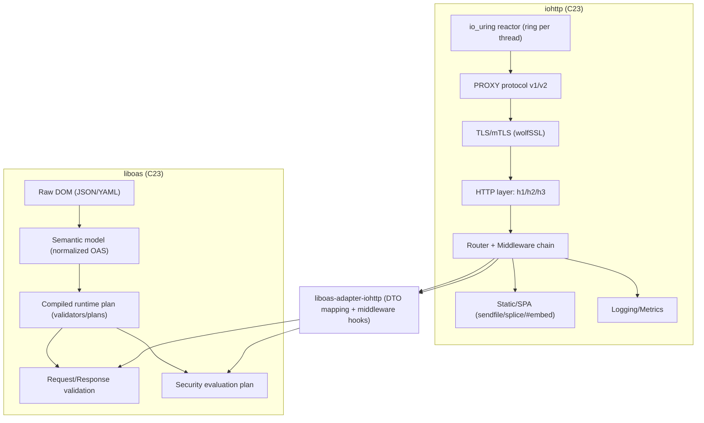

# Аналитический отчёт по архитектуре `liboas` + `iohttp` на C23

## Executive Summary

Целевая декомпозиция «`iohttp` = транспорт/протоколы (io_uring + wolfSSL + PROXY + HTTP/1.1–3 + router/middleware), `liboas` = OpenAPI 3.2.0 + JSON Schema 2020‑12 (DOM → semantic model → compiled runtime plan, request/response validation, security evaluation)» **в целом согласуется** с лучшими практиками высокопроизводительных серверов и требований спецификаций: `mutualTLS` трактуется как _требование_ уровня OpenAPI, а не как реализация handshake; валидатор должен работать от нормализованного контекста, а не от `WOLFSSL*`. citeturn5view0turn9view1turn10view3turn10view4

Главные архитектурные риски сейчас:

- **Неподъёмная сложность раннего полного профиля JSON Schema 2020‑12** (особенно `unevaluated*` и `$dynamicRef/$dynamicAnchor`): эти ключевые слова зависят от аннотаций смежных applicator‑ов и требуют строгого порядка/модели «evaluation graph», что может резко увеличить сложность, латентность и объём тестового покрытия. citeturn7view1turn6view6turn18view0
- **Ошибочное/опасное применение io_uring‑фич без учёта семантики** (например, `SEND_ZC` даёт _два CQE_ и требует удержания буфера до notification; multishot‑accept/recv требуют дисциплины `IORING_CQE_F_MORE`, provided buffers и своевременного возврата буферов, иначе `-ENOBUFS`). citeturn12view2turn12view1turn12view0turn13view0turn11view0turn22view0
- **PROXY protocol**: недопустимо «авто‑определять» наличие PROXY‑header — спецификация прямо предупреждает о подмене источника, если дать обычному клиенту возможность отправлять заголовок; нужен режим _строго по конфигу_ + allowlist доверенных прокси. citeturn17view0

Что следует сделать в первую очередь:

- **P0 MUST**: стабилизировать контракт `liboas-adapter-iohttp` (DTO для request/response/security/meta) и режимы валидации (request: enforce; response: off/log/sampled/enforce), а также минимальный «production‑профиль JSON Schema» с чёткими флагами отключения/ограничения сложных keywords. citeturn6view5turn7view1turn18view0
- **P0 MUST**: формализовать `iohttp` io_uring‑модель (multishot + provided buffers (ring) + selective `SEND_ZC`) и правила lifetime буферов/указателей (особенно при SQPOLL и ZC). citeturn22view0turn12view2turn12view0turn21view0turn16view1
- **P1 SHOULD**: добавить тестовую «базу доказательства корректности» для JSON Schema через официальный JSON‑Schema‑Test‑Suite и fuzzing для `$ref`/URI‑resolution/compilation. citeturn19search0turn4view0turn6view4turn18view0

## Контекст и текущий baseline

По вашим проектным .md:

- `iohttp` описан как библиотека на C23 с core‑runtime на **io_uring**, нативным **wolfSSL**, поддержкой **PROXY protocol v1/v2**, HTTP/1.1–3, router+middleware и раздачей статики/SPA (см. `/mnt/data/01-architecture.md`, `/mnt/data/02-comparison.md`).
- `liboas` задуман как надстройка над `iohttp`: **не владеет сокетами/TLS/io_uring**, делает OpenAPI parsing/compilation/validation и интегрируется через `liboas-adapter-iohttp` (см. `/mnt/data/liboas_technical_spec_c23_iohttp.md`).

Два места, где в текущих .md видны потенциальные несостыковки (нужно чинить):

- В `01-architecture.md` зафиксирован _single-threaded io_uring loop_ как «foundation» (строки ~48–72), а в `iohttp_io_uring_architecture_requirements_c23.md` уже рекомендуете _multi‑reactor ring‑per‑thread_ как production‑профиль (строки ~166–189). Это не критично, но нужно явно развести «dev profile» и «prod profile».
- В `liboas_technical_spec_c23_iohttp.md` `unevaluatedProperties/unevaluatedItems` включены как «обязательные в первой production‑ветке» (строки ~282–298). Это высокий риск для P0/P1; спецификация подчёркивает, что `unevaluated*` завязаны на аннотации и порядок вычисления, а исследовательские работы по JSON Schema показывают, что взаимодействия keywords способны «раздувать» стоимость runtime‑валидации; правильно — вынести в строгий/расширенный профиль или отдельный компиляторный режим. citeturn7view1turn18view0

### Модульная схема



## Нормативная база и требования спецификаций

### OpenAPI 3.2.0

Ключевые места, влияющие на архитектуру `liboas`:

- **Security Requirement логика**: внутри одного Security Requirement Object _все схемы должны удовлетворяться одновременно_; если список Security Requirement Objects содержит несколько элементов — достаточно удовлетворить _один_ (OR‑по списку). Пустой объект `{}` означает допустимый анонимный доступ. Это напрямую диктует дизайн «security evaluation plan» в `liboas` (AND/OR‑дерево). citeturn5view0turn5view2
- **Security Scheme type включает `mutualTLS`, `http` (basic/bearer), `apiKey`** — то есть `liboas` обязан уметь проверять эти типы по внешнему контексту, но не обязан реализовывать TLS. citeturn5view0turn5view1
- **`jsonSchemaDialect`** задаёт дефолтный `$schema` для Schema Objects внутри OAS‑документа (это влияет на выбор dialect/vocabulary при компиляции JSON Schema). citeturn4view0
- **Много‑документность и `$ref`**: документ OAS требует полного парсинга документов для поиска целей ссылок и запрещает преждевременно считать ссылку неразрешимой до завершения парсинга всех документов. Это делает ваш паттерн «raw DOM → semantic model → compiled plan» не просто удобным, а практически обязательным для корректности. citeturn4view0turn23search2turn23search3
- **Streaming/sequential media types**: OpenAPI 3.2 вводит `itemSchema` для streaming‑валидации, где `itemSchema` применяется к каждому элементу потока независимо; также спецификация требует поддержки отображения sequential media types в модель JSON Schema как «массив значений по порядку». Это важно для совместимости `liboas` с SSE/NDJSON/`multipart` и архитектуры streaming‑валидации (или явной диагностики «не поддерживается»). citeturn25view0turn25view1turn25view2

### JSON Schema Draft 2020‑12

Архитектурные последствия для `liboas`:

- **Dialect/vocabulary**: `$vocabulary` определяет требуемые/опциональные наборы keywords (dialect). Если метасхема требует vocabulary, которое реализация не понимает, то обработка должна быть отвергнута; `$schema` должен быть в корневом schema‑объекте, а отсутствие `$schema` даёт implementation‑defined поведение. Для `liboas` это означает: компилятор схем **должен быть dialect‑aware** хотя бы на уровне «понимаю/не понимаю обязательный vocabulary», иначе риск «тихого неверного поведения». citeturn6view5turn25view0turn4view0
- **`$id` и base URI**: правила ресурсов/под‑ресурсов и base URI влияют на `$ref`‑resolution и кэширование. citeturn6view4turn23search2
- **`$dynamicRef`**: динамические ссылки откладывают полное разрешение до runtime и пере‑разрешаются при каждом проходе валидации (не «раз и навсегда при загрузке»). Это резко усложняет «compiled plan» и часто рационально откладывается (или делается опциональным профилем). citeturn6view6turn18view0
- **`unevaluatedItems/unevaluatedProperties`**: эти keywords завязаны на аннотациях от соседних applicator‑ов (`items/prefixItems/contains` для массивов, `properties/patternProperties/additionalProperties` для объектов) и требуют строгого порядка вычисления («сначала вычислить зависимые keywords, потом `unevaluated*`»). Это один из самых больших источников сложности и причин, почему «полный 2020‑12 валидатор» нельзя делать наивно. citeturn7view1turn7view0
- **Выходной формат ошибок**: JSON Schema рекомендует придерживаться стандартного формата validation output (минимальные требования), что полезно для стабильной диагностики в `liboas`. citeturn7view0

### HTTP и security RFC

- RFC 9110 определяет общую семантику HTTP, методы, статус‑коды и общие элементы протокола. citeturn0search2
- RFC 7230/7231 остаются полезными исторически, но частично/полностью заменены обновлениями семейства RFC 9110/9112; если вы ссылаетесь на 7230/7231 в документах, стоит явно указать «см. также RFC 9112/9110» (для читателей и unit‑тестов парсера). citeturn1search0turn1search1turn1search10turn0search6
- RFC 7617 описывает Basic auth, RFC 6750 — использование Bearer token в HTTP. citeturn23search1turn23search0

### PROXY protocol

Спецификация PROXY protocol прямо говорит:

- нельзя полагаться на «авто‑детект» PROXY header; иначе обычный клиент сможет подменить адрес и скрыть активность;
- безопасный подход — принимать header **только по конфигурации** и (на практике) только от **известных источников** (allowlist). citeturn17view0

### wolfSSL

wolfSSL даёт достаточно API, чтобы `iohttp` собрал нормализованный mTLS‑контекст:

- `wolfSSL_CTX_set_verify(...)` задаёт режим верификации peer‑сертификата (в т.ч. `FAIL_IF_NO_PEER_CERT` для mTLS). citeturn9view1
- `wolfSSL_get_verify_result(...)` возвращает результат проверки сертификата после handshake. citeturn9view3
- `wolfSSL_get_peer_certificate(...)` и `wolfSSL_get_peer_chain(...)` дают доступ к сертификату и цепочке peer‑а. citeturn10view3turn10view4

Это подтверждает: **граница ответственности «TLS внутри `iohttp`» реализуема полностью** без утечек wolfSSL‑типов в `liboas`.

### io_uring

Для проектирования `iohttp` вокруг io_uring как core runtime критично:

- multishot запросы: один SQE → множество CQE, экономия на повторных submissions, признак продолжения — `IORING_CQE_F_MORE`. citeturn13view0turn16view1
- multishot accept: `io_uring_prep_multishot_accept`, осторожно с `addr/addrlen` (одна и та же память может быть перезаписана новым accept до обработки). citeturn11view0turn13view0
- multishot recv: требует `len=0`, `IOSQE_BUFFER_SELECT`, provided buffers; без своевременного возврата буферов мультишот завершится. citeturn12view1turn13view0turn12view0
- provided buffers (ring): кольцо должно быть power‑of‑two, max 32768; буфер‑ID 16‑бит; отсутствие буфера = `-ENOBUFS`; provided buffers несовместимы с fixed registered buffers; для новых приложений рекомендован ring‑based механизм (а не legacy `IORING_OP_PROVIDE_BUFFERS`). citeturn12view0turn16view2
- `SEND_ZC`: обычно _два CQE_ (второй — notification: память можно переиспользовать), есть режим отчёта о количестве «скопированных» байт, что важно для адаптивного выбора ZC. citeturn12view2turn14search7
- режимы запуска ring: рекомендации использовать `IORING_SETUP_SINGLE_ISSUER|IORING_SETUP_DEFER_TASKRUN` для снижения context switches при ожидании completions. citeturn21view0turn15view0
- SQPOLL меняет требования к lifetime указателей: при SQPOLL указатели должны оставаться валидными до completion, а не только до submit. Это важно для ваших структур таймаутов/addrlen и любых пользовательских буферов. citeturn22view0

## Архитектурная оценка по аспектам и рекомендации

Нотация статуса: **Согласуется / Частично / Несогласуется / Unspecified**.  
Нотация риска: **L/M/H**.

### Лучшие практики реализации OpenAPI/JSON Schema в C

**Статус: Частично.** `liboas` проектируется корректно как отдельный движок с компиляцией, но профиль JSON Schema в текущем .md слишком «широкий» для ранних этапов.

Риски:

- «Full 2020‑12» в P0/P1 приведёт к затяжной стабилизации и недоказуемой корректности (особенно для проблемных keywords и их взаимодействий). citeturn7view1turn18view0
- В embedded‑контексте/ограниченной памяти нужен более гибкий профиль с отключением части keywords. Практика существующих C‑валидаторов показывает подход «многие фичи опциональны». citeturn24view0

Улучшения:

- **MUST**: определить «минимальный production‑профиль JSON Schema» (P0/P1): типы + `required/properties/items/enum/const` + базовые limits; вынести `unevaluated*` и `$dynamicRef` в **строгий/расширенный профиль** (P3) или отдельный флаг компилятора схем.
- **SHOULD**: разделить валидацию на две фазы, как минимум концептуально: «schema validator» (проверка, что схема допустима) и «instance validator» (валидация payload) — эта граница повышает безопасность и предсказуемость ошибок. citeturn24view1turn18view0
- **MAY**: использовать precompute/компиляцию схем в низкоуровневый instruction‑IR (алгебра инструкций), как делают компилирующие валидаторы; это снижает latency на hot path и упрощает оптимизации. citeturn18view0

### Паттерн raw DOM → semantic model → compiled runtime plan

**Статус: Согласуется.** Это прямо поддержано требованиями OpenAPI к полному парсингу документов и ссылок. citeturn4view0

Риски:

- Если «compiled runtime plan» будет зависеть от mutable структур (DOM‑узлы, временные строки), появятся use‑after‑free и data races.
- Если URI/base‑resolution сделано «упрощённо», `$ref` начнёт вести себя некорректно при много‑документных OAS. citeturn4view0turn6view4turn23search2

Улучшения:

- **MUST**: в `compiled` хранить только _immutable_ данные: interned strings, offsets, precomputed dispatch‑таблицы, precompiled schema validators.
- **SHOULD**: добавить «reference store» с ключом (canonical URI + JSON Pointer) и двухуровневый кэш: (a) parse cache (DOM), (b) compiled cache (validator IR) — иначе `$ref` станет квадратичным на больших спеках.
- **MAY**: добавить «linker step» для слияния всех документов OAD в один «logical package», сохраняя исходные URI и `$id` правила.

Пример C23‑контракта для строк без копий (используется и в adapter, и в валидаторе):

```c
typedef struct {
    const char *ptr;
    size_t      len;
} oas_sv_t;
```

### Request validation / Response validation

**Статус: Частично.** Request validation описана достаточно подробно; response validation режимами — хорошо, но нет чёткой стратегии для streaming/HTTP2/HTTP3 тел и «небуферизуемых» ответов.

Риски:

- Response validation может незаметно вынудить буферизацию «всего тела», что противоречит и io_uring‑архитектуре, и OpenAPI 3.2 streaming‑модели. citeturn25view1turn25view0turn16view2
- Для sequential media types (`application/x-ndjson`, `text/event-stream`, `multipart/mixed`) валидатор обязан либо уметь `itemSchema`, либо диагностировать «не поддержано», иначе контракт OpenAPI 3.2 нарушается. citeturn25view0turn25view1turn25view2

Улучшения:

- **MUST**: разделить API runtime‑валидации тела на два режима:
  - `complete_body`: валидируем готовый contiguous body (P0/P1).
  - `stream_items`: валидируем по `itemSchema` элементами (P2/P3) либо возвращаем явную ошибку «streaming validation unsupported».
- **SHOULD**: для response validation добавить политику «headers-only» и «sampled» по умолчанию; `ENFORCE` для ответа — осторожно (может ломать production, лучше feature flag). citeturn19search6turn25view1
- **MAY**: сделать «валидатор‑прокси» для `iohttp`, который может валидировать JSON на лету (SAX‑подобный интерфейс) без копирования.

Минимальные DTO для request/response (без зависимости от `iohttp`):

```c
typedef enum {
    OAS_HTTP_GET,
    OAS_HTTP_POST,
    OAS_HTTP_PUT,
    OAS_HTTP_DELETE,
    OAS_HTTP_PATCH,
    OAS_HTTP_HEAD,
    OAS_HTTP_OPTIONS,
} oas_http_method_t;

typedef struct {
    oas_http_method_t method;
    oas_sv_t          path;        // "/api/v1/users/42"
    oas_sv_t          query;       // "a=1&b=2" (raw)
    struct { oas_sv_t name, value; } *headers;
    size_t            headers_len;

    // body может быть complete или stream; P0 допускает только complete
    const uint8_t    *body_ptr;
    size_t            body_len;

    // результаты роутинга от iohttp (уже вычислены):
    const void       *op_ref;      // pointer to oas_operation_t (или opaque handle)
} oas_runtime_request_t;

typedef struct {
    int               status;      // HTTP status code
    struct { oas_sv_t name, value; } *headers;
    size_t            headers_len;
    const uint8_t    *body_ptr;
    size_t            body_len;
} oas_runtime_response_t;
```

### Security evaluation (mutualTLS, bearer, apiKey) и граница TLS ↔ `liboas`

**Статус: Согласуется.** OpenAPI определяет `mutualTLS` как Security Scheme type, а логика удовлетворения описана в Security Requirement; архитектура «TLS в `iohttp`, `liboas` оценивает требование по контексту» верна. citeturn5view0turn5view2turn10view3turn9view3

Риски:

- Ошибка трактовки security OR/AND приведёт к багам авторизации.
- Смешение ответственности (`liboas` начинает читать `WOLFSSL*`) разрушит слои и усложнит поддержку. citeturn5view2turn9view1

Улучшения:

- **MUST**: реализовать security evaluation как компилируемое выражение (DNF/CNF или дерево), где:
  - `SecurityRequirementObject` = AND‑узел по схемам;
  - список SecurityRequirementObject = OR‑узел альтернатив;
  - `{}` = отдельная ветка «allow anonymous». citeturn5view2
- **SHOULD**: нормализовать `Authorization` в `iohttp` и передавать в `liboas` уже распарсенную схему (`basic`/`bearer`) и токен/учётные данные (без копий, через `oas_sv_t`).
- **MAY**: добавить policy‑hook для приложений: `oas_authz_hook(op, sec_ctx, user_ctx)`, чтобы связывать OpenAPI security с реальными ACL.

Security context (ключевое: без `WOLFSSL*`):

```c
typedef struct {
    bool  tls_present;
    bool  mtls_present;
    bool  cert_verified;
    long  verify_result;   // например, X509_V_OK / код ошибки; источник: wolfSSL_get_verify_result()
    oas_sv_t subject_dn;
    oas_sv_t issuer_dn;
    oas_sv_t san_dns_first;
    oas_sv_t fingerprint_sha256_hex;
} oas_tls_peer_info_t;

typedef struct {
    // RFC 7617 / RFC 6750 поверх HTTP Authorization
    oas_sv_t scheme;       // "basic" / "bearer"
    oas_sv_t credentials;  // token или base64(user:pass)
} oas_http_auth_t;

typedef struct {
    const oas_tls_peer_info_t *tls;
    const oas_http_auth_t     *auth;

    // apiKey (header/query/cookie)
    oas_sv_t api_key_header_name;
    oas_sv_t api_key_header_value;
    oas_sv_t api_key_query_name;
    oas_sv_t api_key_query_value;
    oas_sv_t api_key_cookie_name;
    oas_sv_t api_key_cookie_value;

    // peer meta (важно для rate limit/audit и если security policy зависит от источника)
    oas_sv_t client_ip;     // уже после PROXY
    uint16_t client_port;
    bool     from_trusted_proxy;
} oas_security_ctx_t;
```

Основание: `iohttp` может получить verify policy и peer cert/chain через wolfSSL API, а `liboas` принимает только «факты». citeturn9view1turn9view3turn10view3turn10view4

### Адаптеры и middleware integration (`liboas-adapter-iohttp`)

**Статус: Согласуется (на уровне замысла), но требуется уточнение контракта.**

Риски:

- Если adapter начнёт «второй роутинг» или повторный path‑match — получите рассинхрон path‑семантики и лишние сравнения на hot path.
- Если adapter будет копировать большие body‑буферы без лимитов, нарушите predictability и получите DoS‑точку.

Улучшения:

- **MUST**: закрепить правило «единственный route lookup в iohttp» и binding `io_route_t ↔ oas_operation_t` при старте (у вас это уже прописано; нужно довести до конкретного API и тестов). citeturn5view0turn4view0
- **SHOULD**: в adapter добавить режим «validate‑before‑handler» (request) и «validate‑after‑handler» (response) с отдельными политиками.
- **MAY**: добавить fast‑path «skip validation» для health‑check endpoints и статики/SPA.

### Performance: zero-copy, multishot, provided buffers

**Статус: Частично.** В .md перечислены правильные фичи, но нужно уточнить семантику и ограничения.

Риски:

- `SEND_ZC` требует удержания отправляемого буфера до notification CQE; если освободить/переиспользовать раньше — data corruption/краши. citeturn12view2turn20search5
- `provided buffers`: если не возвращать буферы в ring, `recv_multishot` завершится `-ENOBUFS` и вы начнёте «терять читаемость» сокета/получать деградацию. citeturn12view0turn13view0turn12view1
- SQPOLL меняет правила lifetime указателей: любые структуры, адреса и таймспеки должны жить до completion, а не до submit. citeturn22view0turn20search0

Улучшения:

- **MUST**: описать (и реализовать) `send_zc` как state machine: `SEND_SUBMITTED → SEND_DONE → NOTIF_DONE`, и только после `IORING_CQE_F_NOTIF` освобождать/возвращать буфер. citeturn12view2turn20search5
- **MUST**: для multishot‑accept/recv обязателен обработчик `IORING_CQE_F_MORE` и политика ресабмита при завершении; для multishot‑recv — обязательный буферный пул. citeturn13view0turn12view1turn11view0
- **SHOULD**: включить adaptive ZC: большие payload‑чанки — `SEND_ZC`, мелкие headers — обычный send/sendmsg, чтобы не платить overhead ZC на маленьких письмах (это подтверждается практическими discussion‑ами в liburing‑сообществе). citeturn14search7turn12view2
- **SHOULD**: использовать ring configuration `IORING_SETUP_SINGLE_ISSUER|IORING_SETUP_DEFER_TASKRUN` в ring‑per‑thread дизайне для меньшего числа context switches при event loop ожиданиях. citeturn21view0turn15view0
- **MAY**: рассмотреть io_uring ZC Rx для специализированных high‑throughput сценариев (не P0): оно убирает kernel→userspace copy на receive path, но требует отдельной инженерии пулов/return‑queue. citeturn2search5turn14search11

### Memory/predictability для embedded

**Статус: Частично.** В `iohttp` хорошо описаны bounded buffers/пулы; в `liboas` — есть лимиты, но профиль schema‑keywords слишком широк.

Риски:

- JSON Schema 2020‑12 с `unevaluated*` и динамическими ссылками может требовать хранения дополнительных аннотаций/контекстов, раздувая память. citeturn7view1turn6view6turn18view0
- provided buffers ring имеет ограничение по размеру и требует «возврата буферов»; иначе будет `-ENOBUFS`. citeturn12view0turn16view2

Улучшения:

- **MUST**: в `liboas` сделать compile‑time флаги профиля, чтобы для embedded сборок отключать тяжёлые ветки (пример практики: «фичи опциональны» в C‑валиде). citeturn24view0turn6view5
- **SHOULD**: ограничить «глубину схемы», «число узлов DOM», «число `$ref`» и объём diagnostic output, т.к. OpenAPI требует полного парсинга и злоумышленный документ может инициировать многоцелевой DoS через `$ref`‑граф. citeturn4view0turn6view4turn23search2
- **MAY**: интернирование строк + (опционально) минимальные perfect‑hash таблицы для dispatch‑а по property names в частых схемах (обоснование: компилирующие валидаторы используют пред‑оптимизацию и сокращение runtime dispatch). citeturn18view0

### Testing/fuzzing

**Статус: Частично.** Тест‑намерения описаны, но нет «обязательного внешнего эталона» уровня JSON Schema Test Suite.

Риски:

- Валидатор, который «вроде работает», часто содержит corner‑case ошибки; исследовательские работы отмечают, что даже популярные валидаторы иногда дают неверные результаты. citeturn18view0

Улучшения:

- **MUST**: подключить официальный JSON‑Schema‑Test‑Suite как часть CI (хотя бы subset для выбранного профиля). citeturn19search0turn24view0
- **SHOULD**: fuzzing для:
  - `$ref` resolver (URI + JSON Pointer),
  - OpenAPI parser,
  - PROXY header decoder,
  - JSON Schema compiler IR. citeturn17view0turn23search3turn6view4
- **MAY**: differential testing: сравнивать результаты валидации с эталонным валидатором (на CI, не в продукте).

### Error handling

**Статус: Согласуется частично.** Категории ошибок перечислены; стоит привести формат к стандартам и стабилизировать коды.

Риски:

- Без стабильных machine‑readable кодов и указателей (schema pointer + instance pointer) диагностика будет нестабильна и дорогая для клиентов.

Улучшения:

- **MUST**: единая модель ошибки: `(code, category, severity, schema_ptr, instance_ptr, message)`.
- **SHOULD**: выводить validation errors для HTTP API в формате Problem Details (RFC 9457, заменяет RFC 7807). citeturn19search6turn19search2
- **MAY**: поддержать JSON Schema output format «как минимум конвертируемый в JSON» (для toolchain и логов). citeturn7view0

### Observability (metrics/logs)

**Статус: Частично / Unspecified для `liboas`.** В `iohttp` это описано, в `liboas` — нужно зафиксировать метрики валидации (latency, fail counts, profile flags hit).

Улучшения:

- **MUST**: метрики `liboas` на уровне adapter: `oas_req_validate_total{op, result}`, `oas_req_validate_seconds`, `oas_resp_validate_total`, `oas_schema_compile_total`, `oas_ref_resolve_fail_total`.
- **SHOULD**: sampling для response validation и логирование только «первых N ошибок» на запрос.
- **MAY**: трассировка «почему security requirement не выполнен» (без утечек секретов), как отдельный debug‑канал.

### Build/feature flags

**Статус: Частично.** Концепт есть; нужно превратить в чёткий набор флагов.

Улучшения:

- **MUST**: флаги профиля `liboas` (пример):
  - `OAS_ENABLE_DYNAMIC_REF` (по умолчанию OFF),
  - `OAS_ENABLE_UNEVALUATED` (по умолчанию OFF или STRICT),
  - `OAS_ENABLE_REGEX` (ON/OFF),
  - `OAS_ENABLE_FULL_OUTPUT` (OFF).
    Основание: `$vocabulary` требует понимать обязательные vocabularies; если вы не реализуете — должны reject или отключать. citeturn6view5turn6view6turn7view1turn24view0
- **SHOULD**: флаги `iohttp` для io_uring режимов: `IO_USE_SQPOLL`, `IO_USE_SEND_ZC`, `IO_USE_RECV_MULTISHOT`, `IO_USE_BUF_RING`, с runtime probing поведения (если kernel не поддерживает — graceful degrade в рамках Linux‑only, но без epoll fallback). citeturn22view0turn12view1turn12view2

### Portability (POSIX/RTOS)

**Статус:**

- `iohttp`: **Несогласуется с RTOS‑портируемостью** по определению (io_uring = Linux userspace API). Это нормально, но надо явно зафиксировать.
- `liboas`: **Согласуется** при условии отсутствия обязательных зависимостей от Linux/wolfSSL.

Улучшения:

- **MUST**: документировать `iohttp` как Linux‑only (уже подразумевается) и выделить «portable core» только для `liboas`.
- **SHOULD**: для `liboas` иметь адаптеры I/O документов (memory/filesystem) без POSIX‑обязательности; filesystem‑адаптер можно выключать, оставляя memory‑only для RTOS. citeturn24view0turn6view5

## Таблицы и план работ

### Соответствие требований vs текущее состояние

| Требование/аспект                                         | Текущее состояние по .md                        |                        Статус | Риск | Комментарий / что блокирует                                                                     |
| --------------------------------------------------------- | ----------------------------------------------- | ----------------------------: | ---: | ----------------------------------------------------------------------------------------------- |
| Чёткий boundary TLS↔OpenAPI (`mutualTLS` как requirement) | Описано в `liboas_technical_spec_c23_iohttp.md` |                   Согласуется |    M | Подтверждается моделью OpenAPI Security Scheme/Requirement. citeturn5view0turn5view2        |
| `liboas-adapter-iohttp` как основной интеграционный слой  | Описано                                         |                   Согласуется |    L | Правильная минимизация связности.                                                               |
| Отказ от `liboas-adapter-wolfssl` в core                  | Описано                                         |                   Согласуется |    L | wolfSSL остаётся в `iohttp`, `liboas` оперирует фактами. citeturn9view1turn10view3          |
| DOM → semantic model → compiled plan                      | Описано                                         |                   Согласуется |    M | Нужен cache `$ref` и строгая иммутабельность. citeturn4view0turn6view4                      |
| JSON Schema dialect/vocabulary support                    | Упомянуто косвенно                              |                      Частично |    H | Нужен dialect‑aware компилятор (`$schema/$vocabulary`). citeturn6view5turn4view0            |
| `unevaluated*` в P0/P1                                    | Включено как обязательное                       | Несогласуется (по риску/ершу) |    H | Необходимы аннотации и порядок вычисления. Лучше STRICT/P3. citeturn7view1turn7view0        |
| `$dynamicRef/$dynamicAnchor`                              | Планируется позже                               |                      Частично |    H | Сильно усложняет runtime. citeturn6view6turn18view0                                         |
| Streaming `itemSchema`                                    | Архитектурно «готовность»                       |                      Частично |    M | Spec требует semantics; если не реализуете — явная диагностика. citeturn25view0turn25view1  |
| PROXY protocol: строго по конфигу + allowlist             | Упомянуто «trusted allowlist»                   |                      Частично |    H | Нужно формализовать «без auto-detect». citeturn17view0                                       |
| io_uring multishot accept/recv                            | Включено                                        |                      Частично |    M | Нужны правила `IORING_CQE_F_MORE`, буферы, ресабмит. citeturn13view0turn12view1turn11view0 |
| Provided buffers ring                                     | Включено                                        |                      Частично |    M | Ограничения ring/ENOBUFS/возврат буферов. citeturn12view0turn16view2                        |
| SEND_ZC                                                   | Включено                                        |                      Частично |    H | Нужен state machine + notification CQE. citeturn12view2turn20search5                        |
| Ответы: OFF/LOG/SAMPLED/ENFORCE                           | Описано                                         |                   Согласуется |    M | Для streaming обязателен «headers-only» режим. citeturn25view1                               |
| Тестовая база JSON Schema                                 | Упомянуто общее тестирование                    |                      Частично |    H | MUST подключить JSON-Schema-Test-Suite. citeturn19search0                                    |
| Problem Details для ошибок API                            | Упомянут RFC7807/9457                           |                      Частично |    M | Лучше сразу RFC9457. citeturn19search6                                                       |

### Roadmap P0–P3

| Приоритет | Задача                                                                              | Результат                                           | Сложность | Риск | Основание                                                                                                                     |
| --------- | ----------------------------------------------------------------------------------- | --------------------------------------------------- | --------: | ---: | ----------------------------------------------------------------------------------------------------------------------------- |
| P0        | Зафиксировать DTO‑контракт `liboas-adapter-iohttp` (request/response/security/meta) | Стабильный ABI между слоями, zero-copy строки       |         M |    M | Без этого невозможно стабилизировать middleware и тесты.                                                                      |
| P0        | PROXY protocol policy: строго по конфигу + allowlist                                | Исключение spoofing IP                              |         S |    H | Spec запрещает auto-detect; иначе клиент подменяет адрес. citeturn17view0                                                  |
| P0        | io_uring: корректные state machines для multishot + buf_ring + SEND_ZC              | Нет UAF/ENOBUFS/застреваний, предсказуемый hot path |         L |    H | multishot/буферы/ZC имеют строгую семантику и ограничения. citeturn12view2turn12view1turn12view0turn22view0turn21view0 |
| P0        | Профиль JSON Schema для P0/P1 (без `unevaluated*`, без `$dynamicRef` по умолчанию)  | Реалистичная поставка, контролируемый объём         |         M |    H | `unevaluated*` и `$dynamicRef` сложны и редко нужны сразу. citeturn7view1turn6view6turn24view0turn18view0               |
| P1        | Security eval engine (AND/OR) + basic/bearer/apiKey/mutualTLS                       | Корректная авторизация по OpenAPI                   |         M |    M | Требование OpenAPI Security Requirement. citeturn5view2turn5view0                                                         |
| P1        | Включить JSON‑Schema‑Test‑Suite subset в CI                                         | Доказательство корректности keyword‑ов              |         M |    H | Официальный набор тестов для валидаторов. citeturn19search0                                                                |
| P2        | Streaming readiness: `itemSchema` API + явная диагностика                           | Совместимость OpenAPI 3.2 streaming                 |         L |    M | Spec требует semantics для sequential media types. citeturn25view0turn25view2                                             |
| P2        | Adaptive SEND_ZC (threshold + usage report)                                         | Меньше CPU на headers, ZC на большие тела           |         M |    M | ZC даёт overhead на мелких отправках. citeturn14search7turn12view2                                                        |
| P3        | `$dynamicRef/$dynamicAnchor` в JSON Schema                                          | Полный 2020‑12 для продвинутых схем                 |         L |    H | Runtime resolution усложняет компиляцию и проверку. citeturn6view6turn18view0                                             |
| P3        | `unevaluated*` как STRICT‑режим                                                     | Расширенный профиль 2020‑12                         |         L |    H | Требует аннотаций и строгого порядка вычисления. citeturn7view1turn7view0                                                 |

### Mapping: `iohttp` outputs → `liboas` inputs

| Источник в `iohttp` | Что это                        | Куда в `liboas`                            | Формат                  | Примечания                                                           |
| ------------------- | ------------------------------ | ------------------------------------------ | ----------------------- | -------------------------------------------------------------------- |
| Router match        | Найденный route/operation      | `oas_runtime_request_t.op_ref`             | opaque pointer/handle   | MUST: без второго path matcher                                       |
| Path params         | Значения `:id` и т.д.          | `oas_runtime_request_t` (params map)       | массив пар `name/value` | Zero-copy `oas_sv_t`                                                 |
| Query raw           | Исходная строка                | `oas_runtime_request_t.query`              | `oas_sv_t`              | Десериализация в `liboas` по OpenAPI style/explode                   |
| Headers             | Заголовки запроса              | `oas_runtime_request_t.headers[]`          | `oas_sv_t` пары         | MUST: case-insensitive lookup (или preprocessing в iohttp)           |
| Body (complete)     | Сырые байты                    | `oas_runtime_request_t.body_ptr/body_len`  | ptr+len                 | P0/P1: только complete                                               |
| TLS state           | mTLS прошёл/нет, verify result | `oas_security_ctx_t.tls`                   | нормализованные поля    | Формируется из wolfSSL API. citeturn9view1turn9view3turn10view3 |
| Authorization       | `Basic/Bearer`                 | `oas_security_ctx_t.auth`                  | scheme+credentials      | Основание: RFC7617/RFC6750. citeturn23search1turn23search0       |
| apiKey              | header/query/cookie            | поля `oas_security_ctx_t`                  | `oas_sv_t`              | Соответствует OpenAPI `apiKey`. citeturn5view0                    |
| PROXY decoded       | «реальный» client IP/port      | `oas_security_ctx_t.client_ip/client_port` | строка/uint16           | MUST: строго по конфигу и allowlist. citeturn17view0              |

## Конкретные правки в ваших .md (строки/разделы)

Ниже — какие места менять; если точного места нет в доступных .md, отмечено как **unspecified**.

- `/mnt/data/liboas_technical_spec_c23_iohttp.md`
  - Раздел «JSON Schema профиль» (строки ~278–305): **перенести `unevaluatedProperties`/`unevaluatedItems` из “обязательных в первой production‑ветке” в STRICT/расширенный профиль**; добавить явный флаг `OAS_ENABLE_UNEVALUATED`. Основание: зависимость от аннотаций и порядка вычисления. citeturn7view1turn7view0
  - Раздел про `$dynamicRef/$dynamicAnchor` (строки ~299–305): оставить в P3, но добавить в P0 “reject schemas using $dynamicRef unless enabled”, иначе будет «тихо неполно». citeturn6view6turn6view5
  - Раздел streaming (строки ~641–666): добавить явную норму: «если media type sequential и указан `itemSchema`, а streaming validation не поддержана — возвращать структурированную диагностику». Основание: `itemSchema MUST be applied to each item independently`. citeturn25view0turn25view1
  - Раздел Security (строки ~422–433): добавить явную формализацию AND/OR и `{}` (anonymous) как acceptance criteria. citeturn5view2turn4view0

- `/mnt/data/01-architecture.md`
  - `Core Architecture` / `I/O Engine` (строки ~48–72): уточнить, что single-thread — _dev/profile_, а production — ring-per-thread; синхронизировать с `/mnt/data/iohttp_io_uring_architecture_requirements_c23.md` (строки ~166–189).
  - `Key io_uring features used` (строки ~59–69): добавить обязательные ограничения:
    - `recv_multishot` требует `IOSQE_BUFFER_SELECT` и provided buffers; следить за `IORING_CQE_F_MORE`; возвращать буферы. citeturn12view1turn12view0turn13view0
    - `SEND_ZC` даёт notification CQE; буфер нельзя переиспользовать до `IORING_CQE_F_NOTIF`. citeturn12view2turn20search5
    - при SQPOLL указатели должны жить до completion (не только до submit). citeturn22view0turn20search0
  - Строка про `IOSQE_CQE_SKIP_SUCCESS` для multishot accept (строка ~61): пометить как **опасное/неприменимое для accept**, т.к. accept‑CQE несёт fd; если пропустить CQE — теряете событие. Основание: io_uring описывает, что `IOSQE_CQE_SKIP_SUCCESS` может отключать CQE на успех. citeturn22view0turn26view0

- `/mnt/data/iohttp_io_uring_architecture_requirements_c23.md`
  - Раздел про ring‑setup (строки ~166–189 и далее): добавить рекомендацию/опцию для production event loop ожиданий: `IORING_SETUP_SINGLE_ISSUER|IORING_SETUP_DEFER_TASKRUN`, чтобы снижать context switches. citeturn21view0turn15view0
  - Раздел про handoff между rings: добавить ссылку на `io_uring_prep_msg_ring`/`io_uring_prep_msg_ring_fd` как средство меж‑ring сигнализации/передачи (если решите делать accept‑thread и workers). citeturn20search1turn20search4turn15view0

- `/mnt/data/02-comparison.md`
  - Раздел PROXY protocol (строки ~27 и далее): добавить security‑оговорку «не auto-detect, allowlist», т.к. сейчас это выглядит как просто фича, без угроз‑модели. citeturn17view0

- Прочие места: **unspecified** (если есть дополнительные внутренние .md/код‑скелеты, не доступные в этом контексте, которые описывают конкретные API `io_request_t/io_response_t`, их нужно синхронизировать с DTO выше).

## Приложение: request flow (end‑to‑end)

```mermaid
flowchart LR
  A[New connection] --> B{PROXY enabled?}
  B -->|yes| C[Read & validate PROXY header\n(allowlist + timeout)]
  B -->|no| D
  C --> D[TLS enabled?]
  D -->|yes| E[wolfSSL handshake\n(mTLS verify policy)]
  D -->|no| F[HTTP parse]
  E --> F[HTTP parse\n(h1/h2/h3 framing)]
  F --> G[Router match -> io_route_t]
  G --> H[liboas middleware (adapter)\nmap iohttp -> oas_runtime_request_t]
  H --> I[liboas validate request\n(params + body + security)]
  I -->|ok| J[Handler]
  I -->|fail| K[Problem Details error response]
  J --> L[liboas validate response\n(policy OFF/LOG/SAMPLED/ENFORCE)]
  L --> M[Response send\n(SEND_ZC if large + notif CQE)]
```

Основания: OpenAPI security semantics и streaming rules определяют требования к security evaluation и `itemSchema`; io_uring/wolfSSL/PROXY определяют безопасные границы и состояния. citeturn5view2turn25view0turn12view2turn17view0turn9view1turn13view0
