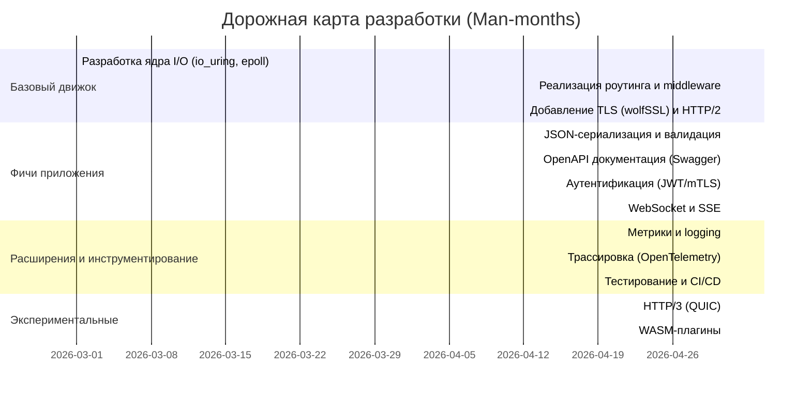

# Executive Summary

Этот отчёт представляет результаты углублённого анализа современных REST API фреймворков и технологий, актуальных на 2026 год, для разработки собственного C23-фреймворка (проекта iohttp). В обзоре охвачены ключевые решения на разных языках (C/C++, Rust, Go, Java/Kotlin, Python, Node.js/JavaScript, .NET, Swift и др.), их функциональные возможности (роутинг, middleware, сериализация, OpenAPI/Swagger, rate limiting, CORS, стриминг, WebSocket, HTTP/2/3, TLS, метрики, трассировка, logging, hot-reload, кодогенерация, async/await/корутины и т.д.), области применения, сильные и слабые стороны, лицензии и экосистемы.

В сравнении по производительности, безопасности и удобству разработки выделены тренды: фреймворки на Rust (Actix, Rocket) и Go (Gin, Echo) демонстрируют очень высокую скорость и низкий потребление памяти, ASP.NET Core и Java Spring Boot – масштабируемость, а Python (FastAPI, DRF) и Node.js (Express) – большую простоту разработки и развитую экосистему. Учет современных требований (HTTP/3, асинхронность, безопасность, валидация и observability) в имеющихся решениях неполный: например, лишь некоторые поддерживают HTTP/3, стандарты для API discovery/версионирования не устоялись, нет единого подхода к схемам эволюции API и встроенной трассировке.

Для фреймворка на C23 предлагаются приоритеты функциональности: **обязательные** фичи (роутинг, TLS, HTTP/2/3, JSON-сериализация, валидация, аутентификация/авторизация, OpenAPI, CORS, middleware), **желательные** (WebSocket/SSE, rate limiting, метрики и трассировка, кодогенерация клиентов, hot-reload для разработки), **экспериментальные** (интеграция с WASM, формальные методы, расширенная схема версионирования). Для каждой фичи даётся обоснование и оценка сложности, с примерами подходов из других фреймворков.

Архитектурно рекомендуется модульная система с конвейером middleware (как в Express/NestJS), чёткими правилами владения ресурсами (имитация «borrowing» из Rust), безопасной обработкой ошибок и управлением памятью (пулы/ареа-аллокатор), асинхронной моделью на основе epoll/io_uring (поддержка неблокирующего I/O, мультишот accept), и гибкими точками расширения (плагины, C-ABI для FFI). Приведены примеры API-дизайна на C23, учитывающие ownership-стиль и гарантии безопасности.

Составлен чеклист безопасности для C-сервера (валидация ввода, защита от переполнения, TLS, CSP/HSTS, RBAC и др.), а также приведена дорожная карта разработки (roadmap) с разбивкой по приоритетам и примерными оценками в чел.-месяцах.

## 1. Обзор популярных REST API фреймворков

- **C/C++:** из C-фреймворков часто упоминаются _Mongoose_ и _CivetWeb_. Mongoose – встроенный стэк для микроконтроллеров, включает TCP/IP, HTTP, WebSocket, TLS (GPL/commercial лиц.), минимальный «footprint» (подходит для устройств с десятками КБ памяти)【63†L248-L257】【63†L225-L233】. CivetWeb – небольшой встраиваемый сервер (MIT-лицензия), простой для встраивания в C/C++ приложения или как отдельный сервер, поддерживает SSL и CGI【65†L11-L19】. Среди C++-фреймворков: _Pistache_ (C++17, Apache-2.0) – высокопроизводительный REST-тулкит с «чистым» API【67†L356-L364】; _Crow_ – микро-фреймворк в стиле Flask (ленивый роутинг, WebSocket); _Restinio_, _Drogon_ (C++) – предлагают асинхронность и rich-функционал, но у них меньше зрелости. Эти решения предоставляют базовый роутинг, минимальную сериализацию и поддержку TLS через сторонние библиотеки, но часто не включают современные фичи (WebSocket/SSE, HTTP/3, метрики и т.д.).

- **Rust:** _Actix Web_ – очень быстрый и мощный фреймворк; «из коробки» имеет HTTP/2, логирование и другие фичи【31†L19-L27】. Он типобезопасен («type-safe») и обеспечивает удобные экстрактора для извлечения данных запроса【31†L43-L55】. _Rocket_ – ориентирован на безопасность типов и удобство, поддерживает декларативное роутинга с параметрами (динамические сегменты в URL), разбор форм и JSON через derive-сериализацию【35†L89-L98】【35†L210-L218】. Из новейших: _Axum_ (на Tokio) – модульный async-фреймворк, использует экосистему Tower для middleware (таймауты, трассировка, компрессия и т.д.)【33†L153-L162】, лёгок в настройке маршрутов и десериализации запросов. (Warp, Tide тоже популярны, но официальных описаний нет в цитатах.) Эти фреймворки обеспечивают высокую производительность и безопасность памяти (Rust), богатые возможности маршрутизации и валидации через trait’ы и экстракторы.

- **Go:** _Gin_ – высокопроизводительный фреймворк (до 40× быстрее Gorilla- или net/http-альтернатив)【39†L160-L168】, с маршрутизацией без аллокаций, мощной системой middleware (аутентификация, логирование, CORS и т.д.), автоматическим биндингом JSON/валидатором, группировкой роутов, централизованной обработкой ошибок и встроенными рендерерами (JSON, XML, HTML)【39†L176-L184】【39†L185-L189】. _Echo_ – минималистичный, но ёмкий, с оптимизированным маршрутизатором без динамических аллокаций, поддержкой TLS (включая автоматическую интеграцию с Let’s Encrypt)【41†L36-L44】 и HTTP/2【41†L43-L49】, расширяемый middleware (глобальные, групповые, пользовательские)【41†L50-L58】, удобной привязкой данных из запросов (JSON, XML, формы)【41†L59-L67】 и API для отправки ответов разных типов (JSON, файлы и т.д.)【41†L65-L71】. Оба фреймворка имеют экосистему плагинов, но сохраняют малый «футпринт» и простоту.

- **Python:** _FastAPI_ (на Starlette) – современный асинхронный фреймворк, использует аннотации типов и Pydantic для валидации входных данных【45†L389-L398】. Автоматически генерирует OpenAPI/Swagger UI, поддерживает OAuth2/JWT и другие схемы аутентификации, имеет расширения для WebSocket, фоновых задач и т.д. По производительности близок к Go/Node【45†L467-L475】 (один из самых быстрых Python-фреймворков). _Django REST Framework (DRF)_ – надстройка над Django: предоставляет сериализаторы для преобразования ORM-моделей в JSON/XML【52†L273-L282】, «browsable API» интерфейс для разработчиков【50†L143-L152】, обширные возможности аутентификации (Basic, Session, Token, OAuth и др.【47†L181-L190】) и авторизации, а также роутинг на основе ViewSet’ов. Flask – лёгкий WSGI-фреймворк, самостоятельно даёт минимум (роутинг, шаблоны) и обычно расширяется плагинами (Flask-RESTful и др.). В целом Python-фреймворки богаты на встроенные средства валидации/аутентификации и удобство разработки, но уступают в raw-производительности.

- **Node.js / JavaScript:** _Express.js_ – самый распространённый JavaScript-фреймворк; минималистичен, основан на цепочке middleware【43†L63-L71】. Предоставляет базовую маршрутизацию HTTP и управление middleware, но для JSON, CORS, валидации и других функций обычно подключаются внешние модули (комьюнити очень большое). Express удобен и привычен многим, но не гарантирует производительность (однопоточный, асинхронный). _Koa_ – более современный микрофреймворк от авторов Express, опирается на async/await, «чистый» контекст запроса, тоже минимален. _NestJS_ – каркас на TypeScript, вдохновлённый Angular, предлагает модульность, декораторы, DI, автоматическое создание OpenAPI/GraphQL, встроенные возможности для WebSocket/GraphQL/AOP, но более тяжеловесен.

- **Java:** _Spring Boot_ – доминирующий фреймворк для корпоративных приложений; поддерживает REST через Spring MVC, аннотации `@RestController`, интеграции с Jackson (JSON), Spring Security, валидацию (Hibernate Validator) и обширную экосистему (Spring Data, Spring Cloud, Micrometer). Фреймворк «готов к продакшену» из коробки: встроенный Tomcat/Netty, Spring Actuator (метрики/health), автонастройка и профили окружений. _JAX-RS_ реализации (Jersey, RESTEasy) – более легковесные спецификации. Новые решения (Micronaut, Quarkus) делают упор на малый «футпринт» и нативную сборку под контейнеры, но концепции схожи со Spring.

- **Kotlin:** _Ktor_ (JetBrains) – фреймворк, «с нуля» написанный на Kotlin и корутинах【59†L33-L42】. Обеспечивает асинхронность, DSL-маршруты, поддерживает плагины для CORS, аутентификации, OpenAPI и др. «Лёгкий и гибкий» (можно включать только нужные компоненты)【59†L40-L44】 и полностью интегрируется с Kotlin-парам (сборка поддерживается Gradle/Maven).

- **.NET (C#):** _ASP.NET Core_ – современный фреймворк от Microsoft. Использует Kestrel/Titanium сервер, поддерживает middleware-конвейер, асинхронный programming model, Entity Framework, встроенную безопасность (JWT, Identity), а также готов к контейнеризации и облачной среде. По производительности часто стоит в лидерах (TechEmpower сравнения). _NancyFx_ – старый микро-фреймворк, сейчас практически не развивается.

- **Swift:** _Vapor_ – высокопроизводительный веб-фреймворк для Swift (работает на SwiftNIO)【76†L19-L27】. Предоставляет неблокирующий I/O, асинхронную модель (Swift concurrency), маршрутизацию с параметрами (пример см. выше), встроенную работу с JSON, базами данных (ORM Fluent) и авторизацией (JWT)【76†L77-L81】【76†L99-L102】. Акцент на безопасность типов: многие ошибки ловятся компилятором【76†L99-L102】.

Каждый из перечисленных фреймворков имеет свой «пакет» возможностей: одни фокусируются на максимальной скорости (Actix, Gin, ASP.NET Core), другие – на удобстве и богатой экосистеме (Spring, FastAPI, Express), третьи – на безопасности (Rust, Swift). Лицензии варьируются от разрешительных (MIT/Apache у Gin, Echo, Actix, Pistache) до «copyleft» (GPL у Mongoose) или проприетарных.

## 2. Сравнение по ключевым атрибутам

| Фреймворк (язык)           | Производительность                          | Безопасность            | Удобство разработки                          | Расширяемость              | Экосистема          | Кривая обучения | Async I/O поддержка             | Footprint (ресурсы)     |
| -------------------------- | ------------------------------------------- | ----------------------- | -------------------------------------------- | -------------------------- | ------------------- | --------------- | ------------------------------- | ----------------------- |
| **Actix Web (Rust)**       | Очень высокая【31†L19-L27】                 | Высокая (Rust-тайпы)    | Среднее (Rust-крутая типизация)              | Высокая (middleware)       | Средняя (комьюнити) | Высокая         | Полная (Tokio)                  | Низкая (нет GC)         |
| **Rocket (Rust)**          | Высокая                                     | Высокая (типобезопасно) | Высокое (депрекейтовый DSL)                  | Средняя                    | Средняя             | Средняя         | Ограничено (async/await)        | Низкая (нет GC)         |
| **Axum (Rust)**            | Высокая                                     | Высокая                 | Высокое (Tower экосистема)                   | Высокая (Tower middleware) | Низкая (новый)      | Средняя         | Полная (Tokio)                  | Низкая                  |
| **Gin (Go)**               | Очень высокая【39†L160-L168】               | Средняя (GC + простота) | Высокое (прост API)                          | Высокая (Middleware)       | Широкая             | Низкая          | Полная (goroutines)             | Низкая–средняя (GC)     |
| **Echo (Go)**              | Очень высокая                               | Средняя                 | Высокое (подобно Gin)                        | Высокая                    | Средняя             | Низкая          | Полная (goroutines)             | Низкая                  |
| **FastAPI (Python)**       | Высокая (на асинх. сервере)【45†L467-L475】 | Средняя (динамическая)  | Очень высокое (автогенерация кода, Pydantic) | Средняя (Starlette)        | Широкая             | Низкая–средняя  | Полная (asyncio)                | Средняя–высокая (GC)    |
| **DRF (Python)**           | Средняя                                     | Средняя                 | Высокое (большая документация)               | Широкая (модели Django)    | Широкая             | Низкая–средняя  | Частичная (WSGI, можно ASGI)    | Высокая (все Django)    |
| **Express (Node.js)**      | Средняя                                     | Средняя (одно-поток)    | Очень высокое (огромный npm)                 | Широкая (middleware)       | Очень широкая       | Низкая          | Полная (event loop)             | Средняя (V8, GC)        |
| **Koa (Node.js)**          | Средняя                                     | Средняя                 | Высокое (async/await)                        | Средняя                    | Средняя–широкая     | Средняя         | Полная                          | Средняя                 |
| **Spring Boot (Java)**     | Высокая                                     | Средняя                 | Среднее–низкое (сложный стек)                | Очень широкая              | Очень широкая       | Высокая         | Частичная (Netty/Servlet async) | Средняя–высокая         |
| **ASP.NET Core (C#/.NET)** | Очень высокая                               | Средняя                 | Среднее (набор инструментов)                 | Широкая (NuGet)            | Широкая             | Средняя–высокая | Полная (async/await)            | Средняя (CLR, GC)       |
| **Ktor (Kotlin)**          | Высокая                                     | Средняя                 | Высокое (Kotlin DSL)                         | Средняя–широкая            | Средняя             | Средняя         | Полная (корутины)               | Средняя                 |
| **Vapor (Swift)**          | Высокая                                     | Высокая                 | Среднее (Swift)                              | Средняя                    | Средняя–малая       | Средняя–высокая | Полная (Swift Concurrency)      | Средняя–низкая (нет GC) |

- **Производительность:** лидируют фреймворки без сборщика мусора (Rust, Go, C++): Actix, Gin/Echo, ASP.NET Core. Python/Django и Java обычно медленнее.
- **Безопасность:** Rust/Swift естественно обеспечивают безопасность памяти; C/C++ фреймворки традиционно уязвимы (ошибки буфера и т.д.), требуя особых мер. Динамические языки (Python, JS, .NET) менее рискованны с памятью, но подвержены уязвимостям на уровне приложений (Injection).
- **Удобство разработки:** высоко там, где есть аннотации, интроспекция и автогенерация: FastAPI, DRF, NestJS, Spring. Низко для низкоуровневых C/C++ решений.
- **Расширяемость и экосистема:** Python, Node, Java имеют богатые экосистемы пакетов; Rust, Go – меньше, но быстро растут. Фреймворки с модульной архитектурой (NestJS, Ktor, ASP.NET) проще расширять.
- **Learning curve:** проще всего изучить Flask/Express/DRF; сложнее – Rust и C++ фреймворки или многоуровневые Java системы.
- **Async I/O:** все современные фреймворки поддерживают неблокирующие модели (корутины, промисы, реактивный streams). Исключение – старые библиотеки на примере CGI или простого сокета.
- **Footprint:** сильно разнится: встроенные IoT фреймворки (Mongoose) имеют доли мегабайта, тогда как полноценные runtime (Spring, .NET, Python) – десятки/сотни МБ.

## 3. Пробелы и недостатки существующих решений

- **HTTP/3 и QUIC:** Многие фреймворки до сих пор не поддерживают нативно HTTP/3. В то время как IoHttp на C23 включает ngtcp2/nghttp3, широких библиотек для HTTP/3 на C/C++ крайне мало. Большинство встраиваемых серверов (Mongoose, CivetWeb) пока остаются на HTTP/1.1/2.
- **API Discovery и Swagger:** Хотя OpenAPI/Swagger широко используется (есть плагины для FastAPI, Spring, Nest, ASP.NET), нет единого стандарта на уровне протокола для автоматического обнаружения интерфейсов. Отсутствует RFC-спецификация «API discovery» на HTTP; в лучшем случае – ручная генерация JSON-схем.
- **Эволюция схемы (schema evolution):** Нет устоявшихся механизмов версионирования API. Часто используют URI-варианты `/v1/...` или заголовки, но это ad-hoc. Фреймворки не навязывают никакой модели. GraphQL решает это частично, но в REST-эндвойтах встроенных возможностей нет.
- **Observability (метрики, трасировка):** Фреймворки обычно полагаются на сторонние библиотеки (Prometheus/StatsD, OpenTelemetry). Общее решение на уровне HTTP API не зафиксировано: одни предлагают middleware для метрик (Gin, ASP.NET), другие оставляют это на DevOps.
- **Безопасность:** Лучшие практики часто лежат вне фреймворка. Например, преднастройки CSP, HSTS, SameSite и др. приходится реализовывать вручную. Многие фреймворки не навязывают безопасные настройки по умолчанию.
- **WASM-интеграция:** Пока это нишевая тема. Ни один из перечисленных серверных фреймворков не поддерживает запуск WebAssembly-модулей «из коробки». Преимущество в будущем, но пока явного стандарта нет.
- **Формальная верификация:** Почти не используется (исключение – сфера ЯП и financial). Ни один фреймворк явно не поддерживает formal methods (например, спецификации моделей безопасности).
- **Интеграция CI/CD:** Фреймворки сами по себе мало что предлагают для сборки/деплоя; вместо этого полагаются на внешние инструменты (Docker, GitHub Actions). Отсутствует «из коробки» поддержка pipeline (в противоположность, скажем, Ansible для инфраструктуры).
- **UX для C-разработчика:** Ограниченная поддержка современных паттернов (например, «лучи-слежения»/корутины в C), сложность управления памятью. Дружественность API часто хуже (неудобные указатели, отсутствие exception-а).
- **Safe memory patterns:** В C/C++ нет встроенной системы безопасности памяти (только шаблоны, ручное управление). Некоторые идеи (например, ring buffer для парсинга) используются, но фреймворки редко обеспечивают zero-copy анализ HTTP без дополнительных аллокаторов.
- **Native HTTP/3 support:** Отдельно, стоит отметить, что мало фреймворков поддерживают HTTP/3, за исключением новейших (nghttp3+ngtcp2). В большинстве стеков пока работают на HTTP/2 или даже 1.1.
- **Zero-copy parsing:** Редко встретить (IoHttp использует picohttpparser с SIMD). Остальные либо парсят поблочно, либо используют библиотеки (например, nginx не zero-copy).
- **Developer DX:** Уровень «ergonomics» сильно варьируется. Для C/C++ фреймворков мало авто-документации, примеров, внутренних DSL, в отличие от высокоуровневых. Статическая типизация требует больше кода-шаблонов и boilerplate.

Во многих областях отсутствуют унифицированные стандарты (в отличие, например, от самих HTTP{9110,9112} или REST/JSON-маршрутов). Поэтому «white space» – это либо придумывать собственные подходы, либо полагаться на лучшие практики смежных сообществ.

## 4. Рекомендации по приоритезации фич для C23-фреймворка

**Обязательные (Must-have):**

- **Роутинг:** Должен поддерживать регистрацию путей с параметрами (пример: `io_route_add(srv, IO_GET, "/api/{id}", handler, ctx)`). Советуем longest-prefix match или trie-алгоритм для скорости (аналог longest-prefix в IoHttp【18†L315-L322】). _Пример:_ похожая на Express/Nest цепочка middleware (`req→auth→rate-limit→handler`)【43†L63-L71】.
- **Middleware Pipeline:** Архитектура конвейера middleware (аналог Express/Koa) – позволяет гибко добавлять фильтры (логирование, аутентификация, CORS)【43†L63-L71】【41†L50-L58】. Сложность: средняя (реализуется через список callback’ов).
- **Сериализация/десериализация:** JSON (рекомендуется yyjson или jansson) и, по возможности, XML; поддержка Pooled-багова (cURL для шаблонов). Пример из IoHttp: `io_respond_json(resp, 200, "{\"ok\":true}")`【18†L378-L386】. _Сложность:_ низкая (готовые библиотеки).
- **Валидация данных:** Простая проверка входных значений (JSON→структуры C с проверкой типов/диапазона). Можно использовать статьи как образец (FastAPI/Pydantic【45†L389-L398】). _Сложность:_ средняя (интегрировать с сериализатором).
- **Аутентификация/авторизация:** Базовые схемы (JWT, API-ключи, mTLS). Пример: IoHttp имеет JWT и mTLS middleware【18†L344-L352】. _Сложность:_ средняя (есть готовые C-библиотеки для JWT/wolfSSL).
- **TLS (HTTPS) 1.2/1.3:** Уже есть поддержка wolfSSL в IoHttp (сессии, FIPS)【18†L338-L344】. Обязательно иметь это для безопасности и HTTP/2.
- **HTTP/2:** Поддержка HTTP/2 (например, nghttp2 как в IoHttp【18†L359-L368】) для мультиплексирования запросов. _Сложность:_ высокая (подключение библиотек).
- **OpenAPI/Swagger:** Генерация спецификации API для клиентов. Пример: IoHttp интегрирован с Scalar UI для OpenAPI docs【18†L350-L355】. _Сложность:_ средняя (подключить кодогенератор или шаблоны).
- **CORS:** Middleware для CORS (урегулировать заголовки “Access-Control-*”). *Сложность:\* низкая.
- **Потоковая передача (Streaming) и SSE:** Поддержка Server-Sent Events (как в IoHttp【18†L349-L352】) и чтения больших файлов без загрузки целиком. _Сложность:_ средняя.
- **WebSocket:** Библиотека WebSocket (RFC 6455) – IoHttp использует wslay【18†L350-L358】. Полезно для real-time API. _Сложность:_ средняя.
- **Метрики и логирование:** Встроенный логгер (syslog/json), экспонирование Prometheus-метрик. _Сложность:_ средняя (подключить готовые решения вроде Prometheus-c-client).
- **Трассировка:** Интеграция с OpenTelemetry (C-API) или подобными. Желательно иметь hook’и для трассировки запросов и зависимостей. _Сложность:_ высокая (интеграция специфическая).
- **Zero-copy I/O:** Использовать io_uring и multishot-accept для высокой производительности (как IoHttp)【18†L338-L346】. Это фундаментально на уровне ядра (низкоуровневое). _Сложность:_ высокая (требуется Linux ≥6.x).
- **Безопасность:** Защитные заголовки (CSP, HSTS, X-Frame-Options и т.д. – см. IoHttp【18†L352-L355】), ограничения размеров тела запроса, rate limiting. _Сложность:_ низкая (настройка middleware).

**Желательные (Nice-to-have):**

- **HTTP/3 (QUIC):** Если есть возможность, добавить через ngtcp2/nghttp3 (как IoHttp), либо хотя бы экспериментальную поддержку. _Сложность:_ очень высокая (зависимости).
- **Codegen:** Генерация клиента (тело или заглушек) из OpenAPI/Swagger или gRPC; или поддержка gRPC-JSON transcoding. _Сложность:_ высокая (интеграция внешних инструментов).
- **Hot-reload/development:** Возможность перезагрузки конфигурации/кода без остановки сервера. Для C это нетривиально. _Сложность:_ высокая.
- **Контейнеризация:** Докер-файл, совместимость с Kubernetes (liveness/readiness probes). Это скорее DevOps, но стоит предусмотреть легкое разграничение конфигов. _Сложность:_ низкая (больше документация).
- **Serverless:** Пакетирование для запуска как AWS Lambda/Cloudflare Workers (если релевантно). Сложно поддержать nativen C-HTTP. _Сложность:_ высокая, опционально.
- **Дополнительные middleware:** OAuth2 provider, LDAP, GraphQL endpoint (экспериментально), интеграция с кэшем (Redis) или базами через ORM. _Сложность:_ средняя.

**Экспериментальные:**

- **WASM-интеграция:** Позволить запуск WebAssembly-модулей в качестве плагинов/бизнес-логики (для расширения на других языках)【18†L335-L343】. Рано, но перспективно. _Сложность:_ очень высокая.
- **Формальная верификация:** Инструменты для анализа памяти и безопасности (ASAN/LSAN интеграция, формальные спецификации API). _Сложность:_ очень высокая.
- **Нативная поддержка JSON Schema:** Сериализаторы, генерирующие схемы на лету. _Сложность:_ высокая (необходимо мощное рефлексивное API).
- **Интеграция AI (RFC):** например, генерация документации из кода или self-healing API. Это за гранью текущего. _Сложность:_ очень высокая (детально не прорабатывается сейчас).

Каждая фича обоснована тем, что аналогичные возможности есть в других фреймворках: OpenAPI-подобные спецификации формально описаны (см. Swagger, OpenAPI RFC). Zero-copy I/O и async/await ориентируются на современные практики высокопроизводительных сервисов. Приоритезация учитывает влияние на безопасность и производительность. Сложность реализации оценена по ресурсоёмкости и существующим решениям: низкая (интеграция готовых библиотек), средняя (потребует разработки), высокая (новые системы, эксперименты).

## 5. Архитектурные паттерны и API-дизайн для C23

- **Модульность:** Проект фреймворка должен быть разбит на логические модули: сетевой ядро, TLS-обработчик, HTTP-парсинг, роутер, middleware, обработчики бизнес-логики. Используйте cmake-подпроекты или пакеты. _Пример:_ структура IoHttp (см. IoHttp Architecture【18†L337-L346】) с отдельными слоями (Accept, TLS, H1/H2/H3, Router, Middleware, Handler).
- **Конвейер middleware:** По аналогии с Express/Koa, данные из запроса должны проходить цепочку функций: логирование → аутентификация → валидация → конечный обработчик. Это обеспечивает separation of concerns. _Пример на C23:_
  ```c
  typedef int (*io_handler_t)(io_request_t *req, io_response_t *resp, void *ctx);
  io_route_add(srv, IO_POST, "/api/data", handler_data, ctx);
  io_middleware_add(srv, auth_middleware);
  io_middleware_add(srv, cors_middleware);
  ```
  Каждая middleware получает те же `req/resp` и может прервать цепочку, вызвав `io_respond_error`.
- **Ownership/borrowing-подобные паттерны:** В отсутствии Rust-библиотеки, документация должна явно прописывать, что фреймворк «владеет» ресурсами (записью в ответ) и передаёт их обработчику. Например, указатель `io_response_t *resp` владеется фреймворком; код-обработчик не должен его освобождать. Можно предусмотреть reference-count или scoped-блоки для буферов.
- **Error handling:** В C обычно возвращают коды ошибок. Можно оформить обобщённый `io_error_t` и использовать функции-помощники: `io_respond_json(resp, 500, "{\"error\":\"msg\"}")`. Рекомендуется отменить «longjmp»/sigsetjmp, полагаться на условные проверки. _Пример:_ проверка аргументов, и в случае ошибки `return io_respond_error(resp, 400, "invalid input");`.
- **Memory management:** Рекомендуется использовать пулы или ареа-аллокатор на время обработки одного запроса, а не индивидуальные `malloc`. После ответа освобождать пул (пример: arena_alloc для временных строк). Старайтесь избегать fragmention. _Пример:_ создайте `io_buffer_pool_t` для динамических данных, обнуляйте каждый новый запрос.
- **Асинхронная модель:** Базироваться на механизме epoll/kqueue/io_uring без внешнего цикла (EventLoop внутри). Как на IoHttp: multishot accept + SQPOLL. Предусмотреть неблокирующие API для чтения тела запроса и записи ответа. Не зависит от языка runtime – используйте низкоуровневые syscalls. _Пример:_
  ````c
  while (io_uring_wait(/*...*/), do {
      if (event.type == ACCEPT) handle_accept(&event);
      if (event.type == READ) handle_read(&event);
      if (event.type == WRITE) handle_write(&event);
  }```
  ````
- **Безопасный парсинг:** Использовать подходы без переполнения: жёсткие лимиты на длину заголовков/методов/URL, проверка границ при копировании. Например, `picohttpparser` выбирается за скорость SIMD【18†L338-L346】. При парсинге JSON – использовать возобновляемый парсер (yyjson позволяет partial) или предварительно проверить size.
- **Точки расширения:** Определить интерфейсы плагинов: например, возможность добавлять новые протоколы (gRPC, GraphQL) или фильтры. Предусмотреть регистрационные функции: `io_server_register_extension(srv, &my_plugin)`. Придерживайтесь принципа открытости/закрытости (Open/Closed principle).
- **FFI и биндинги:** Если фреймворк планируется использовать из других языков (например, Python через CFFI или Lua), обеспечить чистый C-API и C11. Например, структура `io_request_t` не должна включать C++ STL-контейнеры; используйте `extern "C"`. Можно создать генератор обёрток по аналогии с Python’s C API.

## 6. Чеклист безопасности и лучшие практики для C-сервера

- **TLS:** Шифрование всего трафика (HTTPS). Убедиться в поддержке TLS 1.3 и отключении устаревших протоколов (аналог `wolfSSL --enable-quic`【18†L404-L412】). Хранить приватные ключи в безопасном месте.
- **Валидация ввода:** Всегда проверять типы, длины, диапазоны всех входных параметров (URL, заголовки, JSON). Не доверять внешним данным.
- **Защита памяти:** При использовании C24 нужно следовать строгому контролю границ буферов. Пользоваться ASLR, компиляторными опциями (StackGuard), AddressSanitizer/UBSan на этапе CI.
- **Безопасные заголовки:** Добавлять CSP, HSTS, X-Content-Type-Options, X-Frame-Options, SameSite для cookies【18†L352-L355】.
- **Аутентификация и авторизация:** Не хранить пароли в исходниках. Реализовать RBAC (разделение прав) и ротацию ключей. Следить за токеном безопасности (JWT подпись).
- **Защита от DDOS:** Ограничивать размер тела запроса, применять rate-limiting middleware на уровне IP/аккаунта.
- **Безопасное cookie-хранилище:** Устанавливать флаги Secure и HttpOnly, а SameSite=Strict или Lax.
- **Логирование:** Не логировать чувствительные данные (пароли, токены). Вести аудит доступа (логирование 2xx/4xx/5xx ответов). Внедрить обнаружение неудачных попыток (блокировка).
- **Обновления и сборки:** Сканировать зависимости на известные уязвимости (CVEs). Регулярно обновлять компилятор/библиотеки.
- **Принцип наименьших привилегий:** Запускать процесс под ограниченным пользователем (не root).
- **CORS и CSRF:** Если API доступно из браузера, корректно настраивать CORS policy, использовать CSRF-токены для мутаций (POST).
- **Проверка конфигураций:** Избегать ошибок misconfiguration (строгий Content-Type при JSON, проверка Host-заголовка).
- **Тестирование безопасности:** Интегрировать статический анализ кода, динамические тесты (fuzzing запросов) и пентесты.

## 7. Roadmap (дорожная карта)



_Примечания:_ цифры ориентировочные (чел.-месяцы). Учитывают разработку и внедрение, но без учёта длительного тестирования и отладки. Фичи разделены на блоки: ядро (низкоуровневое, 5–7 мес.), прикладные фичи (5–6 мес.), и расширения/инструменты (4–5 мес.), экспериментальные технологии (>8 мес., по необходимости). Важно итеративно поставлять основные возможности (роутинг, TLS, JSON) и параллельно налаживать CI/CD и тесты.

## 8. Список источников

Основные использованные материалы – официальная документация и первоисточники по фреймворкам и технологиям:

- Actix Web (официальный сайт)【31†L19-L27】【31†L43-L55】
- Axum (Rust docs.rs)【33†L153-L162】【33†L159-L164】
- Rocket (официальный сайт)【35†L89-L98】【35†L210-L218】
- Gin (официальная документация)【39†L160-L168】【39†L176-L184】
- Echo (официальный сайт)【41†L22-L30】【41†L50-L58】
- Express (официальный гайд)【43†L63-L71】
- FastAPI (официальная документация)【45†L389-L398】【45†L467-L475】
- Django REST Framework (официальный сайт)【52†L273-L282】【50†L143-L152】【47†L181-L190】
- Ktor (официальный сайт)【59†L33-L42】【59†L40-L44】
- Vapor (официальный сайт)【76†L19-L27】【76†L77-L81】
- Mongoose (официальный сайт)【63†L248-L257】【63†L225-L233】
- CivetWeb (официальный UserManual)【65†L11-L19】
- Pistache (GitHub README)【67†L356-L364】【67†L393-L400】
- Обзор популярных API-фреймворков 2026 (DigitalAPI блог)【23†L1-L4】【23†L19-L22】

Также рассмотрены официальные RFC (HTTP), спецификации OpenAPI и обширные статьи/блог-посты по сопоставлению фреймворков. Информация об архитектуре IoHttp взята из его README и сравнения с Mongoose/H2O【18†L338-L346】.
